<p align="center">
  
</p>

<h1 align="center">VelocityNavigator</h1>

<p align="center">
  <strong>Lobby routing, without the guesswork.</strong>
  <br>
  <em>Built by <a href="https://demonz.org">DemonZ Development</a></em>
</p>

<p align="center">
  
  
  
  
  
</p>

Server administrators use VelocityNavigator to balance initial joins and lobby commands across healthy Velocity backends. You can combine **nine routing modes** with capacity checks, circuit breakers, drain states, contextual pools, persistent affinity, Java and Bedrock selectors, zero-dependency packet NPCs, database storage backends, country-aware geo routing, and operator-focused diagnostics.

<p align="center">
  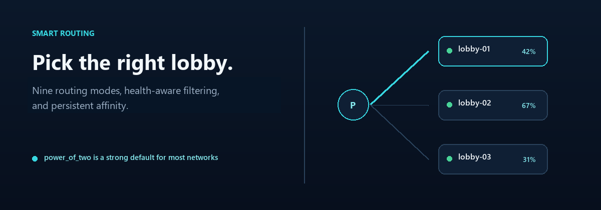
</p>

Every setup installs the JAR on Velocity. Install the exact same JAR on each Paper, Spigot, or Folia backend where you want NPCs, backend YAML menus, the Java inventory selector, PlaceholderAPI bridge values, or backend Redis registration. Those features cannot run on a backend that does not have the JAR.

---

## 1. Intelligent Lobby Routing & Balancing

Simple round-robin routing creates severe load skew in real networks. Disconnections, player parties, and differing server hardware cause imbalances. VelocityNavigator provides **nine specialized routing algorithms**:

| Selection Mode | Strategy Description |
|---|---|
| **`power_of_two`** *(Recommended)* | **Power of Two Random Choices**: Selects two candidate lobbies at random and picks the least loaded. Mathematically eliminates herd behavior and load skew without global locks. |
| **`least_players`** | **Least Loaded**: Routes connections directly to the lobby with the fewest online players to keep servers evenly populated. |
| **`weighted_round_robin`** | **Proportional Capacity**: Assigns weights to servers based on hardware specs (e.g. 3x more players to a 64GB dedicated node than an 8GB VPS). |
| **`consistent_hash`** | **Deterministic Hashing**: Uses a Ketama hash ring with virtual nodes to consistently map player UUIDs to specific backends with minimal disruption when servers change. |
| **`latency` / `ping`** | **Lowest Ping**: Actively evaluates round-trip ping and routes incoming players to the lowest-latency responsive backend. |
| **`least_connections`** | **Active Workflow Balancing**: Routes to the server with the fewest active in-flight connection workflows. |
| **`geo`** | **Country & Continent Routing**: Matches player location to local server clusters via MaxMind GeoLite2, IP-API, or [GeoRestrict](https://modrinth.com/plugin/georestrict). |
| **`round_robin`** | **Sequential Rotation**: Strict cyclic distribution across all healthy candidate lobbies. |
| **`random`** | **Uniform Random**: Random distribution across healthy lobbies. |

**Sticky Sessions & Player Affinity**

Returning players hate landing in a different lobby every time they switch servers. VelocityNavigator provides configurable player affinity:
* Remembers a player's previous lobby within a configurable time window.
* Automatically routes players back to their familiar lobby upon reconnecting.
* Fully persistent across proxy restarts with atomic on-disk storage.
* Instant expiration bypass when the preferred lobby is full, draining, or undergoing maintenance.

**Live Route Explanations**

Need to diagnose why a player routed to a specific lobby? Run `/vn debug player <username>` to view the real-time routing trace: candidate pool discovery, filter rules (health, capacity, drain, maintenance, affinity), scoring calculations, and the selected winner.

---

## 2. Resilient Self-Healing & Circuit Breakers

<p align="center">
  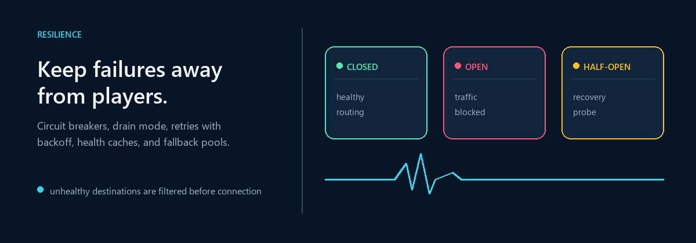
</p>

When a backend crashes or suffers severe TPS drops, standard proxies leave players waiting on timeout screens. VelocityNavigator acts as a self-healing traffic manager:

* **Three-State Circuit Breaker (`CLOSED` ➔ `OPEN` ➔ `HALF-OPEN`)**: Each registered backend maintains an independent circuit breaker. When connection failures or ping timeouts exceed your configured threshold, the circuit trips `OPEN`, instantly cutting off player routing to that server before players experience connection freezes. After a cool-down window, it enters `HALF-OPEN` to test server health with canary connections before resuming full traffic.
* **Exponential Backoff with Jitter**: When disconnected backends recover, reconnect attempts back off progressively with pseudo-random jitter. This prevents the devastating "thundering herd" effect where hundreds of players flood a recovering server simultaneously.
* **Continuous Multi-Vector Health Checks**: Active ping checks, TCP socket verification, MOTD query checks, and backend bridge heartbeats keep proxy state continuously synchronized with real server conditions.
* **Zero-Downtime Drain System (`/vn drain <server>`)**: Safely take lobbies offline without kicking active players. Draining servers immediately stop receiving new joins and `/lobby` transfers while existing players finish their games. Once player count reaches zero, maintenance can be performed safely.
* **Empty Lobby Fallbacks**: If every lobby in a pool becomes unreachable, VelocityNavigator gracefully directs players to a configured fallback server or provides a friendly, localized disconnect notice instead of an unformatted network exception.

---

## 3. Unified Visual Selectors

Deliver a consistent navigation experience across every Minecraft client platform:

<p align="center">
  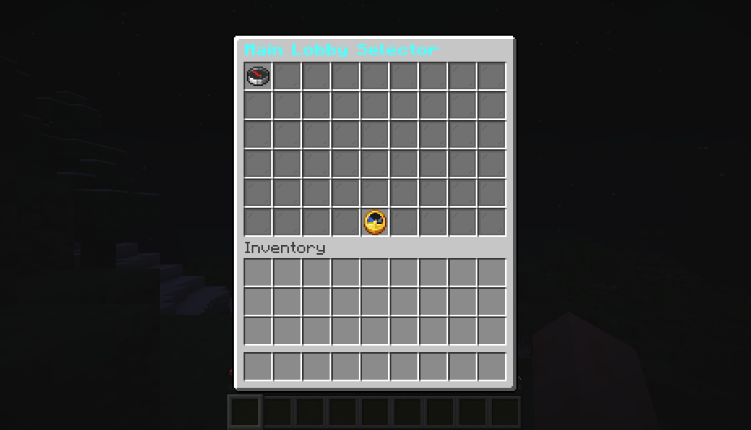
  
</p>

* **Java Chest Inventory GUI**:
  * Multi-page pagination with customizable row sizes (1–6 rows).
  * State-aware item presentation: configure distinct materials, display names, and lore for Open, Full, Draining, Maintenance, and Offline lobbies.
  * Live player counts, capacity counters, and dynamic lore placeholders.
  * Automatic GUI refresh intervals so player counts stay accurate while menus remain open.
  * Cryptographic token validation to prevent slot injection and click-spoofing attacks.
* **Native Bedrock / Geyser Form**:
  * Clean, native Floodgate/Geyser dialog forms designed specifically for touch and controller navigation.
  * Displays server display names, live player counts, descriptions, and custom icon images.
  * Direct server switching on button press without clunky Java GUI emulation.
* **Interactive MiniMessage Chat Selector**:
  * Lightweight, zero-GUI text selector accessible from any client.
  * Formatted with rich MiniMessage styling, hover tooltips showing server details, and single-click connection commands.
* **One Server Configuration for All Selectors**:
  * Define server metadata once in your configuration: `display_name`, `description`, `menu_order`, and `show_in_menu`. Changes immediately synchronize across Java Inventory, Bedrock Forms, and Chat selectors.

---

## 4. Zero-Dependency Backend Bridge & NPCs

<p align="center">
  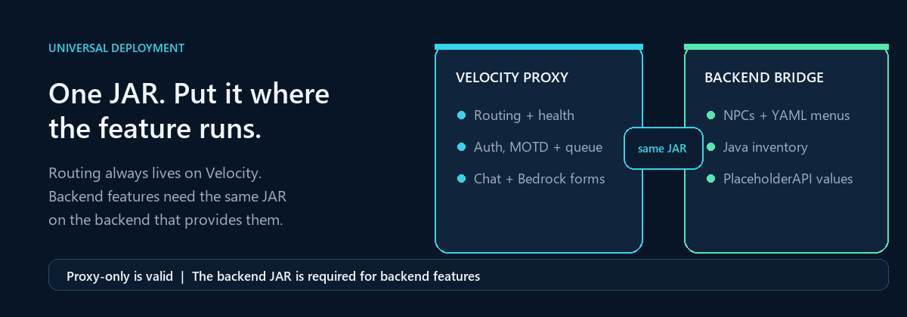
</p>

<p align="center">
  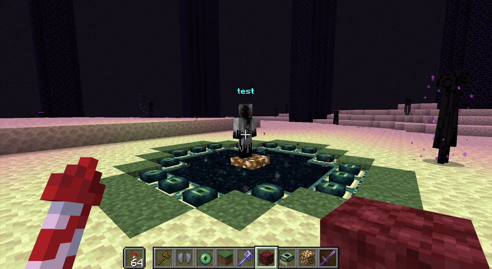
</p>

Unlike other proxy navigators that require separate Spigot plugins, protocol hacks, or heavy dependencies like Citizens, VelocityNavigator is completely self-contained:

* **Single Universal JAR**: The exact same JAR file placed on Velocity runs on Paper, Spigot, and Folia backends.
* **Zero-NMS Packet NPCs**:
  * Spawn lightweight, high-performance NPCs on backend servers without version-locked NMS code.
  * Compatible across Paper 1.16.5 through 1.21.x and Folia out of the box.
  * Fetch custom player skins by username or Mojang texture properties.
  * Configure flexible click actions: connect to a server, open a custom menu, or execute proxy/backend commands.
  * Manage NPCs in-game with `/vn npc create <id> <name>`, `/vn npc skin <id> <player>`, and `/vn npc delete <id>`.
* **Backend YAML Menus (`plugins/VelocityNavigator/menus/*.yml`)**:
  * Build full custom inventory menus on backends without third-party GUI plugins.
  * Configurable slot grids, materials, custom model data, skull owners, and sounds.
  * Multi-action execution: server transfer, commands, broadcast messages, submenus, pagination, and close.
* **PlaceholderAPI Bridge**:
  * Access real-time proxy values on any backend: `%velocitynavigator_lobby%`, `%velocitynavigator_party_leader%`, `%velocitynavigator_party_size%`, `%velocitynavigator_server_status_<server>%`, and `%velocitynavigator_queue_position%`.

---

## 5. Built-in Proxy Systems & Social Features

<p align="center">
  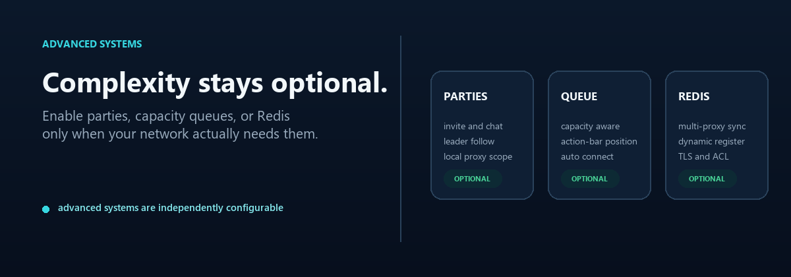
</p>

VelocityNavigator includes production-ready networking tools that eliminate the need for bloated third-party add-ons:

* **Capacity Queue System**:
  * Never turn players away during player spikes. When all routed lobbies reach capacity, players enter a graceful queue in a designated holding server.
  * Displays dynamic actionbar and title countdowns with live queue position and estimated wait time.
  * Priority bypass permissions (`velocitynavigator.queue.priority`) for VIPs and staff.
* **Cross-Server Party System**:
  * Complete party management: `/party create`, `/party invite <player>`, `/party join`, `/party leave`, `/party kick`, and `/party disband`.
  * **Leader Follow**: When the party leader switches lobbies or minigames, all online party members are automatically transferred together.
  * Private cross-proxy party chat (`/party chat <message>`) and open/invite-only party toggles.
* **Network & Per-Server Maintenance**:
  * Toggle network-wide maintenance or lock individual backends (`/vn maintenance set <server> true`).
  * Custom kick reasons with rich MiniMessage and color formatting.
  * Permission-based bypass (`velocitynavigator.bypass.maintenance`) for administrative testing.
  * Dynamic MOTD integration showing maintenance badges and countdowns.

---

## 6. Multi-Proxy Clustering & Redis Sync

Running multiple Velocity proxies behind a BGP Anycast IP or DNS round-robin? VelocityNavigator provides built-in distributed clustering via Redis:

* **Cross-Proxy Health & Circuit Synchronization**: Circuit breaker trip states and backend health snapshots synchronize in milliseconds across every proxy node.
* **Cluster-Wide Player Affinity**: Sticky sessions persist across proxies, ensuring returning players connect to the correct lobby regardless of which proxy receives their connection.
* **Dynamic Server Registration**: Backends can announce themselves dynamically over Redis Pub/Sub, registering with proxy pools on boot and unregistering on shutdown without editing proxy configuration files.
* **Authenticated & Channel-Isolated**: Secure Redis authentication with configurable channels and key prefixes for multi-network environments.

---

## 7. Enterprise Security & Authentication Engine

<p align="center">
  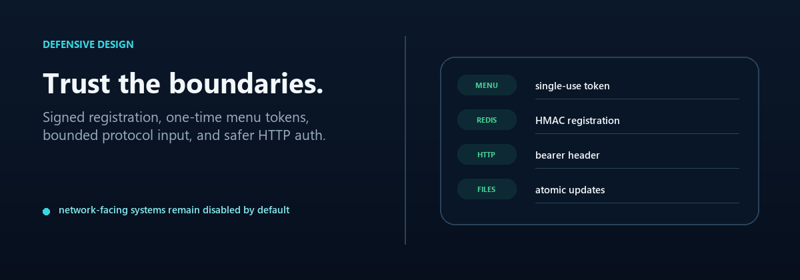
</p>

Protect your proxy network with modern defensive security:

* **Argon2id Password Hashing**: State-of-the-art password security with configurable memory cost, iterations, and parallelism. Includes seamless, backward-compatible verification for legacy SHA-256 databases.
* **Brute-Force Rate Limiting**: Built-in login attempt tracking and temporary IP lockouts stop password guessing before it impacts network performance.
* **Holding Lobby Quarantine**: Unauthenticated players are isolated in a lightweight holding lobby. Player movement, block interactions, inventory access, and chat commands (outside `/login` and `/register`) are completely restricted until authentication succeeds.
* **Native Bedrock Auth Forms**: Bedrock players via Floodgate receive native modal dialogs for registration and password entry instead of typing passwords into open chat.
* **Expiring Session Tokens**: Secure session persistence remembers authenticated players across quick reconnects or proxy transfers within a configurable TTL.

---

## 8. Real-Time Operations & Observability

<p align="center">
  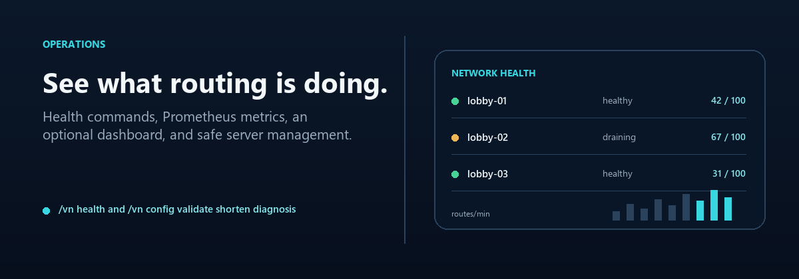
</p>

<p align="center">
  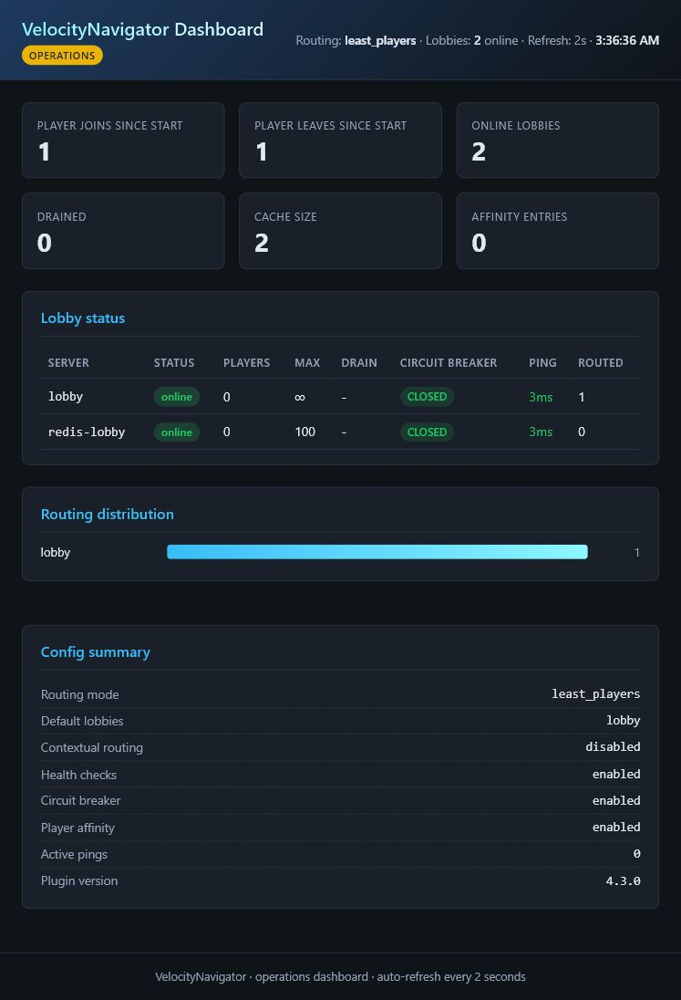
</p>

* **Embedded HTML Operations Dashboard**:
  * Built-in lightweight web dashboard running on its own dedicated port.
  * Real-time lobby status table showing active player counts, max capacity, latency, and circuit health.
  * Visual routing distribution charts, sticky session counters, and join/leave metrics.
  * Secured via HTTP Bearer Token authentication.
* **Prometheus & Grafana Metrics**:
  * Native `/metrics` endpoint exports Prometheus metrics out of the box: routing counts, circuit trips, health check latency, party counts, and queue depth.
  * Generate Grafana dashboards with `/vn setup grafana`.
* **Dynamic MiniMessage MOTD Rotation**:
  * Dynamic MOTD manager supporting Random, Sequential, or Scheduled Time-Window rotations.
  * Embed dynamic player counts, custom hex colors, gradients, and maintenance status lines.
* **Self-Documenting Configuration & Validation**:
  * `/vn config validate` performs deep syntax and semantic checks with Levenshtein distance typo suggestions.
  * `/vn menu validate` audits GUI item slots, materials, duplicate keys, and placeholders before players encounter broken menus.

---

## 9. Global Localization (15 Bundled Languages)

<p align="center">
  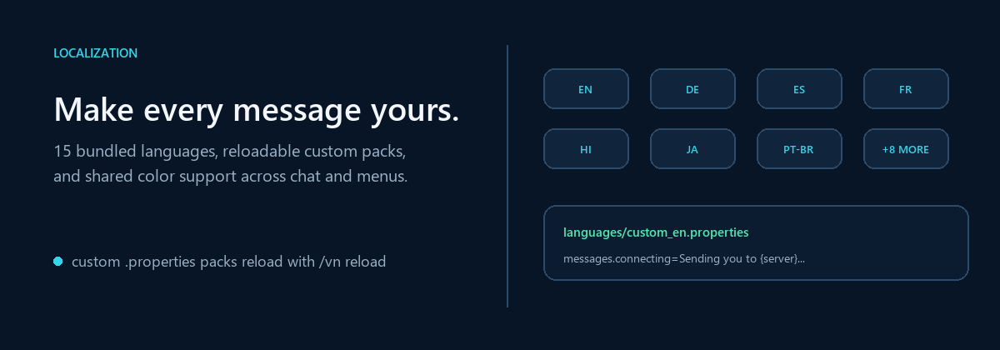
</p>

Deploy globally with **15 bundled language translations** out of the box:

| Language | Code | Language | Code | Language | Code |
|:---|:---:|:---|:---:|:---|:---:|
| **English** | `en` | **Spanish** | `es` | **German** | `de` |
| **French** | `fr` | **Russian** | `ru` | **Portuguese (BR)** | `pt_br` |
| **Chinese (Simp.)** | `zh_cn` | **Japanese** | `ja` | **Korean** | `ko` |
| **Italian** | `it` | **Dutch** | `nl` | **Polish** | `pl` |
| **Turkish** | `tr` | **Arabic** | `ar` | **Hindi** | `hi` |

* Custom `.properties` files can be added to `plugins/velocitynavigator/languages/` with zero recompilation.
* Full hot-reloading with `/vn reload`.

---

## 10. Multi-Engine Storage Architecture

Store player data, sticky sessions, and auth credentials in the storage engine that matches your infrastructure:

* **Plain JSON Files**: Simple, zero-setup storage for small networks.
* **SQLite**: Embedded SQL database with zero configuration or external database servers required.
* **MySQL & MariaDB**: High-performance database storage with HikariCP connection pooling and automatic schema migrations.
* **PostgreSQL**: Robust enterprise database backend for large network deployments.

---

## 11. Quick Start Guide

Get up and running in under five minutes:

1. Download `VelocityNavigator-4.5.0.jar` and place it into your Velocity proxy's `plugins/` directory.
2. Start the proxy once to generate default configuration files, then stop the proxy.
3. Open `plugins/velocitynavigator/navigator.toml` and list your lobby servers (matching names in `velocity.toml`):

```toml
[routing]
selection_mode = "power_of_two"
balance_initial_join = true
default_lobbies = ["lobby-1", "lobby-2", "lobby-3"]

[routing.fallback]
strategy = "disconnect"
message = "<red>All lobbies are currently full or undergoing maintenance.</red>"

[health]
check_interval_seconds = 5
timeout_millis = 2000
circuit_breaker_threshold = 3
circuit_breaker_reset_seconds = 30
```

4. Run `/vn config validate` from the console to verify your configuration.
5. Start the proxy and type `/lobby` in-game to test routing!

> **Adding backend features?** Copy the exact same JAR into the `plugins/` folder of each Paper, Spigot, or Folia backend where you want NPCs, YAML menus, or the Java inventory selector.

---

## 12. Command & Permission Reference

**Administrative Commands**

| Command | Permission | Description |
|---|---|---|
| `/vn health` | `velocitynavigator.admin` | Consolidated proxy diagnostics and circuit health overview |
| `/vn servers` | `velocitynavigator.admin` | Paginated table of server health, capacity, drain, and circuits |
| `/vn debug player <player>` | `velocitynavigator.admin` | Live trace explaining routing decisions for a specific player |
| `/vn drain <server>` | `velocitynavigator.admin` | Toggle drain mode to safely evacuate backends without kicks |
| `/vn undrain <server>` | `velocitynavigator.admin` | Remove drain flag from a backend |
| `/vn maintenance [server] [on/off]` | `velocitynavigator.admin` | Toggle network-wide or per-server maintenance mode |
| `/vn npc create <id> <name>` | `velocitynavigator.admin` | Create a new interactive packet NPC |
| `/vn npc skin <id> <player>` | `velocitynavigator.admin` | Apply a player skin to an existing NPC |
| `/vn npc delete <id>` | `velocitynavigator.admin` | Remove an interactive NPC |
| `/vn menu validate` | `velocitynavigator.admin` | Audit custom menu items, slots, materials, and placeholders |
| `/vn affinity clean` | `velocitynavigator.admin` | Manually purge expired sticky session mappings |
| `/vn bridge status` | `velocitynavigator.admin` | Display detected Paper/Folia backend bridge connections |
| `/vn config validate` | `velocitynavigator.admin` | Audit configuration files for syntax or typo errors |
| `/vn redis status|test` | `velocitynavigator.admin` | Inspect Redis counters or test endpoint, TLS, and PING |
| `/vn setup grafana` | `velocitynavigator.admin` | Generate the bundled Grafana dashboard JSON |
| `/vn reload` | `velocitynavigator.admin` | Hot-reload all configurations, menus, and language packs |

**Player Commands**

| Command | Permission | Description |
|---|---|---|
| `/lobby` or `/hub` | `none` (configurable) | Route player to the best available healthy lobby |
| `/menu` | `none` (configurable) | Open the interactive server selector |
| `/party` | `none` (configurable) | Access the cross-server party management system |
| `/queue [leave]` | `none` (configurable) | Check queue position or leave the holding queue |

---

## 13. Compatibility Matrix

<p align="center">
  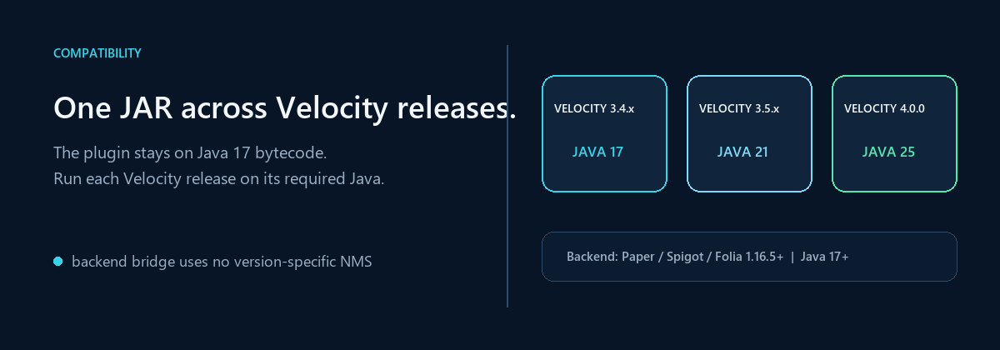
</p>

* **Proxy Platforms**:
  * Velocity 3.4.x (Java 17+)
  * Velocity 3.5.x (Java 21+)
  * Velocity 4.0.0 (Java 25)
* **Backend Platforms (Optional Bridge)**:
  * Paper 1.16.5 – 1.21.x+
  * Spigot 1.16.5 – 1.21.x+
  * Folia 1.20.x – 1.21.x+
* **Ecosystem Integrations**:
  * GeyserMC & Floodgate (Native Bedrock forms and Floodgate UUID translation)
  * PlaceholderAPI (Rich backend placeholders)
  * GeoRestrict & MaxMind GeoLite2 (Geographic routing)
  * Prometheus & Grafana (Metrics monitoring)

---

## 14. Documentation & Community Support

* **Official Website**: [demonz.org](https://demonz.org)
* **Complete Wiki & Documentation**: [GitHub Wiki Documentation](https://github.com/DemonZ-Development/VelocityNavigator/wiki)
* **Issue Tracker**: [GitHub Issues](https://github.com/DemonZ-Development/VelocityNavigator/issues)
* **Discord Community**: [Join DemonZ Discord](https://discord.com/invite/GYsTt96ypf)

[](https://bstats.org/plugin/velocity/Velocity%20Navigator/28341)

<p align="center">
  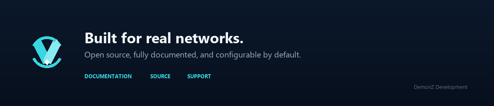
</p>

---

**Sponsored by Nexeu Hosting**


[](https://nexeu.zip/)

High-performance, affordable Minecraft hosting with premium NVMe hardware, DDoS protection, and 24/7 technical support.
