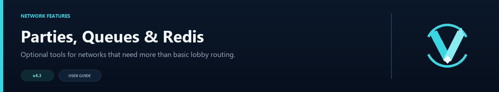

# Advanced Proxy Systems



VelocityNavigator handles lobby balancing for networks. You can enable optional systems below for security, persistence, maintenance coordination, multi-proxy state sharing, and in-world navigation. Enable the systems that solve current problems.

## Player systems

| System | What it does | Guide |
|---|---|---|
| Parties | Keeps friends together as the leader moves across servers | [Party System](Party-System) |
| Capacity queue | Gives players a position in line when lobbies are full | [Capacity Queue](Capacity-Queue) |
| Java and Bedrock selectors | Lets players choose a lobby through an inventory, form, or chat | [Java and Bedrock Selectors](Java-and-Bedrock-Selectors) |
| Language packs | Replaces built-in messages and menu text | [Language Packs](Language-Packs) |
| Player affinity | Prefers the player's recent healthy lobby | [Player Affinity](Player-Affinity) |
| Authentication and security | Adds login, password hashing, sessions, and a holding lobby | [Authentication and Security](Authentication-and-Security) |

## Network and operations

| System | What it does | Guide |
|---|---|---|
| Redis multi-proxy | Shares routing health, affinity, and traffic counters between Velocity proxies | [Redis and Multi-Proxy](Redis-and-Multi-Proxy) |
| Server management | Adds or removes Velocity servers through the admin command with backups | [Server Management](Server-Management) |
| Backend lifecycle states | Routes only to backends that advertise an allowed gameplay state | [Backend Lifecycle States](Backend-Lifecycle-States) |
| Health checks and circuit breakers | Skips failed backends and probes them again after a cooldown | [Health Checks and Circuit Breakers](Health-Checks-and-Circuit-Breakers) |
| Maintenance mode | Stops new connections during planned or emergency maintenance | [Maintenance Mode](Maintenance-Mode) |
| Geo routing | Prefers lobbies in the same country as the connecting player | [Geo Routing](Geo-Routing) |
| HTML operations dashboard | Shows a live browser view of routing and server health | [HTML Dashboard](HTML-Dashboard) |
| Storage and databases | Persists affinity, counters, and auth data through file, SQLite, MySQL, MariaDB, or PostgreSQL | [Storage and Databases](Storage-and-Databases) |
| Modular configuration | Splits settings into dedicated `storage.toml`, `auth.toml`, and `geo.toml` files | [Modular Configuration](Modular-Configuration) |

## What Redis does not share

Party membership and capacity queue positions stay on the proxy that created them. On networks with multiple proxies, use an external load balancer to pin players to a single proxy. This keeps party members and queued players on the same instance.

After enabling systems, run:

```text
/vn config validate
```

The validator reports invalid ports, command collisions, missing holding servers for the auth subsystem, unauthenticated Redis usage, and configuration mistakes before they break the proxy.
