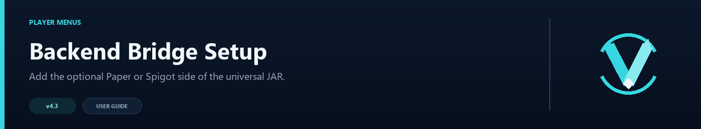

# Backend Bridge Configuration



The backend bridge is optional. Install it when you want a Java inventory selector or when a backend should announce itself through Redis. Velocity still makes every routing decision.

## Install and verify

1. Put the same `VelocityNavigator-4.3.0.jar` on the Velocity proxy and the backend's `plugins/` directory.
2. Start the backend once to create `plugins/VelocityNavigator/config.yml`.
3. Join that backend through the proxy once.
4. On the proxy, run `/vn bridge status` and confirm the backend is listed.

The backend must run Java 17 or newer. The bridge is built against the Spigot 1.16.5 API and uses no version-specific NMS.

## Core settings

```yaml
enabled: true
inventory_menu_enabled: true
handshake_enabled: true
refresh_enabled: true
handshake_delay_ticks: 20
max_title_length: 32
fallback_material: COMPASS
```

| Key | Default | Meaning |
|---|---:|---|
| `enabled` | `true` | Enables the backend bridge. Disable it when this backend never renders the Java selector. |
| `inventory_menu_enabled` | `true` | Allows the proxy to open inventory menus on this backend. |
| `handshake_enabled` | `true` | Reports bridge availability to the proxy; leave enabled for `/vn bridge status`. |
| `refresh_enabled` | `true` | Accepts menu refresh and page-navigation messages. |
| `handshake_delay_ticks` | `20` | Delay before the bridge announces itself after a player joins. |
| `max_title_length` | `32` | Maximum inventory title length accepted by the bridge. |
| `fallback_material` | `COMPASS` | Material used when a requested menu material is unavailable. |

The Velocity-side `routing.use_menu_for_lobby`, `routing.java_menu.type`, and `routing.java_menu.fallback_to_chat` settings decide whether a player is offered the inventory selector. `gui.toml` on the proxy controls layout, slot overrides, icons, and refresh timing.

## Which files belong on which server

The universal JAR runs in two modes, but its configuration is not shared automatically:

| Location | Files to edit |
|---|---|
| Velocity proxy | `plugins/velocitynavigator/navigator.toml`, `messages.toml`, `gui.toml`, and `servers.toml` |
| Paper or Spigot backend | `plugins/VelocityNavigator/config.yml` |

Keep menu text, colors, rows, icons, and per-server slot overrides on the proxy. The backend's `config.yml` only controls bridge safety limits, the handshake, backend telemetry, and optional Redis registration. Do not copy `navigator.toml` or `gui.toml` into a backend plugin folder; the bridge does not read them.

## Backend telemetry

```yaml
bstats_enabled: true
bstats_plugin_id: 0
```

Backend telemetry is independent from the Velocity bStats project. Set `bstats_plugin_id` to the official Bukkit/Spigot project ID only after it is assigned. Leave it at `0`, or set `bstats_enabled: false`, to disable backend telemetry.

## Optional Redis registration

```yaml
redis:
  enabled: false
  host: 127.0.0.1
  port: 6379
  username: ''
  password: ''
  ssl: false
  channel_prefix: vn
  connect_timeout_ms: 3000
  read_timeout_ms: 10000
  registration_secret: ''
  server_name: ''
  advertised_host: ''
  advertised_port: 0
  group: default
  max_players: -1
  weight: 1
  unregister_on_shutdown: true
```

Set `enabled: true` only when the Velocity proxy also enables Redis. `registration_secret` must exactly match the proxy’s secret. `server_name` must be unique; `advertised_host` must be reachable by every proxy and permitted by each proxy’s `allowed_registration_hosts`. An `advertised_port` of `0` uses the Bukkit server port.

Keep Redis private, use TLS outside trusted networks, and configure both a secret and allowlist on every proxy. Redis registration is runtime-only; use `/vn server add lobby` when the server must also be written to `velocity.toml` and `servers.toml`.

## Troubleshooting

- **Chat fallback opens:** confirm this backend has the JAR, a player has visited it, and `/vn bridge status` sees it.
- **Menu opens but clicks do nothing:** allow the `velocitynavigator:menu` plugin channel and keep the player on the backend that opened the menu.
- **Redis registration is rejected:** compare secret, timestamp, host allowlist, advertised host/port, and server name; run `/vn redis status` and `/vn redis test` on the proxy.
- **Material/title problems:** use the proxy’s `gui.toml`; the bridge applies `fallback_material` and `max_title_length` only as safe backend limits.
