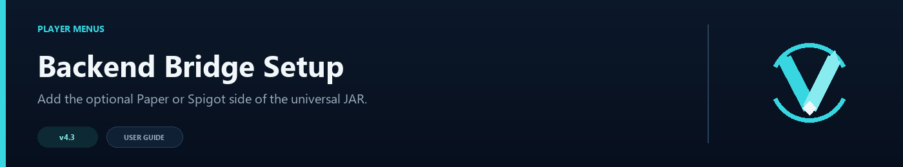

# Backend Bridge Configuration



The backend bridge is the backend half of the same VelocityNavigator JAR. Install it when you want Java inventory selectors, backend YAML menus, NPCs, PlaceholderAPI values, or Redis server registration. Routing decisions still happen on Velocity.

You do not need the bridge for a proxy-only setup or for the clickable chat selector.

## Install it

1. Stop the proxy and backend.
2. Put the same VelocityNavigator JAR in the proxy's `plugins/` folder and the backend's `plugins/` folder.
3. Start the backend, then start Velocity.
4. Join the backend through Velocity.
5. Run `/vn bridge status` on the proxy.

The backend should appear as available after a player joins it. If it does not, check both consoles for plugin-channel or startup errors.

The bridge supports Paper, Spigot, and Folia 1.16.5 or newer and requires Java 17 or newer. It does not use version-specific NMS.

## Default backend config

The backend creates `plugins/VelocityNavigator/config.yml`:

```yaml
enabled: true
inventory_menu_enabled: true
handshake_enabled: true
refresh_enabled: true
handshake_delay_ticks: 20
max_title_length: 32
fallback_material: COMPASS
menus_enabled: true
npcs_enabled: true
npc_look_interval_ticks: 20
bstats_enabled: true
update_check_enabled: true
update_check_interval_minutes: 120
```

| Key | What it controls |
|---|---|
| `enabled` | Enables the backend plugin |
| `inventory_menu_enabled` | Allows the proxy to open its Java inventory selector |
| `handshake_enabled` | Reports bridge availability to `/vn bridge status` |
| `refresh_enabled` | Accepts selector refresh and page actions |
| `handshake_delay_ticks` | Delay before the bridge announces itself after join |
| `max_title_length` | Safe maximum for inventory titles |
| `fallback_material` | Item used when a configured material is unavailable |
| `menus_enabled` | Enables backend YAML menus in `menus/*.yml` |
| `npcs_enabled` | Enables NPC files in `npcs/*.yml` |
| `npc_look_interval_ticks` | Delay between NPC head-tracking checks |
| `update_check_enabled` | Enables the backend Modrinth update check |
| `update_check_interval_minutes` | Delay between update checks, with a minimum of 30 |

The proxy's `navigator.toml` decides whether players use an inventory or chat selector. Its `gui.toml` controls that selector's layout, slots, icons, and refresh timing.

## Keep the files in the right place

| Location | Files to edit |
|---|---|
| Velocity proxy | `plugins/velocitynavigator/navigator.toml`, `messages.toml`, `gui.toml`, and `servers.toml` |
| Paper, Spigot, or Folia backend | `plugins/VelocityNavigator/config.yml`, `menus/*.yml`, and `npcs/*.yml` |

Do not copy `navigator.toml`, `messages.toml`, or `gui.toml` into the backend plugin folder. Backend YAML menus and NPCs have their own formats; see [Backend Menus](Backend-Menus) and [Backend NPCs](Backend-NPCs).

## Backend bStats

```yaml
bstats_enabled: true
```

The backend bridge and proxy have separate anonymous bStats reports. The Bukkit project ID is built into the plugin. Set `bstats_enabled: false` here if you do not want the backend report.

Do not add `bstats_plugin_id`. Old copies of that setting are removed during migration.

## Optional Redis registration

Most networks can leave this disabled. It is for backends that announce themselves dynamically to Redis:

```yaml
redis:
  enabled: false
  host: 127.0.0.1
  port: 6379
  username: ''
  password: ''
  ssl: false
  channel_prefix: vn
  connect_timeout_ms: 3000
  read_timeout_ms: 10000
  registration_secret: ''
  server_name: ''
  advertised_host: ''
  advertised_port: 0
  group: default
  max_players: -1
  weight: 1
  unregister_on_shutdown: true
```

Only enable this when proxy-side Redis registration is also enabled. Match `registration_secret` exactly, give every backend a unique `server_name`, and use an `advertised_host` the proxy can reach. `advertised_port: 0` uses the backend's normal server port.

Keep Redis private. Use TLS when traffic leaves a trusted network, and configure the proxy's registration secret and host allowlist before accepting backend announcements.

## Troubleshooting

- **The selector falls back to chat:** Confirm the backend has the JAR, a player joined it through Velocity, and `/vn bridge status` sees it.
- **Menu opens but clicks do nothing:** Keep the player on the backend that opened the menu and check the `velocitynavigator:menu` plugin channel.
- **NPCs do not appear:** Check `npcs_enabled`, then inspect the backend log for a rejected NPC file.
- **Placeholder returns nothing:** Install PlaceholderAPI on that backend and reconnect through the proxy.
- **Redis registration is rejected:** Compare the secret, host allowlist, advertised address, port, and server name. Run `/vn redis status` and `/vn redis test` on the proxy.
- **Material or title problems:** Edit the proxy's `gui.toml`. The bridge settings are only backend safety limits.
