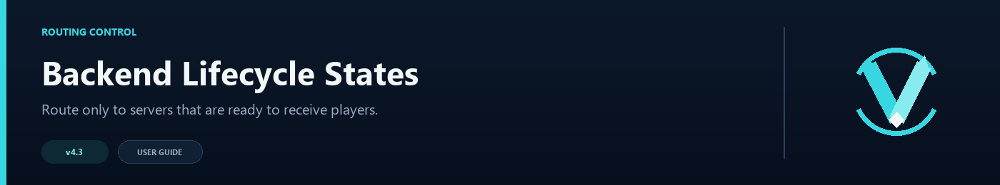

# Backend Lifecycle States



A server can be online without being ready for new players. Lifecycle states let a backend advertise whether it is waiting, in a lobby, starting a match, or already in game, and the router can accept only the states you choose.

## Configure allowed states

```toml
[backend_states]
enabled = true
allowed = ["LOBBY", "WAITING", "AVAILABLE"]
allow_unknown = true
```

State names are case-insensitive. You may use your own names as long as the backend and the `allowed` list agree.

## Advertise a state

Add a marker to the backend's MOTD:

```text
[STATE:LOBBY]
```

VelocityNavigator reads the marker during its normal backend ping. For example, a minigame server could switch between these MOTDs:

```text
[STATE:WAITING] Bed Wars
[STATE:IN_GAME] Bed Wars
```

With only `WAITING` allowed, the server stops receiving routed players as soon as its MOTD changes to `IN_GAME`.

## Unknown states

`allow_unknown = true` keeps servers with no state marker eligible. This is the easiest choice while introducing markers gradually.

Set it to `false` only after every routed backend reliably publishes a marker. A server with no marker will then be excluded even if its ping succeeds.

## Checking the result

Use `/vn health` to review backend health and detected states. If a state does not appear:

- confirm the marker is in the server-list MOTD, not a join message;
- keep the exact `[STATE:name]` format;
- wait for the next health check or reload the plugin;
- make sure the state is present in `allowed`.

When Redis is enabled, detected backend states are shared with the other Velocity proxies.
