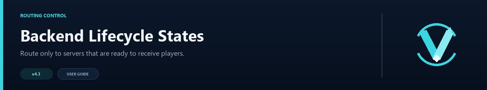

# Backend Lifecycle States



You use backend lifecycle states to advertise whether a server is waiting, in a lobby, starting a match, or in game. You configure the router to accept only chosen states.

## Configure allowed states

```toml
[backend_states]
enabled = true
allowed = ["LOBBY", "WAITING", "AVAILABLE"]
allow_unknown = true
```

You use case-insensitive state names. You configure custom names by matching the backend and the `allowed` list.

## Advertise a state

Add a marker to the backend's server-list MOTD:

```text
[STATE:LOBBY]
```

You configure the proxy to read the marker during the backend ping. You rotate a minigame server between MOTDs:

```text
[STATE:WAITING] Bed Wars
[STATE:IN_GAME] Bed Wars
```

You stop the server from receiving routed players when its MOTD changes to `IN_GAME` if you only allow `WAITING`.

## Unknown states

You keep servers with no state marker eligible using `allow_unknown = true`.

You set it to `false` after every routed backend publishes a marker. You exclude servers without a marker even if they ping successfully.

## Maintenance state interaction

You exclude a server in maintenance from routing before the lifecycle state check runs. You show the maintenance reason to players. You configure lifecycle state and maintenance state as independent flags.

## Checking the result

Use `/vn health` to review backend health and detected states. If a state does not appear:

- confirm the marker is in the server-list MOTD, not a join message;
- keep the exact `[STATE:name]` format;
- wait for the next health check or reload the plugin;
- confirm the state is present in `allowed`.

When Redis is enabled, detected backend states are shared with the other Velocity proxies.
