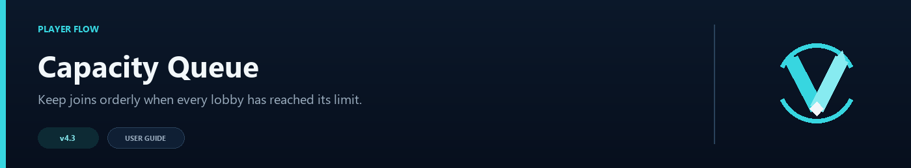

# Capacity Queue



The queue is used when every suitable lobby is full. Players see their position and are connected automatically when a slot opens.

## Before enabling it

Every lobby in the pool must have a finite `max_players` value. An uncapped lobby means the pool is never considered full, so the queue will not start.

Example lobby entries:

```toml
[routing]
default_lobbies = [
  { server = "lobby-1", max_players = 100 },
  { server = "lobby-2", max_players = 100 },
]
```

## Queue settings

```toml
[queue]
enabled = true
poll_seconds = 2
notify_seconds = 5
max_size = 500
holding_server = "holding"
command = "queue"
permission = "none"
```

- `poll_seconds` controls how often VelocityNavigator looks for space.
- `notify_seconds` controls position updates.
- `max_size` prevents an unlimited queue.
- `holding_server` is optional and is mainly useful when a player's first proxy connection arrives while every lobby is full.

## Holding server

VelocityNavigator does not create a holding server, generate a world, or modify a map. `holding_server` is only the name of an existing backend that you create and register in Velocity.

That leaves the waiting experience entirely up to you. It can be a small void room, a dirt platform, a parkour map, or a fully designed waiting lobby with scoreboards, holograms, NPCs, music, and other backend plugins. Queue membership and commands are handled by Velocity, so the holding backend does not need the VelocityNavigator JAR unless you also want its Java inventory bridge there.

Register the backend like any other Velocity server:

```toml
# velocity.toml
[servers]
lobby-1 = "127.0.0.1:25566"
lobby-2 = "127.0.0.1:25567"
queue-holding = "127.0.0.1:25568"
try = ["lobby-1"]
```

Then use the same name in `navigator.toml`:

```toml
[queue]
holding_server = "queue-holding"
```

Use a separate backend for `queue-holding` and do not include it in `default_lobbies` or a contextual routing group. It is a waiting room, not a possible lobby destination. Configure forwarding and protect its backend port in the same way as your other Velocity servers.

The holding server's own player limit must be large enough for the expected queue. If `queue.max_size = 500`, the backend must be able to accept that many waiting players or you should choose a smaller queue limit. Leave some additional capacity for staff and reconnects.

If `holding_server` is blank, players who are already on another backend can still wait there. A brand-new connection follows the normal no-lobby behavior instead of being sent to a holding server.

## What a joining player sees

A player is not left on Minecraft's dirt loading screen. When every suitable lobby is full, Velocity connects a new player to `holding_server`, adds them to the queue, and shows their position in the action bar.

The dirt screen is visible only during the normal connection or transfer. After that, the player sees the world you created on the holding backend. When a lobby has space, VelocityNavigator sends the connecting message, removes the player from the queue, and transfers them automatically.

If the queue reaches `max_size`, the player receives the configured queue-full message and is not assigned a position. If they already reached the holding backend, they remain there until another command or plugin sends them elsewhere.

## Player commands

| Command | Purpose |
|---|---|
| `/queue` | Show the current queue position |
| `/queue leave` | Leave the queue without disconnecting |

Position updates appear in the action bar. When a lobby has room, VelocityNavigator removes the player from the queue and starts the connection.

`/queue leave` removes only the queue entry. It does not guess where the player should go, so a player using it on the holding server remains in that world. Provide an exit command, NPC, portal, or another server destination if players need somewhere else to go.

## Multi-proxy networks

Queue positions are local to one proxy and are not shared through Redis. Use proxy affinity at your external load balancer so a reconnecting player returns to the same Velocity node.

## Troubleshooting

- **Queue never starts:** check that every lobby has `max_players` and that all candidates are actually full.
- **Holding server validation fails:** register it in Velocity and remove it from all lobby pools.
- **Players remain queued after space opens:** use `/vn servers` to confirm the proxy sees the new player count and healthy state.
- **The queue command conflicts:** choose another `command` value and run `/vn config validate`.

Queue messages are in `messages.toml`; see [Language Packs](Language-Packs).
