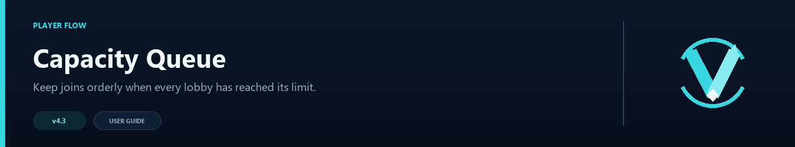

# Capacity Queue



The queue starts when every suitable lobby is full. Waiting players see their position and move automatically when a slot becomes available.

## Quick setup

First, give every lobby in the pool a finite `max_players` value. An uncapped lobby can never be considered full, so the queue will never start.

In `plugins/velocitynavigator/navigator.toml`:

```toml
[routing]
default_lobbies = [
  { server = "lobby-1", max_players = 100 },
  { server = "lobby-2", max_players = 100 },
]

[queue]
enabled = true
poll_seconds = 2
notify_seconds = 5
max_size = 500
holding_server = "holding"
command = "queue"
permission = "none"
```

Register a real backend named `holding` in `velocity.toml`, then run:

```text
/vn config validate
/vn reload
```

To test it, fill both lobbies to their configured limits and connect another player. That player should enter `holding`, receive position updates, and move to a lobby when one slot opens.

`poll_seconds` controls how often the proxy checks for space. `notify_seconds` controls position updates, and `max_size` limits how many players may wait.

## Set up the holding server

VelocityNavigator does not create the holding server, its world, or its map. `holding_server` must be the name of an existing backend registered in Velocity.

Example:

```toml
# velocity.toml
[servers]
lobby-1 = "127.0.0.1:25566"
lobby-2 = "127.0.0.1:25567"
holding = "127.0.0.1:25568"
try = ["lobby-1"]
```

The waiting area can be a simple room, parkour map, or full lobby with scoreboards and NPCs. It only needs the VelocityNavigator JAR if you want bridge features such as backend menus, NPCs, or PlaceholderAPI there.

Keep `holding` out of `default_lobbies` and contextual routing groups. Protect its backend port and configure player forwarding exactly like your other Velocity backends.

Make its player limit large enough for the expected queue. If `queue.max_size = 500`, it must accept roughly that many waiting players, plus room for staff and reconnects.

If `holding_server` is blank, players who are already online wait on their current backend. New connections are not sent to a dedicated waiting server.

## What players see

When all eligible lobbies are full, a new player is sent to `holding`, added to the queue, and shown their position in the action bar. A normal Minecraft connection screen can appear briefly during the transfer.

When space opens, VelocityNavigator removes the first eligible player from the queue and sends them to a lobby.

If the queue reaches `max_size`, the player receives the queue-full message and is not added. If they are already on the holding backend, they stay there until a command or another plugin moves them.

## Player commands

| Command | Purpose |
|---|---|
| `/queue` | Show the current position |
| `/queue leave` | Leave the queue without disconnecting |

`/queue leave` removes the queue entry but does not move the player. Add an exit NPC, portal, or another server command if players need a way out of the holding area.

## If you run more than one proxy

Queue positions live in one proxy's memory. Redis does not share them. Use proxy affinity at your external load balancer so reconnecting players return to the same Velocity instance.

## Troubleshooting

- **Queue never starts:** Verify every eligible lobby has a finite `max_players` value and is actually full.
- **Holding server validation fails:** Register it in Velocity and remove it from every lobby pool.
- **Players remain queued after space opens:** Run `/vn servers` and confirm the proxy sees the new player count and a healthy lobby.
- **The queue command conflicts:** Choose another `command` value and run `/vn config validate`.

Queue messages live in `messages.toml`. See [Language Packs](Language-Packs) if you want to translate them.
