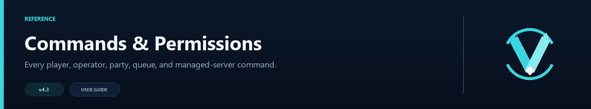

# Commands and Permissions

VelocityNavigator separates normal player commands from operator commands. The examples below use the default names; lobby, admin, party, party-chat, and queue command names can all be changed in `navigator.toml`.

## Player routing

| Command | What it does |
|---|---|
| `/lobby` | Chooses a suitable lobby and connects the player |
| `/hub`, `/spawn` | Default aliases for `/lobby` |
| `/lobby menu` | Opens the configured inventory, Bedrock form, or chat selector |

The player command permission is configured by `commands.permission`. Its default value is `none`, which allows everyone. `velocitynavigator.bypass.cooldown` skips the lobby-command cooldown; the older `velocitynavigator.bypasscooldown` node is also accepted for compatibility.

## Parties

| Command | What it does |
|---|---|
| `/party invite <player>` | Sends a party invitation |
| `/party accept` or `/party deny` | Answers the latest valid invitation |
| `/party status` or `/party list` | Shows members and the leader |
| `/party kick <player>` | Removes a member; leader only |
| `/party leave` | Leaves the party |
| `/party disband` | Disbands the party; leader only |
| `/party chat <message>` | Sends a private party message |
| `/p <message>` | Default shortcut for party chat |

Party access uses `party.permission`. The default is `none`. See [Party System](Party-System) for limits and multi-proxy behavior.

## Capacity queue

| Command | What it does |
|---|---|
| `/queue` | Shows the player's current position |
| `/queue leave` | Leaves the queue |

Queue access uses `queue.permission`, which also defaults to `none`. See [Capacity Queue](Capacity-Queue) for the conditions that start a queue.

## Operator overview

All `/vn` and `/velocitynavigator` commands require `velocitynavigator.admin`.

| Command | What it shows or changes |
|---|---|
| `/vn status` | Version, routing mode, configured features, circuit summary, drains, and routing distribution |
| `/vn health` | Aggregate cache, circuit, affinity, party, queue, Redis, backend-state, and managed-lobby diagnostics |
| `/vn servers [page]` | Per-lobby online state, players, capacity, drain state, and circuit state |
| `/vn debug player <name>` | Previews the route the named online player would receive |
| `/vn debug server <name>` | Inspects one registered server's health and circuit information |
| `/vn version` | Shows installed and latest allowed remote version information |
| `/vn updatecheck` | Checks Modrinth immediately using the configured release channel |
| `/vn help` | Shows the in-game command reference |

## Maintenance and configuration

| Command | What it does |
|---|---|
| `/vn drain <server>` | Stops new routes to a server without moving current players |
| `/vn undrain <server>` | Returns the server to routing |
| `/vn drain status` | Lists drained servers |
| `/vn reload` | Reloads `navigator.toml`, `messages.toml`, `gui.toml`, and managed lobbies from `servers.toml` |
| `/vn config validate` | Checks command conflicts, ports, Redis safety, queue requirements, and managed files |
| `/vn menu validate` | Audits selector server IDs, duplicate display names, Java slots, material-identifier syntax, and `{...}` placeholders |

Drain state is saved across proxy restarts. See [Operations Runbook](Operations-Runbook) for a maintenance workflow.

`/vn menu validate` is read-only. Use it after editing `gui.toml` to catch menu-specific mistakes before players open a selector. `/vn config validate` remains the broader configuration and network-safety check; one command does not replace the other.

## Managed servers

| Command | What it does |
|---|---|
| `/vn server add game <name> <host:port>` | Adds a Velocity game backend without adding it to lobby routing |
| `/vn server add lobby <name> <host:port> [group] [max_players] [weight]` | Adds a Velocity backend and an active lobby-routing entry |
| `/vn server dry-run <game|lobby> <name> <host:port> [group] [max_players] [weight]` | Validates the operation without changing files or runtime state |
| `/vn server remove <name>` | Removes a game or lobby from managed configuration and runtime registration |
| `/vn server list` | Lists command-managed lobbies and the active Velocity config path |

The complete behavior, file changes, examples, backups, and overwrite rules are in [Server Management](Server-Management).

## Integrations

| Command | What it does |
|---|---|
| `/vn bridge status` | Shows Paper/Spigot GUI bridges detected after player visits |
| `/vn redis status` | Shows connection state, counters, reconnects, and rejected registrations |
| `/vn redis test` | Tests the Redis endpoint, TLS, authentication, and `PING` |
| `/vn setup grafana` | Writes `grafana-dashboard.json` in the plugin directory |

## Changing command names

The relevant settings are:

- `commands.primary`, `commands.aliases`, and `commands.admin_aliases`
- `party.command` and `party.chat_command`
- `queue.command`

Run `/vn config validate` after renaming them. A name cannot be shared by two VelocityNavigator commands, and another proxy plugin may already own the name.
