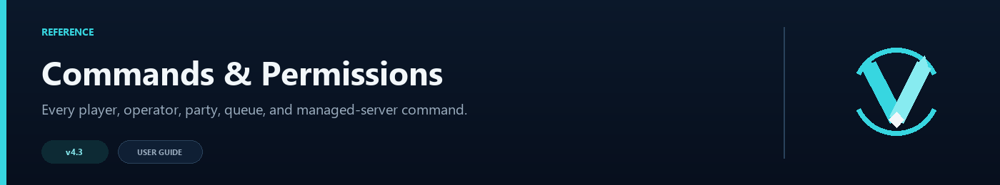

# Commands and Permissions

VelocityNavigator separates player commands from operator commands. Every example below uses the default names; lobby, admin, party, party-chat, and queue command names can all be changed in `navigator.toml`.

## Player routing

| Command | What it does |
|---|---|
| `/lobby` | Picks a suitable lobby and connects the player |
| `/hub`, `/spawn` | Default aliases for the lobby command |
| `/lobby menu` | Opens the configured inventory, Bedrock form, or chat selector |

The player command permission is `commands.permission`. The default value is `none`, which allows everyone. `velocitynavigator.bypass.cooldown` skips the lobby-command cooldown; the legacy `velocitynavigator.bypasscooldown` node is accepted for compatibility.

## Parties

| Command | What it does |
|---|---|
| `/party invite <player>` | Sends a party invitation |
| `/party accept` or `/party deny` | Answers the latest valid invitation |
| `/party status` or `/party list` | Shows party name, open status, leader, and members |
| `/party rename <name>` | Renames party (supports color codes like `&a` / MiniMessage) |
| `/party open` / `/party close` | Toggles open join vs invite-only mode |
| `/party join <leader>` | Joins an open party |
| `/party promote <player>` | Promotes member role or transfers leadership |
| `/party demote <player>` | Demotes an officer to member |
| `/party menu` | Opens the interactive party management GUI (Bedrock form or Java chat status) |
| `/party warp` | Routes all party members to leader's server immediately |
| `/party kick <player>` | Removes a member (leader only) |
| `/party leave` | Leaves the party |
| `/party disband` | Disbands the party (leader only) |
| `/party chat <message>` | Sends a private party message |
| `/p <message>` | Default shortcut for party chat |

Party access uses `party.permission`. The default is `none`. If `/party accept` is run by a player who is already in a different party, the response is `party.already_in_party` rather than `party.no_invite`. See [Party System](Party-System) for limits and multi-proxy behavior.

### NPC & Menu Permissions
- `velocitynavigator.use` — Required for players to click/interact with backend NPCs and open backend selector menus for themselves via `/vnavmenu open` (default: granted to all players).
- `velocitynavigator.admin` — Required for administrative operations, including opening menus for other target players (`/vnavmenu open <player>`), listing menus (`/vnavmenu list`), modifying menu attributes (`add`, `remove`, `title`, `rows`), reloading menus (`/vnavmenu reload`), and managing NPCs (`/vnavnpc`).

## Capacity queue

| Command | What it does |
|---|---|
| `/queue` | Shows the player's current position |
| `/queue leave` | Leaves the queue |

Queue access uses `queue.permission`, which also defaults to `none`. See [Capacity Queue](Capacity-Queue) for the conditions that start a queue.

## Player Authentication

These proxy commands are registered only when `[auth].enabled = true`:

| Command | What it does |
|---|---|
| `/register <password> [repeat]` | Creates the player's password record |
| `/login <password>` | Authenticates the player and routes them out of the holding server |
| `/logout` | Ends the session and returns the player to the holding server |

Unauthenticated players can use the auth commands but cannot bypass the holding server through lobby, party, party-chat, queue, or `/vn` commands. See [Authentication and Security](Authentication-and-Security).

## Operator overview

All `/vn` and `/velocitynavigator` commands require `velocitynavigator.admin`.

| Command | What it shows or changes |
|---|---|
| `/vn status` | Version, routing mode, configured features, circuit summary, drains, and routing distribution |
| `/vn health` | Aggregate cache, circuit, affinity, party, queue, Redis, backend-state, maintenance, and managed-lobby diagnostics |
| `/vn servers [page]` | Per-lobby online state, players, capacity, drain, and circuit state |
| `/vn debug player <name>` | Previews the route the named online player would receive |
| `/vn debug server <name>` | Inspects one registered server's health and circuit information |
| `/vn version` | Shows installed and latest allowed remote version |
| `/vn updatecheck` | Checks Modrinth immediately through the configured release channel |
| `/vn help` | Shows the in-game command reference |

## Maintenance, configuration, and storage

| Command | What it does |
|---|---|
| `/vn drain <server>` | Stops new routes to a server without moving current players |
| `/vn undrain <server>` | Returns the server to routing |
| `/vn drain status` | Lists drained servers |
| `/vn maintenance status` | Shows global and per-server maintenance state |
| `/vn maintenance global on [reason...]` | Replaces the MOTD, rejects new joins, and disconnects existing players with a reason |
| `/vn maintenance off` | Ends global maintenance |
| `/vn maintenance <server> on [reason...]` | Removes one server from routing and moves its players to eligible backends |
| `/vn maintenance <server> off` | Clears maintenance for one server |
| `/vn reload` | Reloads `navigator.toml`, `messages.toml`, `gui.toml`, and `servers.toml` |
| `/vn config validate` | Checks command collisions, ports, Redis safety, queue requirements, auth holding servers, and managed-file paths |
| `/vn menu validate` | Audits selector server IDs, duplicate display names, Java slots, material-identifier syntax, and `{...}` placeholders |
| `/vn affinity clean` | Clears all cached player affinity (sticky session) records |
| `/vn motd reload` | Reloads `motd.toml` |
| `/vn motd list` | Lists normal server-list MOTDs |
| `/vn motd add <text...>` | Adds a normal MOTD |
| `/vn motd remove <index>` | Removes a normal MOTD |
| `/vn motd setmode <ROTATING\|SEQUENTIAL\|RANDOM>` | Changes the MOTD selection mode |

Drain state is in-memory only and does not persist across proxy restarts. See [Maintenance Mode](Maintenance-Mode) and [Operations Runbook](Operations-Runbook) for maintenance workflows.

`/vn menu validate` is read-only. Use it after editing `gui.toml` to catch menu-specific mistakes before players open a selector. `/vn config validate` remains the broader configuration and network-safety check; the two commands do not replace each other.

## Managed servers

| Command | What it does |
|---|---|
| `/vn server add game <name> <host:port>` | Adds a Velocity game backend without adding it to lobby routing |
| `/vn server add lobby <name> <host:port> [group] [max_players] [weight]` | Adds a Velocity backend and an active lobby-routing entry |
| `/vn server dry-run <game\|lobby> <name> <host:port> [group] [max_players] [weight]` | Validates the operation without changing files or runtime state |
| `/vn server remove <name>` | Removes a game or lobby from managed configuration and runtime registration |
| `/vn server list` | Lists command-managed lobbies and the active Velocity config path |

The full behavior, file changes, backup rules, and overwrite handling live in [Server Management](Server-Management).

## Integrations

| Command | What it does |
|---|---|
| `/vn bridge status` | Reports the Paper/Spigot GUI bridges detected after a player visit |
| `/vn redis status` | Reports connection state, traffic counters, reconnects, and rejected registrations |
| `/vn redis test` | Tests the Redis endpoint, TLS, authentication, and `PING` |
| `/vn setup grafana` | Writes `grafana-dashboard.json` under the plugin directory |

## Native Backend NPC Spawner

When `VelocityNavigator.jar` is placed on backend Paper/Spigot/Folia lobby servers, native NPC server selectors can be managed directly without third-party plugins. See [Backend NPCs](Backend-NPCs) for the full guide. `/vn` is reserved for Velocity proxy administration; use `/vnavnpc` directly or `/vnav npc` on a backend. `delete` is accepted as an alias for `remove`.

| Command | What it does |
|---|---|
| `/vnavnpc create <id> [display name...]` | Spawns a native NPC at your location; configure its click behavior separately |
| `/vnavnpc action <id> <server\|menu\|command\|none> [value...]` | Sets or clears the normal click action |
| `/vnavnpc skin [id] [skinUsername]` | Updates the skin texture of an NPC (defaults to your skin and the nearest NPC) |
| `/vnavnpc move [id]` | Moves an NPC to your current location (nearest NPC within 5 blocks when omitted) |
| `/vnavnpc sneak <id> <target\|none>` | Sets or clears the sneak-click alternative action |
| `/vnavnpc hand <id> <material\|none>` | Sets or clears the item in the NPC's main hand |
| `/vnavnpc offhand <id> <material\|none>` | Sets or clears the item in the NPC's offhand |
| `/vnavnpc title <id> set <lineIndex> <text...>` | Sets title line by index (`0` = lowest line right above head, `1` = line above `0`) |
| `/vnavnpc title <id> add <text...>` | Appends a new top title line to the NPC hologram stack |
| `/vnavnpc title <id> remove <lineIndex>` | Removes a specific title line index from the hologram stack |
| `/vnavnpc title <id> clear` | Clears all hologram title lines for an NPC |
| `/vnavnpc toggle lookatplayer <id> [true\|false]` | Toggles head tracking rotation towards nearby players |
| `/vnavnpc remove [id]` | Despawns and removes an NPC (nearest NPC within 5 blocks when omitted) |
| `/vnavnpc list` | Lists all registered backend NPCs and their target servers |
| `/vnavnpc tp [id]` | Teleports you to the specified NPC (nearest NPC within 5 blocks when omitted) |
| `/vnavnpc reload` | Reloads NPC definitions from `npcs/*.yml` |

## Backend YAML Menu Builder

When `VelocityNavigator.jar` is placed on backend Paper/Spigot/Folia lobby servers, YAML selector menus inside `plugins/VelocityNavigator/menus/*.yml` can be created, edited, and opened directly in-game. See [Backend YAML Menus](Backend-Menus) for a complete working file:

| Command | What it does |
|---|---|
| `/vnavmenu open [player] [menu_name]` | Opens a specific backend YAML selector menu (defaults to `main`) |
| `/vnavmenu add <menu_name> <slot> <target> <material> <name> [lore...]` | Adds or replaces a menu slot item (supports `bedwars-1`, `menu:games`, `cmd:/spawn`) |
| `/vnavmenu remove <menu_name> <slot>` | Removes a menu item by inventory slot |
| `/vnavmenu title <menu_name> <title...>` | Updates the GUI inventory title for a menu |
| `/vnavmenu rows <menu_name> <2-6>` | Sets the inventory row count (27 to 54 slots) |
| `/vnavmenu list` | Lists all registered backend YAML selector menus |
| `/vnavmenu reload` | Reloads all menu configurations from `menus/*.yml` |

## Party PlaceholderAPI Values

Install PlaceholderAPI and the VelocityNavigator JAR on each backend where scoreboards, TAB, chat, holograms, or menus need party data. Join through Velocity so the proxy can synchronize the player's current party state.

| Placeholder | Value |
|---|---|
| `%velocitynavigator_party_in_party%` | `true` or `false` |
| `%velocitynavigator_party_name%` | Party name, or `None` when the player has no party |
| `%velocitynavigator_party_leader%` | Leader name |
| `%velocitynavigator_party_size%` | Current member count |
| `%velocitynavigator_party_max_size%` | Configured party limit |
| `%velocitynavigator_party_is_leader%` | Whether the player is the leader |
| `%velocitynavigator_party_role%` | `Leader`, `Officer`, or `Member` |
| `%velocitynavigator_party_is_open%` | Whether public joining is enabled |
| `%velocitynavigator_party_members%` | Comma-separated member names |

Use `/party create [name...]` to create a solo party for testing, then run `/papi parse me %velocitynavigator_party_name%` on the backend. `None` is the expected value before a party exists.

## Changing command names

The relevant settings are:

- `commands.primary`, `commands.aliases`, and `commands.admin_aliases`
- `party.command` and `party.chat_command`
- `queue.command`

Run `/vn config validate` after renaming any of them. A name cannot be shared by two VelocityNavigator commands, and another proxy plugin may already own the name.
