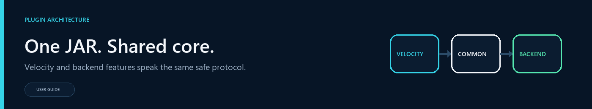

# Common Core Architecture

The same JAR runs as a Velocity proxy plugin and a Paper/Spigot backend bridge. Seven classes live in the `common/` package because they are deliberately side-neutral and can load on either side without classpath conflicts.

## What lives in `common/`

The `common/` package contains seven classes:

| Class | Responsibility | Public surface |
|---|---|---|
| `common/Clock` | Injectable time source used by code that needs deterministic tests | `now`, `millis`, `SYSTEM` |
| `common/RedisRegistrationSigner` | HMAC-SHA256 signing of dynamic-registration payloads | `static String sign(JsonObject payload, String secret)` |
| `common/MenuBridgeProtocol` | Wire-format RESP-ish DTOs (`MenuItem`, `OpenMenu`, `Selection`, `Hello`, `PartyState`, `AuthRequest`) + size-capped encoder/decoder | `encodeOpen/decodeOpen`, `encodeSelection/decodeSelection`, `encodeHello/decodeHello`, `encodePartyState/decodePartyState`, `encodeAuthRequest/decodeAuthRequest`, `packetType` |
| `common/RedisTransport` | Pure RESP wire primitives: connect/authenticate/writeCommand/readResponse + safety caps | `CONNECT_MAX_RESP_LINE_BYTES`, `MAX_RESP_BULK_BYTES`, `MAX_RESP_ARRAY_LENGTH`, `MAX_RESP_NESTING_DEPTH`, `MAX_RESP_FRAME_BYTES`, `ConnectionSettings`, `connect`, `authenticate`, `writeCommand`, `readResponse` |
| `common/RedisSecurityUtils` | Pure validation: HMAC delegation, timestamp freshness window, allowlisted-host matcher | `sign`, `fresh`, `hostAllowed` |
| `common/ModrinthClient` | Data-only Modrinth primitives: URL constant, User-Agent helper, VersionType enum, row parser, best-version selector | `API_URL`, `DOWNLOAD_URL`, `VersionType.fromString`, `ModrinthRelease`, `userAgent`, `parseRelease`, `bestVersionIn` |
| `common/SemanticVersion` | Version parsing, prerelease detection, and ordering | `parse`, `isPrerelease`, `compareTo` |

## Why these classes live here

`common/` enforces zero cross-side dependencies. No class uses `com.velocitypowered.*` or `org.bukkit.*`. Both runtime classpaths can load these types without error. Each side then thin-wraps the shared core and adds its own scheduler, logger, and threading.

| Side | Wraps common core from | Adds on top |
|---|---|---|
| Velocity proxy | `redis/RedisSyncService`, `observability/UpdateChecker` | subscription executor, Velocity `ScheduledTask`, SLF4J, `java.net.http.HttpClient`, bounded exponential backoff, channel filter, replay cache, host allowlist |
| Paper / Spigot backend | `bukkit/BackendRedisRegistration`, `bukkit/BackendUpdateChecker` | JUL `Logger`, `HttpURLConnection`, raw `Thread` + `ScheduledExecutorService`, unbounded-then-doubling backoff, release-only filter |

Both sides inspect the wire the same way because `RedisTransport.readResponse` returns the full RESP hierarchy (String for `+`, Long for `:`, String for `$`, `List<Object>` for `*`), and each side projects the response to whatever its caller needs (`Long` subscriber count for publish-reply, `List<?>` for subscription frames).

## When to extend

Add to `common/` only when:

- The class would otherwise be duplicated as a verbatim copy across both sides.
- Adding the class breaks no side-specific lifecycle expectations (no scheduler, no logger, no thread).
- Its public surface can be modeled with the JDK only (no Velocity or Bukkit imports).
- The semantic differences between sides fit cleanly into type parameters or caller-side predicates.

If a side has a unique semantic concern (e.g., the proxy policy-filters Modrinth rows by channel while the backend only checks `version_type == "release"`), keep the predicate at the call site and ship only the row-parse + version-compare + empty/Optional helpers in `common/`.

## When NOT to extend

Do not move into `common/`:

- Cross-side state with different lifetimes (the proxy holds a long-lived pub/sub socket; the backend holds a short-lived publish-only socket). Keep the lifecycle in the side-specific class.
- Lifecycle owners: `Executors`, `ScheduledTask`, threading decisions, `Logger` type wrappers. These are side-specific.
- Wire-format DTOs whose fields meaning differs across sides (e.g., the wire `token` is a session id, but the on-disk `name` is a persistence identity). Keep duplicated DTOs separate.
- Anything that would transitively drag in a Velocity or Bukkit dependency.

## Tests

Each common class is exercised by:

| Test class | Coverage |
|---|---|
| `MenuBridgeProtocolTest` | Tiny `MenuItem` round-trip + history compatibility (version 4.4.0) |
| `RedisProtocolTest` | RESP encode precision, parse safety caps (lines, bulk, array, nesting, frame), malformed lengths |
| `RedisSecurityTest` | Signature determinism, payload binding, host allowlist exact + wildcard rules, timestamp freshness window |
| `ModrinthClientTest` | `bestVersionIn` for null/empty/no-match/typed-mixed arrays, SemanticVersion-order correctness |

## Cross-references

- [Redis and Multi-Proxy](Redis-and-Multi-Proxy) — describes the proxy-side `RedisSyncService` subscriber loop that uses `RedisTransport` + `RedisSecurityUtils`.
- [Backend Bridge Configuration](Backend-Bridge-Configuration) — covers the backend-side `BackendRedisRegistration` that also uses `RedisTransport`.
- [Storage and Databases](Storage-and-Databases) — covers SQL affinity persistence that is independent of Redis.
- [NavigatorAPI](NavigatorAPI) — public plugin API for external Velocity plugins to inspect routing, health, config, and plugin metadata.
- [Troubleshooting Guide](Troubleshooting-Guide) — see *Redis will not connect* for `/vn redis test` instruction sequence.

## Configuration layer structure (4.5.0)

`ConfigManager` is the orchestration entry point at `config/ConfigManager.java`. Three helper classes keep writing, backups, and parse state separate:

| Class | Responsibility |
|---|---|
| `config/ConfigWriter` | Writes `navigator.toml` to disk using 22 focused section methods plus formatting helpers `quoted()`, `formatList()`, `formatLobbyEntryList()`, `padRight()` |
| `config/BackupUtils` | Legacy `.bak` file migration into `backups/` subfolder + per-base-name version backup pruning |
| `config/ParseState` | Collects parse warnings and a `normalized` flag during configuration loading |

All three are package-private (`final class`); external consumers access them indirectly through `ConfigManager`'s public methods. The TOML reader helpers (`readString`, `readBoolean`, `readInt`, `rawValue`, `stringValue`, `numberValue`, `booleanValue`, `listValue`, `nameOf`, `sectionOf`) remain in `ConfigManager` because they are called from `buildConfig`, `loadLanguage`, `loadGui`, `writeMessages`, and `writeGui`, all of which also live in `ConfigManager`.
