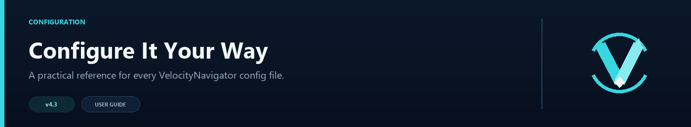

# VelocityNavigator Configuration Guide



VelocityNavigator splits its settings into a few focused files, so changing menu text does not mean digging through routing options. Start with `navigator.toml`; the other files can stay at their defaults until you need them.

## Overview

VelocityNavigator generates four proxy-side configuration files when server management is enabled:

- `navigator.toml` — routing, health, commands, integrations, and operational settings.
- `messages.toml` — server-wide language, player messages, routing reasons, and Java/Bedrock menu text.
- `gui.toml` — Java inventory layout, materials, refresh, controls, and per-server overrides.
- `servers.toml` — lobby entries created by `/vn server add lobby`; game servers are intentionally absent.

All four files are reloaded by `/vn reload`. Legacy text and Java-menu layout settings are migrated with `navigator.toml.pre-messages.bak` and `navigator.toml.pre-gui.bak` backups.

When the universal JAR is installed on a Paper/Spigot backend, it creates a separate backend `config.yml`. See [Backend Bridge Configuration](Backend-Bridge-Configuration) for that file; it is not reloaded by `/vn reload` on the proxy.

The operational file `navigator.toml` is organized into these sections:

1. `[commands]` — Player commands, aliases, permissions, cooldown
2. `[routing]` — Selection algorithm, lobby pool, and core routing behavior
3. `[circuit_breaker]` — Automatic failure detection
4. `[degradation]` — Fallback behavior when all health checks fail
5. `[routing.affinity]` — Player Affinity (Sticky Sessions) configuration
6. `[geo_routing]` — Deferred compatibility keys (no routing effect in 4.4.0)
7. `[routing.contextual]` — Context-aware routing groups
8. `[health_checks]` — Server monitoring configuration
9. `[update_checker]` — Update check settings
10. `[startup]` — First-run welcome and upgrades digest
11. `[bedrock]` — Bedrock/Geyser player support
12. `[lobby]` — Empty lobby fallback strategy
13. `[metrics]` — bStats integration
14. `[dashboard]` — Optional HTML operations dashboard
15. `[debug]` — Verbose logging

Top-level: `notify_on_startup`, `notify_admins_on_join`

---

## `[commands]`

Controls what players type and what permissions are required.

```toml
[commands]
primary = "lobby"
aliases = ["hub", "spawn"]
permission = "velocitynavigator.use"
admin_aliases = ["velocitynavigator", "vn"]
cooldown_seconds = 3
reconnect_if_same_server = false
```

| Setting | Type | Default | Description |
|---------|------|---------|-------------|
| `primary` | string | `"lobby"` | The main command players type (e.g. `/lobby`). |
| `aliases` | string[] | `["hub", "spawn"]` | Alternative commands that map to the primary. |
| `permission` | string | `"none"` | Permission required to use the lobby command. Set to `"none"` to allow all players. **Default changed from `"velocitynavigator.use"` to `"none"` in v4.1.0.** |
| `admin_aliases` | string[] | `["velocitynavigator", "vn"]` | Aliases for the admin command. |
| `cooldown_seconds` | int | `3` | Anti-spam cooldown in seconds between lobby commands. |
| `reconnect_if_same_server` | boolean | `false` | Whether to reconnect a player even if they are already on the selected lobby. |

---

## `messages.toml`

Player-facing messages and menu text support [MiniMessage](https://docs.advntr.dev/minimessage/format.html) rich text formatting and placeholders. Translate the values, but keep placeholder names intact.

```toml
language = "en"
active_language = "en" # managed by the plugin; change only language

[messages]
connecting = "<aqua>Sending you to <server>...</aqua>"
already_connected = "<yellow>You are already connected to <server>.</yellow>"
no_lobby_found = "<red>No available lobby could be found. (<reason>)</red>"
player_only = "<gray>This command can only be used by a player.</gray>"
cooldown = "<yellow>Please wait <time> more second(s).</yellow>"
reload_success = "<green>VelocityNavigator, messages.toml, and gui.toml reloaded.</green>"
reload_failed = "<red>Reload failed. Check console for details.</red>"
retrying = "<yellow>Retrying connection... (<attempt>/<max>)</yellow>"
formatting = "auto"
dashboard_healthy = "<green>"
dashboard_draining = "<yellow>"
dashboard_open = "<red>"
dashboard_offline = "<gray>"
```

Built-in values are `en`, `ru`, `es`, `fr`, `de`, `pt_br`, and `zh_cn`. Change only `language`; when it differs from `active_language`, the selected built-in replaces the complete file on restart or `/vn reload`. Any unsupported code is treated as custom, preserves current values, and updates `active_language` so administrators can translate in place. No player-locale detection is performed.

MiniMessage, classic `&` and `§` colors, `&#RRGGBB`, and Bungee-style `&x&R&R&G&G&B&B`/`§x` hex forms are accepted wherever configurable text is rendered.

| Setting | Type | Default | Placeholders | Description |
|---------|------|---------|-------------|-------------|
| `no_lobby_found` | string | `"<red>No available lobby could be found. (<reason>)</red>"` | `<reason>`, `<mode>`, `<player>` | Shown when no lobby is available. |
| `cooldown` | string | `"<yellow>Please wait <time> more second(s).</yellow>"` | `<time>`, `<player>` | Shown when cooldown is active. |
| `already_connected` | string | `"<yellow>You are already connected to <server>.</yellow>"` | `<server>`, `<player>` | Shown when the player is already on the selected lobby. |
| `connecting` | string | `"<aqua>Sending you to <server>...</aqua>"` | `<player>`, `<server>` | Shown while connecting. |
| `retrying` | string | `"<yellow>Retrying connection... (<attempt>/<max>)</yellow>"` | `<attempt>`, `<max>`, `<player>`, `<server>` | Shown on each retry attempt. **New in v4.** |
| `formatting` | string | `"auto"` | — | Color format mode: `"auto"` (detect + one-time warning), `"minimessage"` (passthrough), `"legacy"` (always convert). **New in v4.1.** |
| `dashboard_healthy` | string | `"<green>"` | — | MiniMessage tag for HEALTHY status in `/vn servers`. Supports hex/RGB. **New in v4.1.** |
| `dashboard_draining` | string | `"<yellow>"` | — | MiniMessage tag for DRAINED status in `/vn servers`. **New in v4.1.** |
| `dashboard_open` | string | `"<red>"` | — | MiniMessage tag for CB_OPEN status in `/vn servers`. **New in v4.1.** |
| `dashboard_offline` | string | `"<gray>"` | — | MiniMessage tag for OFFLINE status in `/vn servers`. **New in v4.1.** |

Available placeholders include `<server>`, `<time>`, `<reason>`, `<mode>`, `<player>`, `<attempt>`, `<max>`, `<max_players>`, `<status>`, `<status_color>`, `<ping>`, `<command>`, `<attempts>`, `<page>`, and `<pages>`.

---

## `[routing]` — Core

Controls the selection algorithm and lobby pool.

```toml
[routing]
selection_mode = "least_players"
cycle_when_possible = true
balance_initial_join = true
default_lobbies = ["lobby-1", "lobby-2"]
max_retries = 2
```

| Setting | Type | Default | Accepted Values | Description |
|---------|------|---------|----------------|-------------|
| `selection_mode` | string | `"least_players"` | `least_players`, `round_robin`, `random`, `power_of_two`, `weighted_round_robin`, `least_connections`, `consistent_hash`, `latency` | The algorithm used to select a lobby. See [Routing Algorithms](Routing-Algorithms). |
| `cycle_when_possible` | boolean | `true` | — | Prevents routing a player to the same server they are already on. |
| `balance_initial_join` | boolean | `true` | — | Applies routing when players first connect to the proxy. |
| `default_lobbies` | LobbyEntry[] | `["lobby-1", "lobby-2"]` | See below | The pool of lobby servers. |
| `max_retries` | int | `2` | `0`–`10` | Number of retry attempts on connection failure. **New in v4.** |
| `use_menu_for_lobby` | boolean | `false` | — | Show the configured Java selector instead of immediately routing. Legacy `use_chat_menu_for_lobby` remains accepted. |
| `routing.java_menu.type` | string | `"inventory"` | `inventory`, `chat` | Java selector presentation. Inventory mode requires the backend bridge. |
| `routing.java_menu.fallback_to_chat` | boolean | `true` | — | Show the clickable chat selector if the current backend does not have the bridge installed. |

Chat selector header, entry, and tooltip text now live under `[menus.chat]` in `messages.toml`. Inventory title, item name, and lore live under `[menus.inventory]`; Bedrock form text lives under `[menus.bedrock]`.

### Java inventory selector setup

1. Put `VelocityNavigator-4.4.0.jar` in the Velocity proxy's `plugins/` directory.
2. Put the same JAR in every backend Paper/Spigot server's `plugins/` directory.
3. Set `routing.use_menu_for_lobby = true`.
4. Set `routing.java_menu.type = "inventory"` and run `/vn reload`.

Velocity remains responsible for routing validation. The backend bridge only renders the inventory; every click carries a one-time token that expires after 60 seconds.

Use `/vn bridge status` after a player has joined each backend to confirm its bridge version and last-seen time. The universal JAR identifies itself as `VELOCITY PROXY mode` or `BACKEND GUI BRIDGE mode` in startup logs.

## `gui.toml`

VelocityNavigator 4.4.0 uses `config_version = 2` for this menu-only file. The main `navigator.toml` schema remains version 8.

```toml
config_version = 2

[layout]
rows = 6
default_material = "COMPASS"
unavailable_material = "BARRIER"
fill_empty_slots = true
filler_material = "GRAY_STAINED_GLASS_PANE"
refresh_seconds = 5

[controls]
previous_slot = 45
refresh_slot = 49
next_slot = 53
previous_material = "ARROW"
refresh_material = "CLOCK"
next_material = "ARROW"

[servers]
"lobby1" = { display_name = "Main Lobby 1", description = "Events, portals, and network help", menu_order = 10, show_in_menu = true, slot = 10, material = "NETHER_STAR", unavailable_material = "", name = "&#55FFFF&l{server}", lore = ["&7{description}", "&7Players: &f{players}/{max_players}", "&8Target: &7{server_id}", "&eClick to connect"] }
"holding" = { display_name = "", description = "", menu_order = -1, show_in_menu = false, slot = -1, material = "", unavailable_material = "", name = "", lore = [] }

[states.full]
material = "REDSTONE_BLOCK"
name = "<red><bold>{server}</bold></red>"
lore = ["<gray>{description}</gray>", "<red>This lobby is full.</red>"]

[states.draining]
material = "YELLOW_CONCRETE"
name = "<yellow><bold>{server}</bold></yellow>"
lore = ["<gray>{description}</gray>", "<yellow>Closed for maintenance.</yellow>"]

[states.offline]
material = "BARRIER"
name = "<gray><bold>{server}</bold></gray>"
lore = ["<gray>{description}</gray>", "<red>This lobby is offline.</red>"]

[states.in_game]
material = "CLOCK"
name = "<gold><bold>{server}</bold></gold>"
lore = ["<gray>{description}</gray>", "<gold>A game is in progress.</gold>"]
```

`layout.rows` is customizable from `2` to `6`. Java chest menus always use nine columns, so this produces 18–54 total slots. The bottom row is reserved for controls by default, leaving `(rows - 1) × 9` automatic server slots per page; a six-row menu therefore displays 45 servers before adding another page. `refresh_seconds = 0` disables automatic refresh; otherwise the proxy re-evaluates availability while the GUI remains open. Offline configured candidates use `unavailable_material`, localized unavailable lore, and cannot be clicked.

Per-server entries are optional. Each key is the raw server ID registered in `velocity.toml`. `display_name` is the player-facing alias shared by Java inventory, Java chat, and Bedrock; `description` is shared through `{description}`. Blank aliases fall back to the raw ID and blank descriptions remain empty. `/vn reload` applies changes without a proxy restart.

`menu_order = -1` leaves order unset. Explicit nonnegative values sort first from lowest to highest in all selectors. Java and chat retain configured candidate order for ties; Bedrock resolves ties through `bedrock.sort_mode`. `show_in_menu = false` removes an entry from all selectors but does not remove, drain, or disable it for automatic routing. `slot = -1` enables automatic Java placement; a fixed `slot` still controls the physical Java inventory cell. Fixed slots cannot replace previous/refresh/next controls.

| Per-server field | Default | Scope |
|---|---:|---|
| `display_name` | Raw ID | Friendly label in all selectors |
| `description` | Empty | `{description}` in all selector templates |
| `menu_order` | `-1` | Primary cross-selector ordering |
| `show_in_menu` | `true` | Menu visibility only; routing is unchanged |
| `slot` | `-1` | Java fixed slot or automatic placement |
| `material` | Empty | Java healthy-material override |
| `unavailable_material` | Empty | Final per-server unavailable material; empty inherits the state/global style |
| `name` | Empty | Final Java item-name template |
| `lore` | Empty list | Final Java item-lore template |

Inventory title, item-name, lore, and control colors are configured under `[menus.inventory]` in `messages.toml`. Per-server and state overrides live in `gui.toml`. All templates accept MiniMessage, gradients, named colors, classic `&`/`§` codes, and hex colors such as `&#55FFFF`.

For Java names and lore, a nonblank/nonempty per-server override is final; otherwise the matching `[states.*]` template is used, then the localized inventory default. An unavailable entry first uses its per-server `unavailable_material`, then the matching state material, then the global unavailable material. Healthy entries use the per-server/global normal material. A routable `IN_GAME` entry uses its state material before its normal-material fallback. `IN_GAME` presentation follows the backend lifecycle marker even if that state remains routable.

When conditions overlap, the effective menu-state order is offline/unhealthy circuit, draining, `IN_GAME`, full, then healthy. The default materials are `FULL = RED_CONCRETE`, `DRAINING = YELLOW_CONCRETE`, `OFFLINE = BARRIER`, and `IN_GAME = ENDER_EYE`.

Selector templates may use `{server}` or `{display_name}` for the player-facing alias, `{server_id}` for the exact registered ID, and `{description}` for shared descriptive text. The alias is never used as a route target: inventory tokens, chat callbacks, Bedrock responses, health lookups, and connection requests retain the raw ID. Duplicate aliases are allowed because identity is still based on the raw ID, but they are discouraged because players cannot easily tell identical labels apart.

Run `/vn menu validate` to audit selector IDs, duplicate labels, slots, material-identifier syntax, and curly-brace placeholders. Because it runs on Velocity, it cannot guarantee that a syntactically valid material exists on every backend Minecraft version. See [Selector Customization](Server-Display-Names) for complete examples, precedence rules, migration behavior, and troubleshooting.

Bedrock forms have no configurable row count because the Bedrock client renders their layout. Use `bedrock.max_buttons` to cap the number of choices and the `[menus.bedrock]` text values to change their wording. `bedrock.sort_mode = "name"` sorts by the displayed alias, falling back to the raw ID. Advanced formatting may be stripped according to `bedrock.strip_advanced_formatting` in `navigator.toml`.

### LobbyEntry Format

Each lobby entry can be a **plain string** or an **inline table**:

**Plain string** (backward compatible):
```toml
default_lobbies = ["lobby-1", "lobby-2"]
```

**Inline table** (v4 — adds max_players and weight):
```toml
default_lobbies = [
  { server = "lobby-1", max_players = 100, weight = 3 },
  { server = "lobby-2", max_players = 50, weight = 1 },
  "lobby-3",  # mixing is fine — this uses defaults
]
```

| Field | Type | Default | Description |
|-------|------|---------|-------------|
| `server` | string | (required) | Server name — must match `velocity.toml`. |
| `max_players` | int | `-1` (uncapped) | Maximum players before the server is considered "full" and skipped. `-1` = no limit. |
| `weight` | int | `1` | Relative weight for `weighted_round_robin`. Higher means more traffic. Only used by WRR. |

> **Tip**: You can mix plain strings and inline tables. Plain strings use `max_players = -1` (uncapped) and `weight = 1`.

---

## `[circuit_breaker]`

Automatic server failure detection. When a server fails repeated health checks, the circuit breaker opens and that server is skipped until it recovers.

```toml
[circuit_breaker]
enabled = true
failure_threshold = 3
cooldown_seconds = 30
half_open_max_tests = 1
```

| Setting | Type | Default | Description |
|---------|------|---------|-------------|
| `enabled` | boolean | `true` | Whether the circuit breaker is active. |
| `failure_threshold` | int | `3` | Consecutive failures before the circuit opens (server is excluded). |
| `cooldown_seconds` | int | `30` | Seconds before an OPEN circuit transitions to HALF_OPEN (allows test requests). |
| `half_open_max_tests` | int | `1` | Number of test requests allowed in HALF_OPEN state before deciding to close or re-open. |

### How It Works

```
CLOSED ──(failures ≥ threshold)──► OPEN
   ▲                                 │
   │                         (cooldown elapses)
   │                                 ▼
   └──(test requests succeed)── HALF_OPEN
                                    │
                          (test requests fail)
                                    │
                                    ▼
                                  OPEN
```

- **CLOSED**: Normal operation. Failures are tracked.
- **OPEN**: Server is excluded from routing. No traffic is sent.
- **HALF_OPEN**: A limited number of test requests are allowed. If they succeed, the circuit closes. If they fail, it reopens.

---

## `[degradation]`

Graceful degradation when all health checks fail. Instead of showing "No lobby found", the plugin falls back to selecting from configured lobbies using a simpler mode that ignores health status.

```toml
[degradation]
enabled = true
mode = "random"
```

| Setting | Type | Default | Accepted Values | Description |
|---------|------|---------|----------------|-------------|
| `enabled` | boolean | `true` | — | Whether degradation mode is active. |
| `mode` | string | `"random"` | `random`, `round_robin`, `least_players` | Algorithm used when degrading. `random` is a simple default. |

> **When this triggers**: only when all candidate servers fail health checks. If even one server is healthy, normal routing continues.

See [Retries and Fallbacks](Retries-and-Fallbacks) for how degradation differs from connection retries, contextual fallbacks, queues, and the empty-lobby strategy.

---

## `[routing.affinity]`

Player affinity (sticky sessions) makes players preferentially return to the lobby they were last connected to during their proxy session. In v4.1.0, this is fully configurable under the `[routing.affinity]` TOML section.

```toml
[routing.affinity]
enabled = true
stickiness = 0.7
```

| Setting | Type | Default | Accepted Values | Description |
|---------|------|---------|----------------|-------------|
| `enabled` | boolean | `true` | — | Whether player affinity is active. |
| `stickiness` | double | `0.7` | `0.0`–`1.0` | Probability factor for session stickiness. `0.7` means a 70% chance of returning to the previous lobby and a 30% chance of running normal routing. |

> **How it works**: when a player runs the lobby command, VelocityNavigator checks whether they have a saved session affinity record. With `stickiness = 0.7`, there is a 70% chance they are immediately routed to their previous lobby (provided it is online and healthy), and a 30% chance the global selection algorithm is run.
>
> **Notes**:
> - Session affinity records have a ten-minute TTL. Unexpired mappings are persisted to disk and can be restored after a proxy restart.
> - Player affinity is bypassed when using the `consistent_hash` mode, since consistent hashing provides its own deterministic, hash-based stickiness.
> - If the player's stickied lobby goes offline or trips the circuit breaker, the affinity system skips it and routes the player using the standard active algorithm.

---

## `[geo_routing]`

These old compatibility keys are still accepted so an existing config can load, but GeoIP routing is not available in 4.4.0. Leave the section disabled; no GeoLite2 database is needed.

```toml
[geo_routing]
enabled = false
database_path = ""
```

| Setting | Type | Default | Description |
|---------|------|---------|-------------|
| `enabled` | boolean | `false` | Compatibility switch only. Enabling it logs a warning and does not change routing in 4.4.0. |
| `database_path` | string | `""` | Compatibility value only. No GeoLite2 database is loaded in 4.4.0. |

The section name is `[geo_routing]` (with an underscore), not `[routing.geo]`.

---

## `[routing.contextual]`

Context-aware routing maps players leaving specific game servers to dedicated lobby pools.

```toml
[routing.contextual]
enabled = false
fallback_to_default = true

[routing.contextual.groups.bedwars_lobbies]
servers = [
  { server = "bw-lobby-1", weight = 2 },
  { server = "bw-lobby-2", weight = 1 },
]
mode = "consistent_hash"

[routing.contextual.groups.survival_lobbies]
servers = ["surv-hub-1", "surv-hub-2"]

[routing.contextual.sources]
"bedwars-1" = "bedwars_lobbies"
"bedwars-2" = "bedwars_lobbies"
"survival-1" = "survival_lobbies"

[routing.contextual.fallback_chain]
bedwars_lobbies = ["survival_lobbies"]
```

| Setting | Type | Default | Description |
|---------|------|---------|-------------|
| `enabled` | boolean | `false` | Whether contextual routing is active. |
| `fallback_to_default` | boolean | `true` | Fall back to `default_lobbies` when no contextual group matches. |
| `groups` | map | — | Named groups of lobby servers. Each group can have `servers` (LobbyEntry[]) and optional `mode`. |
| `sources` | map | — | Maps source server names to group names. |
| `fallback_chain` | map | — | Maps group names to ordered lists of fallback group names. |

### Per-Group Selection Mode Override

Each group can specify its own `mode`, overriding the global `selection_mode`:

```toml
[routing.contextual.groups.bedwars_lobbies]
servers = ["bw-1", "bw-2"]
mode = "consistent_hash"   # Overrides global selection_mode for this group
```

If `mode` is omitted, the global `selection_mode` is used.

### Fallback Chain

When a group's servers are all unavailable, the fallback chain determines which groups to try next:

```toml
[routing.contextual.fallback_chain]
bedwars_lobbies = ["survival_lobbies"]
survival_lobbies = ["bedwars_lobbies"]
```

The chain is walked in order. If no fallback group has available servers and `fallback_to_default = true`, the default lobby pool is used as a last resort.

See [Contextual Routing Guide](Contextual-Routing-Guide) for a full tutorial.

---

## `[health_checks]`

Controls how the proxy monitors backend server availability. When health checks are enabled, VelocityNavigator pings backend servers and uses **live player counts** from `RegisteredServer.getPlayersConnected()` for routing decisions, so load balancing stays accurate even when cache entries are stale.

```toml
[health_checks]
enabled = true
timeout_ms = 2500
cache_seconds = 60
```

| Setting | Type | Default | Description |
|---------|------|---------|-------------|
| `enabled` | boolean | `true` | Whether health checks are performed. |
| `timeout_ms` | int | `2500` | Milliseconds to wait for a ping response before considering a server unhealthy. |
| `cache_seconds` | int | `60` | How long health check results are cached before re-checking. |

---

## `[update_checker]`

Controls Modrinth update checks. The checker runs after startup, repeats at the configured interval, and can be triggered manually with `/vn updatecheck`.

```toml
[update_checker]
channel = "release"
enabled = true
check_interval = 60
notify_admins = true
silent = true
```

| Setting | Type | Default | Accepted Values | Description |
|---------|------|---------|----------------|-------------|
| `channel` | string | `"release"` | `release`, `beta`, `alpha` | Which release channel to check against. |
| `enabled` | boolean | `true` | — | Enables all automatic and manual update checks. |
| `check_interval` | int | `60` | `30` or greater | Minutes between automatic checks. HTTP 429 responses apply exponential backoff up to four hours. |
| `notify_admins` | boolean | `true` | — | Allows an admin joining the proxy to receive an available-update notification. |
| `silent` | boolean | `true` | — | Suppresses normal console success/update messages; `/vn updatecheck` still displays the result. |

Most servers should keep `channel = "release"`. Choose `beta` only if you want stable and beta builds, or `alpha` if you deliberately want every published build. Use `/vn updatecheck` whenever you want to check manually.

**v4.3 changes**:
- Update checks are silent by default — no startup log line, no periodic console message.
- Set `update_checker.silent = false` in `navigator.toml` to restore the previous behavior.

> **Tip**: set `notify_on_startup = false` to defer the first automatic check until the normal interval. Set `notify_admins_on_join = false` to suppress in-game admin notifications.

---

## `[startup]` — First-Run Experience

> **New in v4.1.0** — Controls the welcome dashboard and upgrade digest shown in console on plugin start.

```toml
[startup]
welcome_enabled = true
```

| Setting | Type | Default | Description |
|---------|------|---------|-------------|
| `welcome_enabled` | boolean | `true` | Show the "Getting Started" dashboard on fresh install and the release notes digest on upgrades. |

Documentation links always use the official VelocityNavigator wiki and are no longer configurable. Existing `startup.wiki_url` entries are removed automatically the next time the configuration is loaded.

---

## `[bedrock]` — Bedrock/Geyser Support

> **New in v4.1.0** — Configure Bedrock player routing support via Geyser and Floodgate.

```toml
[bedrock]
enabled = false
auto_detect = true
strip_advanced_formatting = true
affinity_use_java_uuid = true
use_gui_for_lobby = false
```

| Setting | Type | Default | Description |
|---------|------|---------|-------------|
| `enabled` | boolean | `false` | Enable Bedrock/Geyser support manually. |
| `auto_detect` | boolean | `true` | Auto-detect Geyser/Floodgate on the classpath to enable automatically. |
| `strip_advanced_formatting` | boolean | `true` | Strip gradients, hover actions, and click events from messages so they render on Bedrock clients. |
| `affinity_use_java_uuid` | boolean | `true` | Use Floodgate-mapped Java UUIDs instead of Bedrock XUIDs for player affinity tracking. |
| `use_gui_for_lobby` | boolean | `false` | Enable native Cumulus SimpleForm lobby selector menu for Bedrock players. **New in v4.2.** |

Bedrock title, content, and button text are configured in `messages.toml` under `[menus.bedrock]`.

---

## `[lobby]` — Empty Lobby Strategy

> **New in v4.1.0** — Configures behavior when no lobby servers are available for routing.

```toml
[lobby]
no_server_strategy = "disconnect"
fallback_server = ""
```

| Setting | Type | Default | Description |
|---------|------|---------|-------------|
| `no_server_strategy` | string | `"disconnect"` | Strategy when no lobbies are online: `"disconnect"` (show message and disconnect) or `"fallback_server"` (route to a specific fallback server). |
| `fallback_server` | string | `""` | Server name to route to when using the `"fallback_server"` strategy. |

The disconnect text is `lobby.no_server_message` in `messages.toml`.

---

## `[debug]` and Top-Level Settings

```toml
notify_on_startup = true
notify_admins_on_join = true

[debug]
verbose_logging = false
```

| Setting | Type | Default | Description |
|---------|------|---------|-------------|
| `notify_on_startup` | boolean | `true` | Whether to run an update check and log to console when the proxy starts. |
| `notify_admins_on_join` | boolean | `true` | Whether to notify admins with `velocitynavigator.admin` permission about available updates when they join the server. |
| `verbose_logging` | boolean | `false` | Enable debug-level logging for routing decisions. Located under `[debug]`, not a top-level setting. |

---

## `[metrics]`

```toml
[metrics]
enabled = true

[metrics.prometheus]
enabled = false
port = 9225
bind_host = "127.0.0.1"
bearer_token = ""
```

| Setting | Type | Default | Description |
|---------|------|---------|-------------|
| `enabled` | boolean | `true` | Enable standard bStats metrics. |
| `prometheus.enabled` | boolean | `false` | Enable the embedded Prometheus metrics server. **New in v4.2.** |
| `prometheus.port` | int | `9225` | Port to expose the `/metrics` endpoint. **New in v4.2.** |
| `prometheus.bind_host` | string | `"127.0.0.1"` | Host/IP to bind the metrics server. **New in v4.2.** |
| `prometheus.bearer_token` | string | `""` | Optional bearer token required through the `Authorization` header. Keep an unauthenticated listener on loopback only. |

---

## `[dashboard]` — HTML Operations Dashboard

The dashboard runs on its own port, separate from the Prometheus exporter, and is disabled by default. See [HTML Dashboard](HTML-Dashboard) for safe access and troubleshooting.

```toml
[dashboard]
enabled = false
port = 9226
bind_host = "127.0.0.1"
bearer_token = ""
refresh_seconds = 5
```

| Setting | Type | Default | Description |
|---------|------|---------|-------------|
| `enabled` | boolean | `false` | Enable the HTML dashboard. |
| `port` | int | `9226` | Port for the dashboard HTTP server. Hosting-panel users must replace this with a separate allocated port. |
| `bind_host` | string | `"127.0.0.1"` | Local interface used by the listener. `127.0.0.1` is universal loopback, not a public IP; containers commonly require `0.0.0.0`. |
| `bearer_token` | string | `""` | Optional bearer token required through the `Authorization` header. Blank means no authentication and is suitable only for a loopback listener. |
| `refresh_seconds` | int | `5` | Browser refresh interval. Values below two seconds are normalized to two. |

Keep the listener on loopback when possible. The browser address may be your provider hostname or dashboard domain even when `bind_host` is `0.0.0.0` or a private address. For remote access, set a strong bearer token and restrict the allocated port with a firewall or reverse proxy. Tokens are sent through the authorization header, not the URL.

---

## Full Example Config

```toml
# VelocityNavigator v4.4.0 Configuration
# https://github.com/DemonZ-Development/VelocityNavigator/wiki

notify_on_startup = true
notify_admins_on_join = true

[commands]
primary = "lobby"
aliases = ["hub", "spawn"]
permission = "none"
admin_aliases = ["velocitynavigator", "vn"]
cooldown_seconds = 3
reconnect_if_same_server = false

[routing]
selection_mode = "power_of_two"
cycle_when_possible = true
balance_initial_join = true
max_retries = 2

default_lobbies = [
  { server = "lobby-1", max_players = 100, weight = 2 },
  { server = "lobby-2", max_players = 100, weight = 2 },
  { server = "lobby-3", max_players = 50, weight = 1 },
]

[routing.affinity]
enabled = true
stickiness = 0.7

[routing.contextual]
enabled = true
fallback_to_default = true

[routing.contextual.groups.bedwars_lobbies]
servers = ["bw-hub-1", "bw-hub-2"]
mode = "consistent_hash"

[routing.contextual.sources]
"bedwars-1" = "bedwars_lobbies"
"bedwars-2" = "bedwars_lobbies"

[routing.contextual.fallback_chain]
bedwars_lobbies = ["survival_lobbies"]

[health_checks]
enabled = true
timeout_ms = 2500
cache_seconds = 60

[update_checker]
enabled = true
channel = "release"
check_interval = 60
notify_admins = true

[metrics]
enabled = true

[metrics.prometheus]
enabled = false
port = 9225
bind_host = "127.0.0.1"

[dashboard]
enabled = false
port = 9226
bind_host = "127.0.0.1"
bearer_token = ""

[circuit_breaker]
enabled = true
failure_threshold = 3
cooldown_seconds = 30
half_open_max_tests = 1

[degradation]
enabled = true
mode = "random"

[geo_routing]
enabled = false
database_path = ""

[startup]
welcome_enabled = true

[bedrock]
enabled = false
auto_detect = true
strip_advanced_formatting = true
affinity_use_java_uuid = true

[lobby]
no_server_strategy = "disconnect"
fallback_server = ""

[debug]
verbose_logging = false
```

---

## Optional network systems

Each larger system has its own guide and `enabled` switch.

| Section | Guide |
|---|---|
| `[party]` | [Party System](Party-System) |
| `[queue]` | [Capacity Queue](Capacity-Queue) |
| `[redis]` | [Redis and Multi-Proxy](Redis-and-Multi-Proxy) |
| `[backend_states]` | [Backend Lifecycle States](Backend-Lifecycle-States) |
| `[server_management]` | [Server Management](Server-Management) |

Parties and queues are local to one proxy. Redis shares routing health, circuit state, backend states, and affinity, but it does not share party membership or queue positions.

The queue's `holding_server` refers to a backend you create and register in `velocity.toml`; VelocityNavigator does not generate that server or its world. Keep it outside all routed lobby pools, give it enough player capacity for the queue, and design the waiting world however you prefer. The [Capacity Queue](Capacity-Queue) guide includes a complete example and explains the player experience.

Run `/vn config validate` after any advanced configuration change. Run `/vn server dry-run ...` before changing Velocity's server table.

**Next**: [Contextual Routing Guide](Contextual-Routing-Guide) | [Advanced Proxy Systems](Advanced-Proxy-Systems) | [Migration Guide v3 → v4](Migration-Guide-v3-to-v4)
