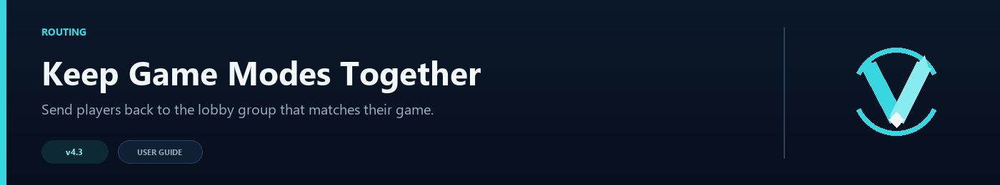

# Contextual Routing Guide



You use contextual routing to keep each game mode connected to its lobby pool. Players leaving BedWars return to a BedWars lobby. Players leaving SkyWars return to SkyWars.

## What contextual routing does

By default, players typing `/lobby` route from the global pool (`default_lobbies`). Players in multi-mode networks often belong to a game-mode-specific lobby.

You define groups of lobbies and map source servers to those groups. Players leaving `bedwars-1` and typing `/lobby` route to the BedWars lobby pool.

---

## When to use it

- Game-mode-specific lobbies (BedWars hub, SkyWars hub, and so on).
- Players should stay in a game-mode ecosystem when a match ends.
- Different game modes need different routing algorithms.
- Fallback chains help when a whole group is offline.

---

## Basic setup

### Step 1: Define your groups

Each group is a named collection of lobby servers:

```toml
[routing.contextual.groups.bedwars_lobbies]
servers = ["bw-hub-1", "bw-hub-2"]

[routing.contextual.groups.skywars_lobbies]
servers = ["sw-hub-1", "sw-hub-2"]

[routing.contextual.groups.main_hubs]
servers = ["hub-1", "hub-2", "hub-3"]
```

### Step 2: Map source servers to groups

Players leaving a source server and using `/lobby` route to the mapped group:

```toml
[routing.contextual.sources]
"bedwars-1" = "bedwars_lobbies"
"bedwars-2" = "bedwars_lobbies"
"skywars-1" = "skywars_lobbies"
"skywars-2" = "skywars_lobbies"
```

### Step 3: Enable it

```toml
[routing.contextual]
enabled = true
fallback_to_default = true
```

You route players leaving BedWars servers to BedWars lobbies.

---

## Per-group selection mode override

You override the global `selection_mode` per group. You configure BedWars lobbies with `consistent_hash` so players return to their previous lobby. You configure other groups to use the global mode:

```toml
[routing.contextual.groups.bedwars_lobbies]
servers = ["bw-hub-1", "bw-hub-2"]
mode = "consistent_hash"

[routing.contextual.groups.skywars_lobbies]
servers = ["sw-hub-1", "sw-hub-2"]
mode = "power_of_two"
# If mode is omitted, the global selection_mode is used.
```

Configuration pairings:

- **`consistent_hash`**: You configure this to return players to the same lobby.
- **`power_of_two`**: You configure this for high-traffic groups needing fast distribution.
- **`weighted_round_robin`**: You configure this for groups with servers of different capacities.

---

## Fallback chain configuration

You configure a fallback chain to specify the list of groups to try when all servers in a group are offline:

```toml
[routing.contextual.fallback_chain]
bedwars_lobbies = ["main_hubs", "skywars_lobbies"]
skywars_lobbies = ["main_hubs"]
```

Step by step:

1. Players leave `bedwars-1` and map to `bedwars_lobbies`.
2. You check the fallback chain when all BedWars lobbies are offline.
3. You route players to `hub-2` in `main_hubs`.

You use the default lobby pool when no fallback group has available servers and you set `fallback_to_default = true`.

---

## Using LobbyEntry with groups

Groups support the same LobbyEntry format as `default_lobbies`:

```toml
[routing.contextual.groups.bedwars_lobbies]
servers = [
  { server = "bw-hub-1", max_players = 80, weight = 3 },
  { server = "bw-hub-2", max_players = 40, weight = 1 },
]
mode = "weighted_round_robin"
```

You can:

- Set **`max_players`** per server in a group. You route fewer players to smaller servers.
- Set **`weight`** for weighted round-robin distribution.
- Mix strings and inline tables.

---

## Real-world examples

### Example 1: PvP network

A network with duels, FFA, and a main hub:

```toml
[routing.contextual]
enabled = true
fallback_to_default = true

[routing.contextual.groups.duel_lobbies]
servers = ["duel-hub-1", "duel-hub-2"]
mode = "consistent_hash"  # Players return to their duel hub

[routing.contextual.groups.ffa_lobbies]
servers = [
  { server = "ffa-hub-1", max_players = 200 },
  { server = "ffa-hub-2", max_players = 200 },
]
mode = "power_of_two"

[routing.contextual.sources]
"duel-1" = "duel_lobbies"
"duel-2" = "duel_lobbies"
"ffa-1" = "ffa_lobbies"
"ffa-2" = "ffa_lobbies"

[routing.contextual.fallback_chain]
duel_lobbies = ["ffa_lobbies"]
ffa_lobbies = ["duel_lobbies"]
```

### Example 2: Event network

A network that runs events with a dedicated event lobby:

```toml
[routing.contextual]
enabled = true
fallback_to_default = true

[routing.contextual.groups.event_lobbies]
servers = ["event-hub"]
mode = "round_robin"  # Only one server, doesn't matter

[routing.contextual.groups.main_hubs]
servers = ["hub-1", "hub-2", "hub-3"]
mode = "least_players"

[routing.contextual.sources]
"event-1" = "event_lobbies"
"event-2" = "event_lobbies"

[routing.contextual.fallback_chain]
event_lobbies = ["main_hubs"]
```

### Example 3: Mixed network with weighted servers

A network where some lobby servers are larger than others:

```toml
[routing.contextual]
enabled = true
fallback_to_default = true

[routing.contextual.groups.priority_lobbies]
servers = [
  { server = "priority-hub-1", max_players = 500, weight = 5 },
  { server = "priority-hub-2", max_players = 300, weight = 3 },
]
mode = "weighted_round_robin"

[routing.contextual.groups.standard_lobbies]
servers = [
  { server = "std-hub-1", max_players = 100, weight = 2 },
  { server = "std-hub-2", max_players = 100, weight = 2 },
  { server = "std-hub-3", max_players = 100, weight = 1 },
]
mode = "power_of_two"

[routing.contextual.sources]
"priority-game-1" = "priority_lobbies"
"standard-game-1" = "standard_lobbies"
"standard-game-2" = "standard_lobbies"
```

---

## Geo-source mapping

You map a contextual source by ISO country code when you enable [Geo Routing](Geo-Routing). You use this when a proxy fronts many game servers and you use the geo service for player location:

```toml
[routing.contextual.sources]
"US" = "main_hubs"
"DE" = "eu_lobbies"
```

You fall back to the per-server source map when the country match fails.

---

## Troubleshooting contextual routing

| Symptom | Likely cause | Fix |
|---------|--------------|-----|
| Players route to default lobbies | `enabled = false` | Set `enabled = true` in `[routing.contextual]` |
| Players route to wrong lobby | Source server not in `sources` map | Add the source server name (must match `velocity.toml` exactly) |
| "No lobby found" error | All group lobbies are offline and you set `fallback_to_default = false` | Set `fallback_to_default = true` or add a fallback chain |
| Fallback chain not working | Chain references a group name that does not exist | Verify group names match exactly |

See also: [Configuration Guide](Configuration-Guide) | [Routing Algorithms](Routing-Algorithms) | [Troubleshooting Guide](Troubleshooting-Guide)
