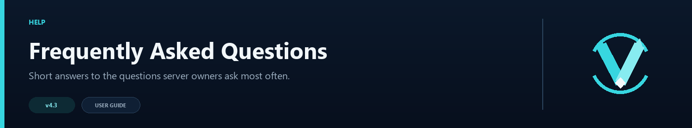

# Frequently Asked Questions



Here are the answers server owners usually need while setting up or running VelocityNavigator. For a problem that is happening right now, the [Troubleshooting Guide](Troubleshooting-Guide) is usually faster.

## General

### Which selection mode should I use?

**For most networks**: `power_of_two`. It is fast, produces near-optimal distribution, and works well from 4 servers up to hundreds.

**Specific cases**:
- **2–3 servers**: `least_players` (simplest, perfectly even).
- **Need weighted distribution**: `weighted_round_robin`.
- **Need sticky sessions**: `consistent_hash`.
- **Bursty traffic**: `least_connections`.
- **Prefer the lowest measured backend ping**: `latency`.
- **Just testing**: `round_robin`.

See [Routing Algorithms](Routing-Algorithms) for the full comparison.

---

### Do I need a database?

**No database is required.** A single-proxy installation stores runtime state locally, and player affinity is also persisted to disk so it can survive proxy restarts.

Redis is optional. Enable it only when multiple Velocity nodes need to synchronize circuit, health, backend-state, or affinity data, or when backends should register dynamically. MySQL and PostgreSQL are not used.

---

### Do I need GeoIP?

No. GeoIP/MaxMind routing is intentionally deferred and is not implemented in 4.3.0. The compatibility keys remain accepted, but enabling them does not change route selection.

Do not purchase or configure a GeoLite2 database for this release. Contextual groups are the closest alternative when different game modes or regions already use separate entry points.

---

### What happens if all servers go down?

If all lobby servers fail health checks:

1. **With degradation enabled** (default): VelocityNavigator falls back to selecting from configured lobbies using the degradation mode (default: `random`), ignoring health status. Players are sent to a server even if it might be down.
2. **With degradation disabled**: players see the "No lobby found" message.

Keeping degradation enabled is recommended:
```toml
[degradation]
enabled = true
mode = "random"
```

---

### Can I use different selection modes for different groups?

Yes. Each contextual routing group can override the global `selection_mode`:

```toml
[routing.contextual.groups.bedwars_lobbies]
servers = ["bw-1", "bw-2"]
mode = "consistent_hash"  # Overrides global mode for this group
```

See [Contextual Routing Guide](Contextual-Routing-Guide) for the full tutorial.

---

### How do I take a server offline for maintenance?

Use the drain command:

```
/vn drain lobby-2
```

This prevents any new players from being routed to `lobby-2`. Existing players are not kicked. When maintenance is complete:

```
/vn undrain lobby-2
```

See [Operations Runbook](Operations-Runbook) for the full procedure.

---

### Does it work with Velocity 3.x only?

Yes, VelocityNavigator is built for Velocity 3.x. It requires Java 17 or higher.

It does **not** work with BungeeCord, Waterfall, or other proxy software.

---

### What's the difference between `least_players` and `least_connections`?

- **`least_players`**: looks at the current player count and picks the server with the fewest players. Simple and accurate for steady-state traffic.
- **`least_connections`**: uses an Exponential Moving Average (EMA) of connection rates and load over time. Better at handling **bursty** traffic where many players join simultaneously.

For most networks, `least_players` or `power_of_two` is sufficient. Use `least_connections` if you experience traffic spikes.

---

### How do I make players always return to the same lobby?

Use `consistent_hash` mode — it hashes the player's UUID to deterministically assign them to a server:

```toml
[routing]
selection_mode = "consistent_hash"
```

Or combine it with **player affinity** for stronger stickiness. In v4.1.0, player affinity is fully configurable and enabled by default with a `0.7` stickiness factor — meaning there is a 70% chance players return to their previous lobby. This works alongside any selection mode and can be tuned or disabled in your config:

```toml
[routing]
selection_mode = "power_of_two"

[routing.affinity]
enabled = true
stickiness = 0.7   # 70% chance to return to previous lobby
```

You can disable it entirely by setting `enabled = false`, or adjust `stickiness` anywhere from `0.0` (disabled) to `1.0` (always return to the previous lobby if it's healthy). As of v4.3, affinity mappings persist across proxy restarts.

---

### How do I set different player caps for different servers?

Use the LobbyEntry inline table format with `max_players`:

```toml
default_lobbies = [
  { server = "lobby-big", max_players = 200 },
  { server = "lobby-small", max_players = 50 },
  "lobby-default",  # uncapped (-1)
]
```

When a server reaches its `max_players` cap, it is excluded from routing.

---

### Can I mix plain strings and inline tables in `default_lobbies`?

Yes. Plain strings use default values (`max_players = -1`, `weight = 1`):

```toml
default_lobbies = [
  { server = "lobby-1", max_players = 100, weight = 3 },
  "lobby-2",   # max_players = -1 (uncapped), weight = 1
  { server = "lobby-3", weight = 2 },
]
```

---

### How does the update checker work in v4.1+?

In v4.1.0, the update checker features a **periodic scheduled task** with exponential backoff:

1. A **startup check** — runs 5 seconds after the proxy starts.
2. A **recurring scheduled check** — repeats at the configured `check_interval` (minimum 30 minutes).
3. A **manual check command**: `/vn updatecheck`.
4. An **admin join notification** — when a player with `velocitynavigator.admin` permission joins, if an update is available, they receive a chat message.
5. **HTTP 429 backoff** — if Modrinth returns rate-limit errors, the checker backs off exponentially up to 4 hours.

To suppress the startup notification, set `notify_on_startup = false`. To suppress the admin join notification, set `notify_admins_on_join = false`.

> **v4.3 change**: update checks are silent by default — no startup log line, no periodic console message. Set `update_checker.silent = false` to restore the previous behavior.

---

### What's the new permission node?

| v3 | v4 | Status |
|----|----|--------|
| `velocitynavigator.bypasscooldown` | `velocitynavigator.bypass.cooldown` | **Both work.** The v3 name is checked as a fallback. |
| `velocitynavigator.use` | `"none"` (default) | **Changed in v4.1.0.** Default set to `"none"` — works out of the box without permission plugins. Custom values are preserved on migration. |

Update your permission plugin when convenient, but nothing will break.

---

### How do I check if the circuit breaker has opened?

```
/vn debug server lobby-1
```

Look for the `Circuit breaker` line in the output. States: `CLOSED` (healthy), `OPEN` (excluded), `HALF_OPEN` (testing).

To check all at once:
```
/vn status
```

For a consolidated view that also includes cache sizes and affinity entry count, run `/vn health` (new in v4.3).

---

### Does VelocityNavigator support multiple proxies?

Yes. `random`, `power_of_two`, `least_players`, `consistent_hash`, and `latency` can operate independently on every proxy. `round_robin` and `weighted_round_robin` keep counters per proxy instance.

When Redis is enabled, VelocityNavigator synchronizes circuit-breaker state, health snapshots, backend lifecycle state, and player affinity across proxy nodes. Parties and queue positions remain local to one proxy, so the load balancer should keep related players on the same proxy.

Redis Cluster discovery and Sentinel failover are not implemented. Point every proxy at one stable standalone-compatible endpoint. See [Advanced Proxy Systems](Advanced-Proxy-Systems).

---

### Why does the inventory GUI JAR need to be on backend servers?

Velocity owns routing but cannot open Bukkit inventories. The same universal JAR runs as a lightweight Paper/Spigot bridge that only renders the menu and returns clicks. Startup logs identify `VELOCITY PROXY mode` or `BACKEND GUI BRIDGE mode`. Use `/vn bridge status` after a player joins each backend. Without a detected bridge, `fallback_to_chat = true` safely shows the clickable chat selector.

The bridge is built against the Spigot API 1.16.5 baseline and uses no version-specific NMS. Java 17+ is required on both runtimes.

---

### What is the difference between adding a game server and a lobby?

`/vn server add game <name> <host:port>` registers the backend in Velocity only. `/vn server add lobby <name> <host:port> ...` also persists lobby metadata in `servers.toml` and activates it in the routing pool.

Use `/vn server dry-run ...` first. Managed writes create backups, validate conflicts, and roll back a failed multi-file transaction.

---

### Is Redis required for parties or queues?

No. Parties and queues run locally on Velocity and do not require Redis. Redis does not make those two systems global in 4.3.0.

---

### How is the HTML dashboard authenticated?

The dashboard is disabled by default. Its API accepts a bearer token through the `Authorization` header; the browser login keeps the token in memory rather than putting it in the URL or persistent browser storage. `127.0.0.1` is the universal loopback address, not a public IP. Hosting-panel users should allocate their own dashboard port and use the bind address required by their container, commonly `0.0.0.0`. Keep the listener on loopback unless authentication and network filtering are configured.

---

### Does the backend bridge use the Velocity bStats project?

No. Proxy telemetry uses the Velocity bStats project. Backend telemetry uses Bukkit bStats wiring and requires a separate Bukkit/Spigot project ID. A backend ID of `0` safely disables backend reporting.

---

### How do I change language without automatic locale detection?

Change `language` at the top of `messages.toml`. Built-ins are `en`, `ru`, `es`, `fr`, `de`, `pt_br`, and `zh_cn`. Restart or run `/vn reload`; the selected pack replaces the active values. Any other code is treated as a custom translation. Leave `active_language` unchanged because VelocityNavigator updates it for you. Native speakers who want to improve or add a translation are warmly invited to follow the [Language Packs](Language-Packs) contribution guide.

---

### Can every lobby have a different GUI icon and slot?

Yes. Add an inline entry under `[servers]` in `gui.toml` with `slot`, `material`, `unavailable_material`, `name`, and `lore`. Text accepts MiniMessage, `&`/`§`, inline hex, and Bungee hex codes. Entries without overrides use localized defaults and automatic pagination.

---

See also: [Configuration Guide](Configuration-Guide) | [Routing Algorithms](Routing-Algorithms) | [Operations Runbook](Operations-Runbook)
