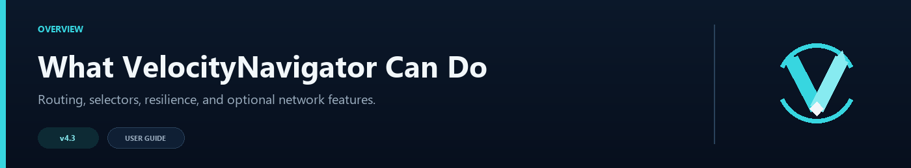

# Feature Overview

VelocityNavigator can be a simple two-lobby balancer or the routing layer for a much larger network. Most features are independent, so you can keep the setup small and add more only when you need it.

## Smart lobby selection

Eight routing modes cover even spreading, weighted servers, sticky placement, busy traffic, and latency. Health checks, capacity limits, drain mode, fallback groups, and server states keep unsuitable lobbies out of the choice.

Initial joins follow the same rules as `/lobby`, so players are balanced from the moment they connect.

Start with [Routing Algorithms](Routing-Algorithms), then add [Contextual Routing](Contextual-Routing-Guide) if different game modes need different lobby pools.

## Java, Bedrock, and chat menus

Java players can use a paginated inventory, Bedrock players can use a native Geyser/Floodgate form, and any network can fall back to a clickable chat selector. Shared display names and descriptions make raw Velocity IDs player-friendly; menu ordering and visibility stay consistent across selectors without changing automatic routing.

Java inventory icons, fixed slots, names, lore, colors, paging, and refresh timing are configurable in `gui.toml`. Full, draining, offline, and in-game entries can each inherit a state-specific material, name, and lore. `/vn menu validate` catches unknown IDs, duplicate labels, bad slots, malformed material identifiers, and unsupported `{...}` placeholders before rollout.

The Java inventory needs the optional backend bridge. Bedrock forms and chat menus work from the proxy.

## One JAR for proxy and backend

The JAR always goes on Velocity. Put the same file on Paper or Spigot only when that backend should open the Java selector or register itself through Redis. Proxy-only installations are fully supported.

See [Backend Bridge Configuration](Backend-Bridge-Configuration) if you want the inventory selector.

## Safer maintenance and recovery

Drain mode stops new players from entering a lobby while the people already there finish normally. Circuit breakers temporarily avoid a backend that keeps failing. Cached health checks and fallback groups help routing stay responsive when part of the network is having a bad day.

The [Operations Runbook](Operations-Runbook) covers the commands used during maintenance.

## Parties, queues, and Redis

Parties add invitations, a member list, private chat, and leader follow. Capacity queues hold players when every lobby is full and connect them when a slot opens. Redis lets several proxies share health, affinity, circuit, and backend-state information.

Each system has its own switch. Redis is disabled until an endpoint is configured. Party membership and queue positions stay on one proxy, so a multi-proxy network should keep those players pinned to the same node.

See [Advanced Proxy Systems](Advanced-Proxy-Systems) for setup examples.

## Tools for server owners

`/vn health`, `/vn servers`, `/vn bridge status`, and `/vn debug` show what the router sees. Prometheus and Grafana are available for longer-term monitoring, while the optional HTML dashboard gives you a quick browser view on the proxy host. [Commands and Permissions](Commands-and-Permissions) lists every player and operator command.

Server-management commands can add game backends or routed lobbies, preview changes, list managed lobbies, and remove entries without hand-editing every file.

## Languages and formatting

English, Russian, Spanish, French, German, Brazilian Portuguese, and Simplified Chinese are included. Custom translations can be kept in `messages.toml`. Menu and chat text supports MiniMessage, classic color codes, and RGB colors.

## Compatibility

- Velocity 3.4.x, Velocity 3.5.x, and Velocity 4.0.0 with one JAR
- Java 17 for Velocity 3.4.x, Java 21 for Velocity 3.5.x, and Java 25 for Velocity 4.0.0
- Minecraft versions supported by your Velocity build
- Optional Paper/Spigot 1.16.5+ backend bridge
- Geyser and Floodgate for native Bedrock forms

BungeeCord and Waterfall are not supported. Redis Cluster/Sentinel discovery and GeoIP routing are not included in 4.4.0.
