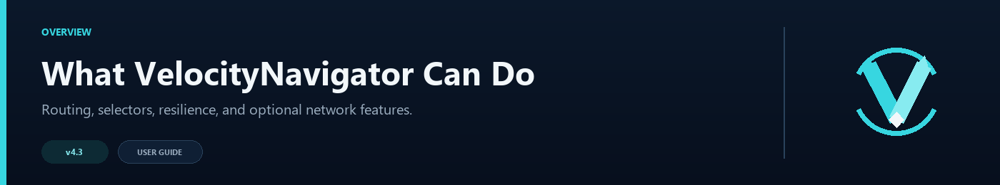

# Feature Overview

VelocityNavigator can be a simple two-lobby balancer or the routing layer for a much larger network. Most features are independent, so you can keep the setup small and add more when you need it.

## Smart lobby selection

Nine routing modes cover even spreading, weighted servers, sticky placement, busy traffic, latency, and geo distance. Health checks, capacity limits, drain mode, fallback groups, and server states keep unsuitable lobbies out of the choice.

Initial joins follow the same rules as `/lobby`, so players are balanced from the moment they connect.

Start with [Routing Algorithms](Routing-Algorithms), then add [Contextual Routing](Contextual-Routing-Guide) if different game modes need different lobby pools.

## Java, Bedrock, and chat menus

Java players can use a paginated inventory, Bedrock players can use a native Geyser/Floodgate form, and any network can fall back to a clickable chat selector. Shared display names and descriptions make raw Velocity IDs player-friendly; menu ordering and visibility stay consistent across selectors without changing automatic routing.

Java inventory icons, fixed slots, names, lore, colors, paging, and refresh timing are configurable in `gui.toml`. Full, draining, offline, and in-game entries can each inherit a state-specific material, name, and lore. `/vn menu validate` catches unknown IDs, duplicate labels, bad slots, malformed material identifiers, and unsupported `{...}` placeholders before rollout.

The Java inventory needs the backend bridge. Bedrock forms and chat menus work from the proxy.

## One JAR for proxy and backend

The JAR always goes on Velocity. It must also go on every Paper, Spigot, or Folia backend that provides NPCs, YAML menus, Java inventory, PlaceholderAPI values, or Redis registration. Proxy-only routing remains fully supported.

See [Backend Bridge Configuration](Backend-Bridge-Configuration) if you want the inventory selector.

## Safer maintenance and recovery

Drain mode stops new players from entering a lobby while the people already there finish normally. Circuit breakers temporarily avoid a backend that keeps failing. Cached health checks and fallback groups help routing stay responsive when part of the network is having a bad day.

The [Operations Runbook](Operations-Runbook) covers the commands used during maintenance.

## Parties, queues, and Redis

Parties add invitations, a member list, private chat, and leader follow. Capacity queues hold players when every lobby is full and connect them when a slot opens. Redis lets several proxies share health, affinity, circuit, and backend-state information.

Each system has its own switch. Redis stays disabled until you configure an endpoint. Party membership and queue positions stay on one proxy, so a multi-proxy network should keep those players pinned to the same node.

See [Advanced Proxy Systems](Advanced-Proxy-Systems) for setup examples.

## Tools for server owners

`/vn health`, `/vn servers`, `/vn bridge status`, and `/vn debug` show what the router sees. Prometheus and Grafana are available for longer-term monitoring, while the optional HTML dashboard gives you a quick browser view on the proxy host. [Commands and Permissions](Commands-and-Permissions) lists every player and operator command.

Server-management commands can add game backends or routed lobbies, preview changes, list managed lobbies, and remove entries without hand-editing every file.

## Database storage backends

VelocityNavigator supports multiple storage backends for persistent data. File-based JSON works without extra setup. For larger networks, MySQL, MariaDB, and PostgreSQL provide storage with connection pooling via HikariCP. SQLite is also available for lightweight single-node deployments. Database schemas are created on provider initialization.

## Country-aware geo routing

Players can be routed by country affinity. VelocityNavigator prefers the GeoRestrict API when installed, then MaxMind GeoLite2 and IP-API fallbacks.

## Network & per-server maintenance mode

Maintenance mode can be toggled globally across the entire network or on individual servers. When a player hits a server in maintenance, they see a configurable reason message explaining the situation. Global maintenance affects all backends at once; per-server maintenance gives fine-grained control.

## Player authentication

New credentials use Argon2id hashing; legacy salted SHA-256 records remain verifiable. Players register and log in through proxy commands before routing, with expiring sessions and holding-lobby isolation. TOTP/2FA is reserved for a later release and is rejected by 4.5.0 configuration validation.

## Languages and formatting

English, Russian, Spanish, French, German, Brazilian Portuguese, Simplified Chinese, Japanese, Italian, Korean, Dutch, Polish, Turkish, Arabic, and Hindi are included. Custom translations can be kept in `messages.toml`. Menu and chat text supports MiniMessage, classic color codes, and RGB colors.

## Native Backend NPC Spawner

When the universal JAR is placed on backend Paper, Spigot, or Folia servers, VelocityNavigator includes a native NPC server selector engine. Server admins can spawn in-game NPCs using `/vnavnpc create`, add floating holograms, load Mojang skins, and route clicks through the proxy. Modern servers use `Interaction` and `TextDisplay` entities; older supported backends fall back to armor stands.

### Third-Party Plugin Interoperability & Recommendations
VelocityNavigator can run beside third-party NPC and GUI plugins such as Citizens, ZNPCsPlus, FancyNpcs, DeluxeMenus, and ChestCommands. Those plugins do not automatically become VelocityNavigator selectors. Use their normal command actions for `/lobby` or `/lobby menu`, or use VelocityNavigator's native NPC/menu system when you need a fixed target server.

> [!TIP]
> If you do not already depend on another NPC plugin, start with `/vnavnpc help`. `/vn` is reserved for proxy administration so backend commands cannot shadow it.

## Compatibility

- Velocity 3.4.x, Velocity 3.5.x, and Velocity 4.0.0 with one JAR
- Java 17 for Velocity 3.4.x, Java 21 for Velocity 3.5.x, or Java 25 for Velocity 4.0.0
- Paper, Spigot, or Folia 1.16.5+ wherever backend bridge features are used
- The backend JAR is required for native NPCs, YAML menus, Java inventory, and backend placeholders
- Geyser and Floodgate for native Bedrock forms
- File JSON, SQLite, MySQL, MariaDB, or PostgreSQL for storage (HikariCP connection pooling included)

BungeeCord and Waterfall are not supported. Redis Cluster/Sentinel discovery is not included in 4.5.0.

| Feature | Guide |
|---|---|
| [Database Storage Backends](Storage-and-Databases) | Configure JSON, SQLite, MySQL, MariaDB, or PostgreSQL storage |
| [Geo Routing](Geo-Routing) | Set up country-affinity routing with GeoRestrict, MaxMind, or IP-API |
| [Network Maintenance Mode](Maintenance-Mode) | Global and per-server maintenance configuration |
| [Player Authentication](Authentication-and-Security) | Argon2id, registration/login, sessions, and holding-lobby isolation |
