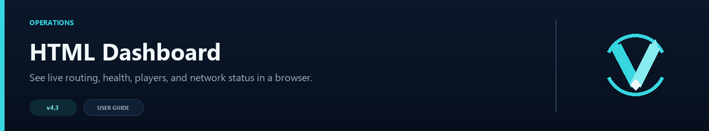

# HTML Dashboard



The optional dashboard gives operators a live browser view of lobby health, player counts, routing activity, affinity, and the active configuration summary. It uses its own port and can be changed in `navigator.toml`.


This capture comes from a running proxy with one configured lobby and one Redis-discovered lobby. Dynamic servers appear alongside configured servers and keep their advertised capacity.

## Enable it

```toml
[dashboard]
enabled = true
port = 9226
bind_host = "127.0.0.1"
bearer_token = "choose-a-long-random-token"
refresh_seconds = 5
```

`127.0.0.1` is the universal loopback address, not anybody's public or personal IP. The values above are safe examples. Choose a port assigned by your hosting provider, and choose a bind address that exists inside your server or container.

| Where Velocity runs | `bind_host` | `port` | Address you open |
|---|---|---|---|
| Your own machine, local access only | `127.0.0.1` | Any unused port | `http://127.0.0.1:<port>/` |
| Pterodactyl or another container panel | Usually `0.0.0.0` | A separate port allocated by the provider | Your provider's node address or assigned domain plus that port |
| Behind a reverse proxy | `127.0.0.1` or a private interface | Any private unused port | Your HTTPS dashboard domain |

Do not copy a provider's public IP into `bind_host` unless its documentation specifically tells you to. `bind_host` is the local interface the plugin listens on; it is not necessarily the hostname or IP that you type into a browser. When a token is configured, the page asks for it before loading live data.

## What the page shows

- current lobby health, state, latency, and player count;
- routing distribution and live counters since the proxy started;
- the current number of saved affinity records;
- routing mode and important feature settings;

The dashboard reads live proxy data. It is an operations view, not a historical analytics database, so counters reset when the proxy restarts.

### Reading the summary cards

| Field | Meaning |
|---|---|
| Player joins / leaves | Connections and disconnections observed since this proxy started; these are not the current online-player count. |
| Online lobbies | Tracked lobbies with a current online health sample. |
| Drained | Lobbies intentionally excluded from new routing. |
| Cache size | Health records currently held by the proxy. |
| Affinity entries | Players with a remembered lobby assignment. |

### Reading a lobby row

| Field | Meaning |
|---|---|
| Players | Player count from the latest health sample. |
| Capacity | The lobby's configured or dynamically advertised `max_players`; uncapped servers show no fixed limit. |
| Latency | Latest measured backend ping time; an unavailable value means no usable sample has been recorded yet. |
| Routed | Successful routing decisions sent to that lobby since the proxy started. |
| Drained | Whether operators have paused new routing to the lobby. |
| Circuit | `CLOSED` is normal, `OPEN` blocks routing after repeated failures, and `HALF_OPEN` is a recovery probe. |

The routing distribution counts decisions made by VelocityNavigator. It is not a billing or long-term traffic report and should not be treated as one.

## Port and network access

Both the port and bind address are configurable. `127.0.0.1` is the safest default because only the proxy machine can connect. Hosting-panel users must allocate a separate dashboard port in their provider panel and put that exact number in `port`. Use `0.0.0.0` only when the container or network requires it, and protect it with a strong `bearer_token` plus the provider firewall or allocation rules.

The built-in listener serves HTTP. For a public hostname or HTTPS, keep it on a private address and place a trusted reverse proxy in front of it.

## Troubleshooting

| Problem | Check |
|---|---|
| Page does not open | Confirm `enabled`, the port, bind address, and firewall rule |
| Address already in use | Choose another unused or provider-allocated `port` and reload |
| Cannot assign requested address | The configured `bind_host` does not exist inside the machine or container; panel users usually need `0.0.0.0` |
| Token is rejected | Copy the value exactly; tokens are case-sensitive |
| Another computer cannot connect | Do not use `127.0.0.1` for remote access; bind to a private interface and add a firewall rule |
| Values look empty | Join through the proxy and wait for a health-check cycle |

After a change, run `/vn reload` and check the proxy log for the dashboard address.
