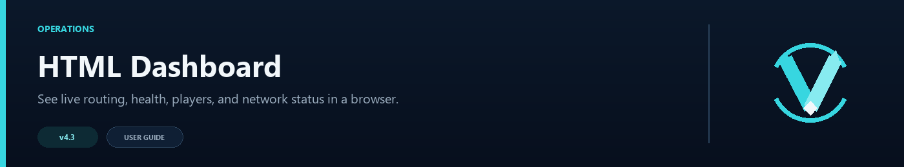

# HTML Dashboard



The optional dashboard provides operators a live browser view of lobby health, player counts, routing activity, affinity, and the active configuration summary. It uses a dedicated port configured in `navigator.toml`.


This capture shows a running proxy with one configured lobby and one Redis-discovered lobby. Dynamic servers appear alongside configured servers and show their advertised capacity.

## Enable it

```toml
[dashboard]
enabled = true
port = 9226
bind_host = "127.0.0.1"
bearer_token = "choose-a-long-random-token"
refresh_seconds = 5
```

`127.0.0.1` represents the local loopback address, not a public IP. The values above serve as examples. Assign a port provided by your hosting provider and select a bind address valid within your server or container.

| Where Velocity runs | `bind_host` | `port` | Address you open |
|---|---|---|---|
| Your own machine, local access only | `127.0.0.1` | Any unused port | `http://127.0.0.1:<port>/` |
| Pterodactyl or another container panel | Usually `0.0.0.0` | A separate port allocated by the provider | Your provider's node address or assigned domain plus that port |
| Behind a reverse proxy | `127.0.0.1` or a private interface | Any private unused port | Your HTTPS dashboard domain |

Avoid copying a provider's public IP into `bind_host` unless explicitly documented. `bind_host` defines the local interface the plugin listens on. It is not the browser address. A configured token prompts for authentication before data loads.

## What the page shows

- current lobby health, state, latency, and player count
- routing distribution and live counters since the proxy started
- current number of saved affinity records
- routing mode and important feature settings

The dashboard displays live proxy data. It functions as an operations view, not a historical database. Counters reset on proxy restart.

### Reading the summary cards

| Field | Meaning |
|---|---|
| Player joins / leaves | Connections and disconnections observed since the proxy started. They do not equal current online players. |
| Online lobbies | Tracked lobbies holding a current online health sample. |
| Drained | Lobbies intentionally excluded from new routing. |
| Cache size | Health records held by the proxy. |
| Affinity entries | Players assigned to specific lobbies. |
| Active pings | Health-check ping requests currently in flight. |

### Reading a lobby row

| Field | Meaning |
|---|---|
| Players | Player count from the latest health sample. |
| Capacity | Configured or dynamically advertised `max_players`. Uncapped servers lack limits. |
| Latency | Measured backend ping time. An unavailable value indicates a missing sample. |
| Routed | Successful routing decisions assigned to that lobby since the proxy started. |
| Drained | Denotes paused routing. |
| Circuit | `CLOSED` permits routing. `OPEN` blocks routing after failures. `HALF_OPEN` performs a recovery probe. |

The routing distribution logs decisions made by VelocityNavigator. It is not a billing or long-term traffic report.

## Port and network access

The port and bind address are configurable. `127.0.0.1` secures the listener, restricting connections to the proxy machine. Hosting-panel users must secure a separate dashboard port and define it under `port`. Use `0.0.0.0` for container requirements, securing it with a strong `bearer_token` and provider firewall rules.

The internal listener handles HTTP. Place a trusted reverse proxy in front for HTTPS access over a private address.

## Troubleshooting

| Problem | Check |
|---|---|
| Page does not open | Verify `enabled`, port, bind address, and firewall settings. |
| Address already in use | Select another unused or allocated `port` and reload. |
| Cannot assign requested address | The `bind_host` is invalid on the machine. Panel users often require `0.0.0.0`. |
| Token is rejected | Enter the case-sensitive value precisely. |
| Another computer cannot connect | Avoid `127.0.0.1` for remote access. Bind to a private interface and configure a firewall rule. |
| Values look empty | Join through the proxy and await a health-check cycle. |

After changes, execute `/vn reload` and verify the dashboard address in the proxy log.
