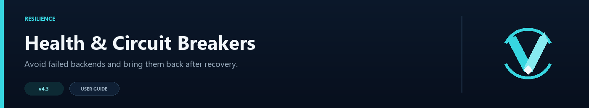

# Health Checks and Circuit Breakers



Health checks stop the router from sending players to a backend that cannot answer. The circuit breaker adds recovery control: after repeated failures, it temporarily removes the server and tests it again after a cooldown.

## Health checks

```toml
[health_checks]
enabled = true
timeout_ms = 2500
cache_seconds = 60
```

VelocityNavigator pings candidate backends and caches the result briefly. Live Velocity player counts are still used for routing, so a cached ping does not freeze the displayed load.

## Circuit breaker

```toml
[circuit_breaker]
enabled = true
failure_threshold = 3
cooldown_seconds = 30
half_open_max_tests = 1
```

The three states are simple:

1. `CLOSED` — the backend is available for normal routing.
2. `OPEN` — repeated failures have temporarily removed it.
3. `HALF_OPEN` — the cooldown ended and a limited recovery check is allowed.

A successful recovery closes the circuit. Another failure opens it again for the next cooldown.

## Useful commands

| Command | Use |
|---|---|
| `/vn health` | Shows aggregate health, circuit, cache, queue, party, Redis, and affinity diagnostics |
| `/vn status` | Shows routing distribution and the main runtime settings |
| `/vn servers [page]` | Shows per-lobby online, drain, circuit, player, and capacity state |
| `/vn drain <server>` | Stops new routing to a server for maintenance |
| `/vn undrain <server>` | Returns a drained server to routing |
| `/vn config validate` | Checks the health and circuit settings |

Drain mode is the right tool for planned maintenance; circuit breakers are for unexpected failures.

## Choosing values

The defaults suit most networks. Lower thresholds react faster but may remove a backend during a brief network hiccup. Longer cooldowns reduce repeated connection attempts but delay recovery. Start with the defaults, then adjust only when your logs show a consistent reason.

When Redis is enabled, health snapshots and circuit state are shared across the Velocity proxies.
