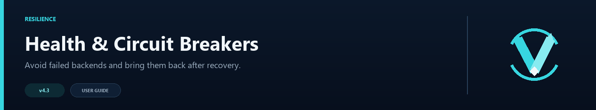

# Health Checks and Circuit Breakers



You configure health checks to stop the router from sending players to an unresponsive backend. You use the circuit breaker for recovery control: it temporarily removes the server after repeated failures and tests it again after a cooldown.

## Health checks

```toml
[health_checks]
enabled = true
timeout_ms = 2500
cache_seconds = 60
```

You configure the proxy to ping candidate backends and cache the result briefly. You use live Velocity player counts to drive routing so a cached ping does not freeze the displayed load.

## Circuit breaker

```toml
[circuit_breaker]
enabled = true
failure_threshold = 3
cooldown_seconds = 30
half_open_max_tests = 1
```

You monitor three states:

1. **`CLOSED`**: you route normally to the backend.
2. **`OPEN`**: you temporarily remove the backend after repeated failures.
3. **`HALF_OPEN`**: you allow a limited recovery check after the cooldown ends.

You close the circuit on a successful recovery. You open it again for the next cooldown on another failure.

## Interaction with maintenance and drain

You use the circuit breaker to react to unexpected failures. You use [Maintenance Mode](Maintenance-Mode) for planned or emergency outages. You use the `/vn drain <server>` command to remove a server from new routing while existing players remain. You stack the states:

- You exclude a drained backend from new routes even with a `CLOSED` circuit.
- You exclude a maintenance-flagged backend from new routes and eligibility checks.
- You exclude an `OPEN` circuit backend from new routes.

## Useful commands

| Command | Use |
|---|---|
| `/vn health` | Shows aggregate health, circuit, cache, queue, party, Redis, affinity, backend states, and maintenance diagnostics |
| `/vn status` | Shows routing distribution and the main runtime settings |
| `/vn servers [page]` | Shows per-lobby online, drain, circuit, player, and capacity state |
| `/vn drain <server>` | Stops new routing to a server for maintenance |
| `/vn undrain <server>` | Returns a drained server to routing |
| `/vn config validate` | Checks the health and circuit settings |

You use drain mode to remove one server. You use maintenance mode for whole-network or per-server outages. You use circuit breakers to handle unrecoverable failures.

## Choosing values

You use the defaults for most networks. You set lower thresholds to react faster, though this can remove a backend during brief network issues. You use longer cooldowns to reduce connection attempts while delaying recovery. You start with the defaults and adjust when logs show a reason.

You share health snapshots and circuit state across Velocity proxies when you enable Redis.
