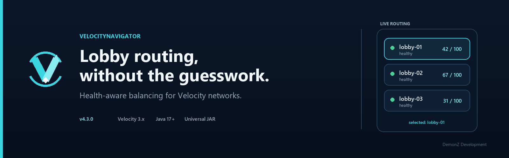

<p align="center">
  
</p>

# VelocityNavigator

> **4.3.0** · Velocity 3.x · Java 17+ · Optional Paper/Spigot bridge

VelocityNavigator stops one lobby from taking every player just because it appears first in Velocity's `try` list. It chooses a healthy, suitable lobby for initial joins and lobby commands, while giving you sensible controls for maintenance and larger networks.

A basic setup only needs the JAR on Velocity and a list of lobby names. The same JAR can be added to Paper or Spigot later if you want the Java inventory selector.

## Start here

| I want to… | Read this |
|---|---|
| Set up two balanced lobbies | [Quick Start Guide](Quick-Start-Guide) |
| Choose a routing mode | [Routing Algorithms](Routing-Algorithms) |
| Change commands, messages, or menus | [Configuration Guide](Configuration-Guide) |
| Find a command or permission | [Commands and Permissions](Commands-and-Permissions) |
| Add the Java inventory selector | [Backend Bridge Configuration](Backend-Bridge-Configuration) |
| Keep game modes in separate lobby pools | [Contextual Routing Guide](Contextual-Routing-Guide) |
| Configure parties, queues, Redis, or storage | [Advanced Proxy Systems](Advanced-Proxy-Systems) |
| Open the live browser view | [HTML Dashboard](HTML-Dashboard) |
| Diagnose or maintain a live network | [Operations Runbook](Operations-Runbook) |

## What you get

- Eight routing modes, including least players, weighted routing, sticky routing, and latency
- Initial-join balancing instead of a first-server-only `try` list
- Health checks, capacity limits, drain mode, fallback groups, and circuit breakers
- Java inventory, Bedrock form, and chat selectors
- Contextual lobby groups for networks with several game modes
- Optional parties, capacity queues, Redis sync, Prometheus, and an HTML dashboard
- Clear admin commands for health, bridge status, Redis, routing decisions, and config checks
- Seven included languages plus custom translations

Every larger feature has its own switch. You can run only the parts that make sense for your network.

## A good first configuration

```toml
[routing]
selection_mode = "power_of_two"
balance_initial_join = true
default_lobbies = ["lobby-1", "lobby-2"]
```

Make sure those names already exist in Velocity's `velocity.toml`, then run `/vn config validate` and try joining through the proxy.

## Compatibility

| Part | Requirement |
|---|---|
| Proxy | Velocity 3.x |
| Java | 17 or newer |
| Minecraft | Any version supported by your Velocity build |
| Optional backend bridge | Paper or Spigot 1.16.5+ |
| Native Bedrock form | Geyser and Floodgate |

BungeeCord and Waterfall are not supported. Party membership and queue positions are local to one proxy.

## More guides

| Area | Pages |
|---|---|
| Learn the routing choices | [Routing Algorithms](Routing-Algorithms) · [Visual Examples](Algorithm-Visualizations) · [Initial Join Balancing](Initial-Join-Balancing) · [Retries & Fallbacks](Retries-and-Fallbacks) |
| Configure the plugin | [Configuration Guide](Configuration-Guide) · [Backend Bridge](Backend-Bridge-Configuration) · [Migration from v3](Migration-Guide-v3-to-v4) |
| Add player features | [Java & Bedrock Selectors](Java-and-Bedrock-Selectors) · [Language Packs](Language-Packs) · [Parties](Party-System) · [Queue](Capacity-Queue) |
| Grow to several proxies | [Redis & Multi-Proxy](Redis-and-Multi-Proxy) · [Storage & Databases](Storage-and-Databases) · [Server Management](Server-Management) |
| Run the network | [Commands & Permissions](Commands-and-Permissions) · [Operations Runbook](Operations-Runbook) · [Prometheus & Grafana](Prometheus-&-Grafana-Setup) |
| Solve a problem | [Troubleshooting Guide](Troubleshooting-Guide) · [FAQ](FAQ) |
