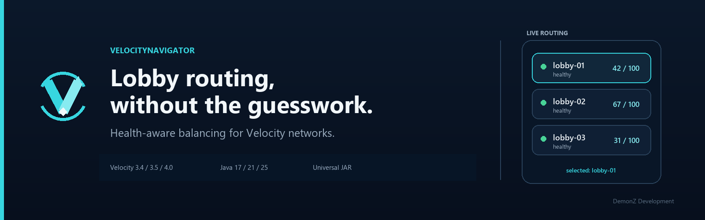

<p align="center">
  
</p>

# VelocityNavigator

> **4.5.0** · Velocity 3.4.x, 3.5.x, and 4.0.0 · Java 17/21/25 depending on Velocity version · Feature-dependent Paper/Spigot/Folia bridge

VelocityNavigator stops one lobby from taking every player when it appears first in Velocity's `try` list. It chooses a healthy, suitable lobby for initial joins and lobby commands, and gives you controls for maintenance and larger networks.

A routing-only setup needs the JAR on Velocity and a list of lobby names. Install the same JAR on every Paper, Spigot, or Folia backend where you want NPCs, YAML menus, Java inventory, or backend placeholders.

## Start here

| I want to… | Read this |
|---|---|
| Set up two balanced lobbies | [Quick Start Guide](Quick-Start-Guide) |
| Choose a routing mode | [Routing Algorithms](Routing-Algorithms) |
| Change commands, messages, or menus | [Configuration Guide](Configuration-Guide) |
| Customize selector names, descriptions, order, visibility, and state styles | [Selector Customization](Server-Display-Names) |
| Find a command or permission | [Commands and Permissions](Commands-and-Permissions) |
| Add the Java inventory selector | [Backend Bridge Configuration](Backend-Bridge-Configuration) |
| Place interactive NPC server selectors | [Backend NPCs](Backend-NPCs) |
| Build a custom backend YAML menu | [Backend YAML Menus](Backend-Menus) |
| Keep game modes in separate lobby pools | [Contextual Routing Guide](Contextual-Routing-Guide) |
| Configure parties, queues, Redis, or storage | [Advanced Proxy Systems](Advanced-Proxy-Systems) |
| Choose a storage backend | [Storage & Databases](Storage-and-Databases) |
| Set up player authentication | [Authentication & Security](Authentication-and-Security) |
| Route players by geographic distance | [Geo Routing](Geo-Routing) |
| Take servers offline for maintenance | [Maintenance Mode](Maintenance-Mode) |
| Change the Minecraft server-list message | [Server-List MOTD](MOTD-Configuration) |
| Organize configuration into focused files | [Modular Configuration](Modular-Configuration) |
| Build a plugin that reads VelocityNavigator state | [NavigatorAPI](NavigatorAPI) |
| Open the live browser view | [HTML Dashboard](HTML-Dashboard) |
| Diagnose or maintain a live network | [Operations Runbook](Operations-Runbook) |

## What you get

- Nine routing modes, including least players, weighted routing, sticky routing, latency, and geo distance
- Initial-join balancing instead of a first-server-only `try` list
- Health checks, capacity limits, drain mode, fallback groups, and circuit breakers
- Java inventory, Bedrock form, and chat selectors with shared names, descriptions, ordering, and visibility
- Contextual lobby groups for networks with several game modes
- Database storage backends: File JSON, SQLite, MySQL, MariaDB, and PostgreSQL via HikariCP
- Country-aware geo routing with GeoRestrict, MaxMind GeoLite2, or IP-API
- Network-wide and per-server maintenance mode with customizable reason messages
- Redis sync for circuit state, health/lifecycle snapshots, affinity, and dynamic backend registration
- Player authentication with Argon2id hashing, login/registration commands, sessions, and holding-lobby isolation
- Modular configuration files for storage, geo, and auth settings
- Optional parties, capacity queues, Prometheus, and an HTML dashboard
- Clear admin commands for health, bridge status, Redis, routing decisions, config checks, and menu validation
- Public `NavigatorAPI` for external Velocity plugins to inspect routing, health, config, and plugin metadata
- Fifteen included languages plus reloadable custom `.properties` packs

Each large feature has a switch. You can run the parts that make sense for your network.

## A good first configuration

```toml
[routing]
selection_mode = "power_of_two"
balance_initial_join = true
default_lobbies = ["lobby-1", "lobby-2"]
```

Make sure those names already exist in Velocity's `velocity.toml`, then run `/vn config validate` and try joining through the proxy.

## Compatibility

| Part | Requirement |
|---|---|
| Proxy | Velocity 3.4.x, Velocity 3.5.x, or Velocity 4.0.0 (same JAR) |
| Java | 17 for Velocity 3.4.x, 21 for Velocity 3.5.x, or 25 for Velocity 4.0.0 |
| Minecraft | Any version supported by your Velocity build |
| Backend features | Paper, Spigot, or Folia 1.16.5+ with the JAR installed |
| Native Bedrock form | Geyser and Floodgate |
| Database storage | SQLite (bundled), MySQL 5.7+, MariaDB 10.3+, PostgreSQL 12+ |
| GeoIP routing | MaxMind GeoLite2 database (free) or IP-API HTTP fallback |

BungeeCord and Waterfall are not supported. Party membership, auth sessions, and queue positions are local to one proxy. Password records can be shared through a SQL storage provider.

## More guides

| Area | Pages |
|---|---|
| Learn the routing choices | [Routing Algorithms](Routing-Algorithms) · [Visual Examples](Algorithm-Visualizations) · [Initial Join Balancing](Initial-Join-Balancing) · [Retries & Fallbacks](Retries-and-Fallbacks) · [Geo Routing](Geo-Routing) |
| Configure the plugin | [Configuration Guide](Configuration-Guide) · [Modular Configuration](Modular-Configuration) · [Backend Bridge](Backend-Bridge-Configuration) · [Migration from v3](Migration-Guide-v3-to-v4) · [Upgrade to 4.5](Migration-Guide-v4-to-v5) |
| Add player features | [Java & Bedrock Selectors](Java-and-Bedrock-Selectors) · [Selector Customization](Server-Display-Names) · [Language Packs](Language-Packs) · [Server-List MOTD](MOTD-Configuration) · [Parties](Party-System) · [Queue](Capacity-Queue) |
| Grow to several proxies | [Redis & Multi-Proxy](Redis-and-Multi-Proxy) · [Common Core Architecture](Common-Core-Architecture) · [NavigatorAPI](NavigatorAPI) · [Storage & Databases](Storage-and-Databases) · [Server Management](Server-Management) |
| Run the network | [Commands & Permissions](Commands-and-Permissions) · [Operations Runbook](Operations-Runbook) · [Prometheus & Grafana](Prometheus-&-Grafana-Setup) · [Maintenance Mode](Maintenance-Mode) |
| Security & auth | [Authentication & Security](Authentication-and-Security) |
| Solve a problem | [Troubleshooting Guide](Troubleshooting-Guide) · [FAQ](FAQ) |
