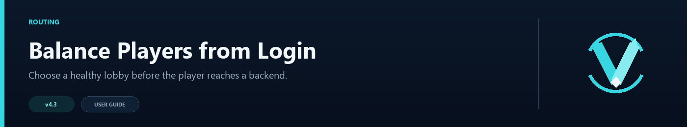
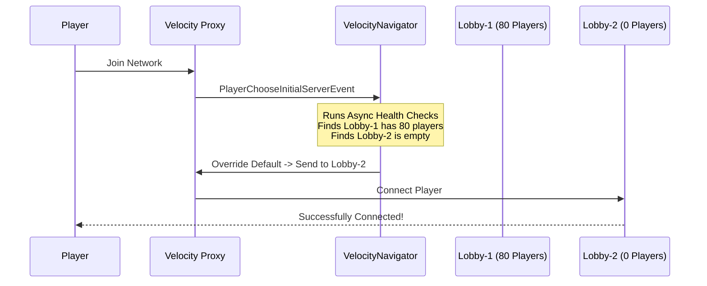

# Initial Join Balancing



Velocity's `try` list is designed for fallback, so it sends everyone to the first online server. Initial-join balancing lets VelocityNavigator choose a healthy lobby as soon as a player logs in.

## The Vanilla Velocity Behavior

By default, Velocity uses a static `try` list in `velocity.toml` to decide which server a new player joins:

```toml
[servers]
try = ["lobby-1", "lobby-2"]
```

Velocity always tries the **first server** in the list. If `lobby-1` is online, every player joins `lobby-1`. The second server is only used if the first one crashes or shuts down. The second lobby stays empty while the first one absorbs the entire player load.

---

## How VelocityNavigator Handles It

VelocityNavigator intercepts the `PlayerChooseInitialServerEvent` and applies its routing logic **before** the player's client lands on any server.



- **`least_players` mode**: the server with the fewest players is selected.
- **`power_of_two` mode**: two random candidates are picked; the emptier one wins.
- **`round_robin` mode**: players alternate between lobbies in strict rotation.
- **`random` mode**: each player gets a random lobby assignment.
- **`weighted_round_robin` mode**: servers with higher weight receive proportionally more players.
- **`least_connections` mode**: uses EMA of connection rates and load for bursty traffic.
- **`consistent_hash` mode**: player UUID deterministically maps to a specific server.

---

## Configuration

Open your `navigator.toml`:

```toml
[routing]
balance_initial_join = true
```

| Value | Behavior |
|-------|----------|
| `true` | Players are load-balanced immediately upon initial join. |
| `false` | Velocity's native `try` list is used (default Velocity fallback). |

---

> [!WARNING]
> Set `balance_initial_join = false` if you have a dedicated "Welcome/Auth" server that all unverified players must join first.

---

## How initial routing works

- Subscribes to `PlayerChooseInitialServerEvent` (fires immediately after `PostLoginEvent`).
- Routing ping-health tests run concurrently to avoid adding sign-in latency.
- When `verbose_logging = true`, every balanced initial join is debug-logged.
