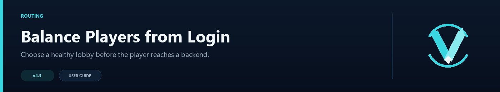
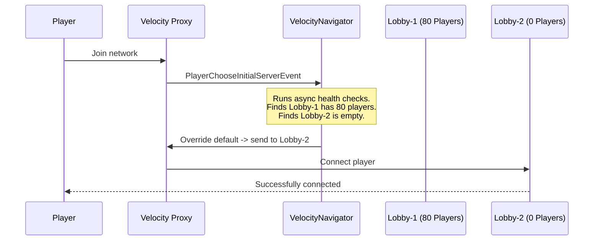

# Initial Join Balancing



You configure Velocity's `try` list for fallback to route players to the first online server. You configure Initial-join balancing to select a healthy lobby at login.

## Vanilla Velocity behavior

You configure a static `try` list in `velocity.toml` to route new players:

```toml
[servers]
try = ["lobby-1", "lobby-2"]
```

Velocity routes players to the first server in the list. Players join `lobby-1` when it is online. You use the second server when the first crashes. You leave the second lobby empty while the first absorbs the load.

---

## How VelocityNavigator handles it

You intercept the `PlayerChooseInitialServerEvent` and apply routing logic before players land on a backend.


```mermaid
sequenceDiagram
    participant Player
    participant Proxy as Velocity Proxy
    participant VN as VelocityNavigator
    participant L1 as Lobby-1 (80 Players)
    participant L2 as Lobby-2 (0 Players)

    Player->>Proxy: Join network
    Proxy->>VN: PlayerChooseInitialServerEvent
    Note over VN: Runs async health checks.<br/>Finds Lobby-1 has 80 players.<br/>Finds Lobby-2 is empty.
    VN->>Proxy: Override default -> send to Lobby-2
    Proxy->>L2: Connect player
    L2-->>Player: Successfully connected
```

- **`least_players`**: You select the server with the fewest players.
- **`power_of_two`**: You pick two random candidates and select the emptier one.
- **`round_robin`**: You alternate players between lobbies in rotation.
- **`random`**: You assign players a random lobby.
- **`weighted_round_robin`**: You route more players to servers with higher weights.
- **`least_connections`**: You use EMA of connection rates to handle burst traffic.
- **`consistent_hash`**: You map player UUIDs to specific servers.
- **`latency`**: You select the candidate with the lowest proxy-to-backend ping.

---

## Configuration

Open your `navigator.toml`:

```toml
[routing]
balance_initial_join = true
```

| Value | Behavior |
|-------|----------|
| `true` | You load-balance players immediately on initial join |
| `false` | You use Velocity's native `try` list |

---

> [!WARNING]
> You set `balance_initial_join = false` when your network has a dedicated welcome server. You route players past the welcome server when you enable balance. You short-circuit the initial route when you enable the auth holding lobby.

---

## How initial routing works

- You subscribe to `PlayerChooseInitialServerEvent`.
- You run routing ping-health tests concurrently to avoid sign-in latency.
- You debug-log balanced initial joins when you set `verbose_logging = true`.
- You choose the holding lobby over the routing decision when you enable the auth subsystem for unverified players.
