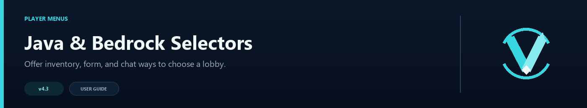

# Java and Bedrock Selectors



VelocityNavigator can show a Java inventory, a native Bedrock form, or a clickable chat list. All three use the same lobby availability rules, so an offline, full, or drained server cannot be selected just because it appears in a menu.

## What players see

### Java Edition


The inventory above is a real Java Edition capture from the Paper backend bridge.

### Bedrock Edition


The form above is a real Bedrock capture through Geyser and Floodgate.

## Choose the Java selector

In `navigator.toml`:

```toml
[routing]
use_menu_for_lobby = true

[routing.java_menu]
type = "inventory"
fallback_to_chat = true
```

`inventory` uses the optional backend bridge. `chat` always uses clickable text. Players can also use `/lobby menu` to open the selector directly.

## Java inventory setup

1. Put the same VelocityNavigator JAR on the Velocity proxy and the Paper/Spigot backend.
2. Start both servers.
3. Join the backend through Velocity once.
4. Run `/vn bridge status` on the proxy.
5. Run `/lobby menu` while connected to that backend.

If the bridge is missing and `fallback_to_chat = true`, the player receives the chat selector instead.

## Inventory layout

`gui.toml` controls the inventory:

```toml
[layout]
rows = 6
default_material = "COMPASS"
unavailable_material = "BARRIER"
fill_empty_slots = true
filler_material = "GRAY_STAINED_GLASS_PANE"
refresh_seconds = 5

[controls]
previous_slot = 45
refresh_slot = 49
next_slot = 53
previous_material = "ARROW"
refresh_material = "CLOCK"
next_material = "ARROW"
```

`rows` accepts `2` through `6`. Minecraft chest inventories always have nine columns, so the available sizes are 18, 27, 36, 45, or 54 slots. VelocityNavigator reserves the bottom row for previous, refresh, and next controls; the other rows hold server entries. For example, `rows = 4` creates a 36-slot menu with 27 automatic server slots per page.

Control and fixed server slots use zero-based slot numbers. Keep every configured slot below `rows × 9`. Invalid or duplicate control slots are moved to safe positions in the bottom row, while invalid server slots fall back to automatic placement.

Per-server overrides can set a fixed slot, material, unavailable material, name, and lore. Leave `slot = -1` for automatic placement.

```toml
[servers]
"lobby-1" = { slot = 10, material = "NETHER_STAR", unavailable_material = "BARRIER", name = "<gradient:#55FFFF:#FFFFFF><bold>Lobby One</bold></gradient>", lore = ["<gray>Players:</gray> <white>{players}/{max_players}</white>", "&#55FF88Click to connect"] }
```

## Bedrock form

Native Bedrock forms require Geyser and Floodgate on the network. In `navigator.toml`:

```toml
[bedrock]
enabled = true
auto_detect = true
strip_advanced_formatting = true
affinity_use_java_uuid = true
use_gui_for_lobby = true
```

Then adjust the form in `gui.toml`:

```toml
[bedrock]
enabled = true
fallback_to_chat = true
sort_mode = "routing"
max_buttons = 100
show_players = true
show_max_players = true
show_ping = true
show_status = true
title = ""
content = ""
button_format = ""
```

Blank text values use the active language pack. `sort_mode` accepts `routing`, `name`, or `players`.

Bedrock forms do not use Java inventory rows. `max_buttons` limits how many server buttons can be included, while the Bedrock client chooses the form's physical size and layout.

## Text and colors

Default chat, inventory, and Bedrock text lives in `messages.toml`. Java inventory titles, item names, lore, and controls are under `[menus.inventory]`:

```toml
[menus.inventory]
title = "<gradient:#55FFFF:#FFFFFF><bold>Choose a Lobby</bold></gradient>"
item_name = "&#55FFFF&l{server}"
previous = "<yellow>Previous Page</yellow>"
next = "<yellow>Next Page</yellow>"
refresh = "<aqua>Refresh</aqua>"
item_lore = ["&7Players: &f{players}/{max_players}", "&eClick to connect"]
```

MiniMessage tags, named colors, gradients, `&` and `§` codes, `&#RRGGBB`, and Bungee-style hex codes are supported. Per-server `name` and `lore` values in `gui.toml` use the same formatting.

Bedrock text can also be changed, but native forms do not render every advanced Java style. With `strip_advanced_formatting = true`, unsupported MiniMessage formatting is removed before the form is sent. See [Language Packs](Language-Packs) for translations, placeholders, and formatting.

## Common problems

- **Inventory falls back to chat:** join the backend once and check `/vn bridge status`.
- **Bedrock player sees chat:** confirm Geyser/Floodgate detection and both Bedrock enable switches.
- **An icon is invalid:** use a material available on the backend version; the bridge uses the configured fallback material when needed.
- **Too many servers:** the Java menu adds pages automatically; Bedrock uses `max_buttons`.
