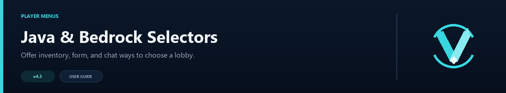

# Java and Bedrock Selectors



You configure the proxy to show a Java inventory, a native Bedrock form, or a clickable chat list. You enforce the same lobby availability rules across all three menus.

## Which interface opens?

| Player | Interface |
|---|---|
| Java with a detected backend bridge | Java inventory when `routing.java_menu.type = "inventory"` |
| Java without a bridge | Clickable chat when `fallback_to_chat = true` |
| Bedrock detected through Floodgate | Native Bedrock form when `bedrock.use_gui_for_lobby = true` and the Bedrock menu is enabled |
| Bedrock with the native form disabled | Falls through to the configured Java selector; use the chat selector if you do not want an inventory through Geyser |

The Bedrock lobby form is proxy-side and does not require the backend bridge. NPCs and backend YAML menus still require the JAR on the backend where they exist.

This client-specific behavior also applies to authentication. Java players use `/register` and `/login`. Floodgate Bedrock players receive a native registration or login form when `auth.bedrock_form_enabled = true`; the commands remain available as a fallback. The form fields are visible while typing because Bedrock CustomForm has no masked password input. See [Authentication and Security](Authentication-and-Security).

## What players see

### Java Edition


You view a real Java Edition capture from the Paper backend bridge.

### Bedrock Edition


You view a real Bedrock capture through Geyser and Floodgate.

## Choose the Java selector

In `navigator.toml`:

```toml
[routing]
use_menu_for_lobby = true

[routing.java_menu]
type = "inventory"
fallback_to_chat = true
```

You configure `inventory` to use the backend bridge. You configure `chat` to use clickable text. Players type `/lobby menu` to open the selector.

## Java inventory setup

1. Put the same VelocityNavigator JAR on the Velocity proxy and every Paper/Spigot/Folia backend that should open the Java inventory.
2. Start both servers.
3. Join the backend through Velocity once.
4. Run `/vn bridge status` on the proxy.
5. Run `/lobby menu` while connected to that backend.

You deliver the chat selector to the player when the bridge is missing and you set `fallback_to_chat = true`.

## Inventory layout

You configure the inventory in `gui.toml`:

```toml
[layout]
rows = 6
default_material = "COMPASS"
unavailable_material = "BARRIER"
fill_empty_slots = true
filler_material = "GRAY_STAINED_GLASS_PANE"
refresh_seconds = 5

[controls]
previous_slot = 45
refresh_slot = 49
next_slot = 53
previous_material = "ARROW"
refresh_material = "CLOCK"
next_material = "ARROW"
```

You configure `rows` from `2` to `6`. You have available sizes of 18, 27, 36, 45, or 54 slots. You reserve the bottom row for previous, refresh, and next controls. You place server entries in the other rows. You configure `rows = 4` to create a 36-slot menu with 27 server slots per page.

| `rows` | Total slots | Automatic servers per page | Previous | Refresh | Next |
|---:|---:|---:|---:|---:|---:|
| 2 | 18 | 9 | 9 | 13 | 17 |
| 3 | 27 | 18 | 18 | 22 | 26 |
| 4 | 36 | 27 | 27 | 31 | 35 |
| 5 | 45 | 36 | 36 | 40 | 44 |
| 6 | 54 | 45 | 45 | 49 | 53 |

You match control slots from this table when changing `rows`. You save `gui.toml`, execute `/vn reload`, and confirm the result with `/vn menu validate`. You move controls outside the reserved bottom row to safe defaults during validation.

You configure control and fixed server slots with zero-based numbers. You keep slots below `rows × 9`. You shift invalid or non-bottom-row control slots to safe positions and fall back to automatic placement for invalid server slots.

You configure per-server overrides to set selector metadata and Java-inventory presentation. You match the table key to the server ID in `velocity.toml`. You include spaces in `display_name` and use `description` in selector templates. You apply `menu_order` and `show_in_menu` to Java inventory, Java chat, and Bedrock.

```toml
config_version = 2

[servers]
"lobby1" = { display_name = "Main Lobby 1", description = "Events, portals, and network help", menu_order = 10, show_in_menu = true, slot = 10, material = "NETHER_STAR", unavailable_material = "", name = "<gradient:#55FFFF:#FFFFFF><bold>{server}</bold></gradient>", lore = ["<gray>{description}</gray>", "<gray>Players</gray> <white>{players}/{max_players}</white>", "<dark_gray>Target: {server_id}</dark_gray>", "&#55FF88Click to connect"] }
"holding" = { display_name = "Holding Server", description = "", menu_order = -1, show_in_menu = false, slot = -1, material = "", unavailable_material = "", name = "", lore = [] }
```

You use these fields for presentation. You retain the raw `lobby1` ID for the inventory target, token allowlist, chat callback, Bedrock response, and connection request. You fall back to the raw ID when omitting `display_name`. You save `gui.toml` and execute `/vn reload` to apply changes.

You use nonnegative `menu_order` values to order the selector. You set `-1` to leave the value unset. You resolve ties with candidate order for Java and chat, and with `sort_mode` for Bedrock. You control the physical cell with a fixed Java `slot`. You hide an entry without affecting routing by setting `show_in_menu = false`.

You use the `name` field for the inventory item-name template. You leave `name = ""` to use the localized `[menus.inventory].item_name` template.

You assign non-unique display aliases. You should avoid duplicates to help players distinguish buttons. You run `/vn menu validate` to report ambiguous labels, unknown IDs, slot mistakes, malformed material identifiers, and unsupported placeholders.

## State presentation in the Java inventory

You configure Java inventory items to change when a backend is full, draining, offline, or reports the `IN_GAME` lifecycle marker:

```toml
[states.full]
material = "RED_CONCRETE"
name = "<red><bold>{server}</bold> · {status}</red>"
lore = ["<gray>{description}</gray>", "<red>Try another lobby</red>"]

[states.draining]
material = "YELLOW_CONCRETE"
name = "<yellow><bold>{server}</bold> · {status}</yellow>"
lore = ["<gray>{description}</gray>", "<yellow>Closed for maintenance</yellow>"]

[states.offline]
material = "BARRIER"
name = "<gray><bold>{server}</bold> · {status}</gray>"
lore = ["<gray>{description}</gray>", "<red>Currently offline</red>"]

[states.in_game]
material = "ENDER_EYE"
name = "<gold><bold>{server}</bold> · {status}</gold>"
lore = ["<gray>{description}</gray>", "<gold>Game in progress</gold>"]
```

You customize names, lore, and materials. You use a per-server `name` or `lore` over the state template and the global default. You fall back through per-server `unavailable_material`, state material, and global material for unavailable entries. You keep normal materials for healthy entries. You style `IN_GAME` entries according to the reported marker.

You prioritize states in this order: offline circuit, draining, maintenance-flagged, `IN_GAME`, full, then healthy.

You use state materials for Java-inventory presentation. You show the effective state through `{status}` and use `{description}` in templates for Chat and Bedrock.

You view [Selector Customization](Server-Display-Names) for examples and troubleshooting.

## Bedrock form

You install Geyser and Floodgate on the network for native Bedrock forms. You configure `navigator.toml`:

```toml
[bedrock]
enabled = true
auto_detect = true
strip_advanced_formatting = true
affinity_use_java_uuid = true
use_gui_for_lobby = true
```

You adjust the form in `gui.toml`:

```toml
[bedrock]
enabled = true
fallback_to_chat = true
sort_mode = "routing"
max_buttons = 100
show_players = true
show_max_players = true
show_ping = true
show_status = true
title = ""
content = ""
button_format = ""
```

You use the active language pack for blank text values. You configure `sort_mode` to `routing`, `name`, or `players`. You sort by `display_name` for names. You prioritize `menu_order` and resolve ties with `sort_mode`.

You skip Java inventory rows for Bedrock forms. You configure `max_buttons` to limit server buttons. You let the Bedrock client choose the physical size.

Authentication uses the UUID presented by the connected player. A pending Floodgate player receives a Bedrock login or registration form on the holding backend when it is enabled in `auth.toml`. Lobby selection and authentication are separate forms with separate settings.

## Text and colors

You configure text in `messages.toml`. You configure Java inventory titles and controls under `[menus.inventory]`:

```toml
[menus.inventory]
title = "<gradient:#55FFFF:#FFFFFF><bold>Choose a Lobby</bold></gradient>"
item_name = "&#55FFFF&l{server}"
previous = "<yellow>Previous Page</yellow>"
next = "<yellow>Next Page</yellow>"
refresh = "<aqua>Refresh</aqua>"
item_lore = ["&7Players: &f{players}/{max_players}", "&eClick to connect"]
```

You format text with MiniMessage tags, named colors, gradients, `&` codes, `§` codes, `&#RRGGBB`, and Bungee-style hex codes. You apply the same formatting for `name` and `lore` values in `gui.toml`.

You substitute `{server}` and `{display_name}` with the player-facing alias. You use `{server_id}` for the registered Velocity ID. You use `{description}` for the description. You access variables like `{players}`, `{max_players}`, `{status}`, `{status_color}`, and `{ping}`.

You strip unsupported formatting from Bedrock forms with `strip_advanced_formatting = true`. You view [Language Packs](Language-Packs) for translations.

## Common problems

- **Inventory falls back to chat:** You join the backend and check `/vn bridge status`.
- **Bedrock player sees chat:** You verify Geyser/Floodgate detection.
- **An icon is invalid:** You supply a valid material for the backend version.
- **Too many servers:** You rely on automatic pages for Java and configure `max_buttons` for Bedrock.
- **A hidden server receives routes:** You remove the server from its pool or put it in maintenance mode.
- **A state style does not appear:** You clear overrides, compare signals in `/vn servers`, verify lifecycle markers, and execute `/vn menu validate`.
