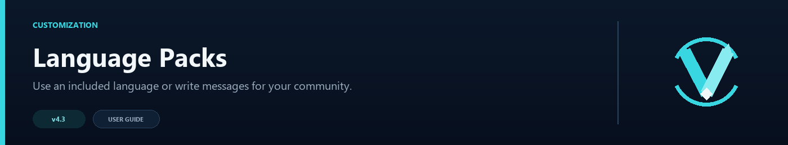

# Language Packs



VelocityNavigator keeps player-facing text in `messages.toml`. You can use one of the included translations, adjust a few lines for your network, or maintain a completely custom language.

## Included languages

| Code | Language |
|---|---|
| `en` | English |
| `ru` | Russian |
| `es` | Spanish |
| `fr` | French |
| `de` | German |
| `pt_br` | Brazilian Portuguese |
| `zh_cn` | Simplified Chinese |

Set the language at the top of `messages.toml`:

```toml
language = "de"
```

Restart the proxy or run `/vn reload`. Choosing an included language loads the complete pack, so make a copy first if you have edited the current messages.

Automated tests verify that every included pack has the complete set of messages and menu lists, contains no blank entries, switches correctly, and keeps custom-language text intact. Those checks cannot judge whether every sentence sounds natural to a native speaker, so community review still matters.

## Help us add more languages

We are eagerly looking for native speakers who can help make the included translations more natural and bring VelocityNavigator to more languages. If you can improve an existing pack or contribute a new one, please open an [issue](https://github.com/DemonZ-Development/VelocityNavigator/issues) or [pull request](https://github.com/DemonZ-Development/VelocityNavigator/pulls).

When contributing, include the language name and code, translate every player-facing value, and keep placeholders such as `<player>`, `<server>`, and `<time>` unchanged. Native review is especially valuable for party, queue, error, and menu wording that automated checks cannot evaluate.

## Custom translations

Use your own short code when you want to keep custom text:

```toml
language = "nl"
```

Unknown codes are treated as custom packs and your current values are preserved. Leave `active_language` alone; VelocityNavigator updates it to remember which built-in pack is currently written to the file.

To make a private translation for your own network:

1. Back up `messages.toml`.
2. Set `language` to a code that is not in the included-language table, such as `nl` or `pirate`.
3. Run `/vn reload` once so the custom code becomes active without replacing your current values.
4. Translate the message, menu, party, and queue values and reload again.

Because the code is custom, VelocityNavigator will not overwrite those translations with a built-in pack.

VelocityNavigator uses one language for the whole proxy. It does not switch messages automatically from each player's client locale.

## Placeholders

Messages may contain placeholders such as `<player>`, `<server>`, `<time>`, `<reason>`, `<attempt>`, and `<max>`. Keep the placeholders that matter to the message even when you rewrite the surrounding sentence.

For example:

```toml
connecting = "<green>Sending you to <server>...</green>"
cooldown = "<yellow>Please wait <time> more second(s).</yellow>"
```

Party, queue, menu, and admin messages have their own placeholders. The comments written above each setting show the values available there.

## Colors and formatting

The text fields accept:

- MiniMessage tags such as `<green>` and `<bold>`
- classic codes such as `&a` and `&l`
- hex colors such as `&#55FFFF`
- Bungee-style hex color sequences

If you want angle brackets to appear as text instead of a placeholder, use `&lt;` and `&gt;`.

## Menu text

The same file also contains the default text used by selectors:

- `[menus.chat]` for the clickable Java chat menu
- `[menus.inventory]` for the Java inventory title, item names, and lore
- `[menus.bedrock]` for the Bedrock form title, content, and buttons

Per-server icons, slots, names, and lore overrides belong in `gui.toml`; see [Java and Bedrock Selectors](Java-and-Bedrock-Selectors).

## After editing

Run:

```text
/vn reload
```

If a line does not render as expected, check for an unclosed MiniMessage tag or a placeholder that was accidentally changed. The [Troubleshooting Guide](Troubleshooting-Guide) has more formatting checks.
