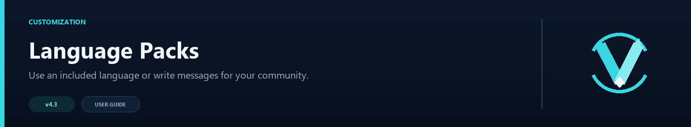

# Language Packs



VelocityNavigator stores player-facing text in `messages.toml`. You can use an included translation, adjust lines for your network, or maintain a custom language.

## Included languages

| Code | Language |
|---|---|
| `en` | English |
| `ru` | Russian |
| `es` | Spanish |
| `fr` | French |
| `de` | German |
| `pt_br` | Brazilian Portuguese |
| `zh_cn` | Simplified Chinese |
| `ja` | Japanese |
| `it` | Italian |
| `ko` | Korean |
| `nl` | Dutch |
| `pl` | Polish |
| `tr` | Turkish |
| `ar` | Arabic |
| `hi` | Hindi |

To use one of these translations, change only `language` at the top of `plugins/velocitynavigator/messages.toml`:

```toml
language = "de"
```

Then run `/vn reload`. The plugin replaces `messages.toml` with the selected built-in pack and updates `active_language` itself.

Do not edit `active_language`. If you customized the current `messages.toml`, copy it somewhere safe before switching to another built-in language.

Automated tests verify that included packs contain complete messages and menu lists, lack blank entries, switch correctly, and keep custom-language text intact. Automated checks cannot evaluate natural phrasing. Community review remains important.

## Help us add more languages

Native speakers can improve translations and add new languages. Open an [issue](https://github.com/DemonZ-Development/VelocityNavigator/issues) or [pull request](https://github.com/DemonZ-Development/VelocityNavigator/pulls) to contribute.

Include the language name and code when contributing. Translate player-facing values. Keep placeholders such as `<player>`, `<server>`, and `<time>` intact. Native review improves party, queue, error, and menu text.

## Make a Custom Language Pack

Use an external `.properties` file if you want a translation you can keep and update. This is easier to maintain than repeatedly editing the generated `messages.toml`.

1. Create this directory if it does not exist:

   ```text
   plugins/velocitynavigator/languages/
   ```

2. Create a file named after your language or network. For example:

   ```text
   plugins/velocitynavigator/languages/pirate.properties
   ```

3. Add only the lines you want to replace:

   ```properties
   messages.connecting=<aqua>Sailing to <server>...</aqua>
   messages.cooldown=<yellow>Wait <time> more second(s), matey.</yellow>
   party.not_in_party=<red>You are not sailing with a crew.</red>
   queue.not_queued=<gray>You are not waiting at the dock.</gray>
   ```

4. Set the same code in `messages.toml`:

   ```toml
   language = "pirate"
   ```

5. Run:

   ```text
   /vn reload
   ```

6. Test one of the changed messages in game. For the example above, `/party status` should show the custom crew message when the player is not in a party.

The filename and language code are case-insensitive after normalization, but lowercase names without spaces are easiest to manage.

## What Happens to Missing Keys

A custom pack does not need to copy every English line. Missing keys fall back to English. Unknown keys are ignored, which protects the plugin from misspelled or obsolete setting names.

Keep placeholders exactly as written. For example, do not translate `<server>`, `<time>`, `<player>`, `{status}`, or `{players}`.

While an external pack is active, edit the `.properties` file—not the generated values in `messages.toml`. Running `/vn reload` reads the external file again and regenerates the active message values.

## List Values

Menu lore uses numbered keys:

```properties
menus.inventory.item_lore.0=<gray>Status:</gray> {status_color}{status}
menus.inventory.item_lore.1=<gray>Players:</gray> <white>{players}/{max_players}</white>
menus.inventory.item_lore.2=
menus.inventory.item_lore.3=<yellow>Click to connect</yellow>
```

Start at `.0` and keep the numbers in display order. Providing numbered entries replaces that entire default list.

VelocityNavigator uses one language for the proxy. It does not switch messages based on client locales.

## Placeholders

Messages contain placeholders such as `<player>`, `<server>`, `<time>`, `<reason>`, `<attempt>`, and `<max>`. Keep the placeholders when you rewrite sentences.

For example:

```toml
connecting = "<green>Sending you to <server>...</green>"
cooldown = "<yellow>Please wait <time> more second(s).</yellow>"
```

Party, queue, and menu messages use different placeholders. The generated `messages.toml` and the bundled English pack are the safest references for valid key names.

Selector templates follow these rules:

- `{server}` and `{display_name}` show the player-facing alias configured in `gui.toml`.
- `{server_id}` shows the server ID registered in `velocity.toml`.
- `{description}` shows the shared per-server selector description.
- Missing `display_name` values cause placeholders to fall back to the raw ID.

Chat, inventory, and Bedrock selector templates use these braces. Connection messages use the connection target. Display aliases do not replace the raw ID in routing, selector tokens, or connection requests.

## Colors and formatting

Text fields accept:

- MiniMessage tags (`<green>`, `<bold>`)
- Classic codes (`&a`, `&l`)
- Hex colors (`&#55FFFF`)
- Bungee-style hex color sequences

Use `&lt;` and `&gt;` for text angle brackets.

## Menu text

The file contains default text used by selectors:

- `[menus.chat]` for the clickable Java chat menu
- `[menus.inventory]` for the Java inventory title, item names, and lore
- `[menus.bedrock]` for the Bedrock form title, content, and buttons

Per-server display aliases, descriptions, ordering, visibility, icons, slots, inventory templates, and state styles reside in `gui.toml`. See [Selector Customization](Server-Display-Names). The inventory `name`/`lore` fields take precedence over state and localized defaults. Run `/vn reload` after editing files.

Each server uses one `display_name` and `description`. It lacks localized per-language aliases. Language packs translate surrounding selector templates, controls, status values, and shared wording.

## After editing

Run:

```text
/vn reload
```

If a line renders incorrectly, check for unclosed MiniMessage tags or changed placeholders. The [Troubleshooting Guide](Troubleshooting-Guide) lists formatting checks.

If the custom text does not appear, check these four things:

1. The file is under the proxy's `plugins/velocitynavigator/languages/` directory.
2. The filename matches `language` exactly apart from case normalization.
3. The key exists in the generated `messages.toml`.
4. `/vn reload` completed successfully.
