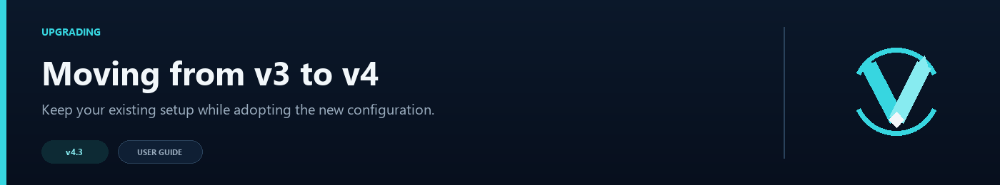

# Migration Guide: v3 → v4



The upgrade is straightforward, but keep a copy of the old plugin folder until you have tried the new JAR on one proxy. This guide walks through the files and settings worth checking.

## Before You Begin

**Back up your config before starting.**

```bash
cp plugins/velocitynavigator/navigator.toml plugins/velocitynavigator/navigator.toml.v3-backup
```

Also back up your entire `plugins/velocitynavigator/` directory if you want to be safe.

---

## Step 1: Replace the JAR

1. Download `VelocityNavigator-4.3.0.jar` from the [VelocityNavigator Modrinth page](https://modrinth.com/plugin/velocitynavigator).
2. Remove the old JAR from `plugins/`.
3. Place the new JAR in `plugins/`.

```
plugins/
├── VelocityNavigator-4.3.0.jar   ← new
└── velocitynavigator/
    ├── navigator.toml              ← will be auto-migrated
    └── ...
```

---

## Step 2: Start the Proxy

Start (or restart) your Velocity proxy. VelocityNavigator v4 will:

1. Detect the v3 config format.
2. Automatically migrate it to v4 format.
3. Create a backup at `navigator.toml.bak`.
4. Log any migration warnings to the console.

You should see something like:

```
[VelocityNavigator] Config migrated from v3 to v4 format. Backup saved as navigator.toml.bak
```

---

## Step 3: Verify the Migration

### Compare the backup with the new config

```bash
diff plugins/velocitynavigator/navigator.toml.bak plugins/velocitynavigator/navigator.toml
```

### Check for logged warnings

Review the proxy console for any warnings like:

```
[VelocityNavigator] WARNING: Config field 'update_checker.enabled' is no longer supported in v4. The update checker now always runs on startup.
```

These warnings indicate fields that were removed or renamed. See the [Config Changes Table](#config-changes-table) below.

### Verify routing works

1. Run `/vn status` to confirm the plugin loaded correctly.
2. Type `/lobby` in-game to test routing.
3. Run `/vn debug player <name>` to verify routing decisions.

---

## Step 4: Update Scripts and Automation

If you have any scripts or external tools that depend on v3 config fields, update them:

- Scripts reading `update_checker.enabled` → removed (checker always runs on startup).
- Scripts reading `update_checker.notifyConsole` → removed (always logs to console).
- Scripts reading `update_checker.startupDelaySeconds` → removed (fixed at 5 seconds).
- Scripts checking `velocitynavigator.bypasscooldown` permission → update to `velocitynavigator.bypass.cooldown` (legacy name still works).

---

## Config Changes Table

### Removed Fields

| Field | Was (v3) | Notes |
|-------|----------|-------|
| `update_checker.enabled` | `true`/`false` | Checker now always runs once on startup. Use `notifyOnStartup` to suppress notification. |
| `update_checker.notifyConsole` | `true`/`false` | Always logs to console now. |
| `update_checker.startupDelaySeconds` | `5` | Fixed at 5 seconds. |

### Added Fields

| Field | Default | Description |
|-------|---------|-------------|
| `routing.max_retries` | `2` | Connection retry attempts on failure. |
| `circuit_breaker.enabled` | `true` | Enable/disable circuit breaker. |
| `circuit_breaker.failure_threshold` | `3` | Failures before circuit opens. |
| `circuit_breaker.cooldown_seconds` | `30` | Seconds before HALF_OPEN transition. |
| `circuit_breaker.half_open_max_tests` | `1` | Test requests in HALF_OPEN state. |
| `degradation.enabled` | `true` | Enable graceful degradation. |
| `degradation.mode` | `"random"` | Degradation selection mode. |
| `messages.retrying` | `"<yellow>Connection failed, retrying... (<attempt>/<max>)</yellow>"` | Retry notification message. |
| `notify_on_startup` | `true` | Show update notification on proxy start. |
| `notify_admins_on_join` | `true` | Notify admins with `velocitynavigator.admin` permission about available updates when they join. |
| Contextual group `mode` | (inherits global) | Per-group selection mode override. |
| Contextual `fallback_chain` | `{}` | Fallback group ordering. |

### Changed Fields

| Field | v3 | v4 | Migration |
|-------|----|----|-----------|
| `routing.default_lobbies` | `["lobby-1", "lobby-2"]` | Same format + inline tables | Backward compatible — plain strings still work |
| `routing.selection_mode` | 3 modes | 7 modes | Old modes still work; new: `power_of_two`, `weighted_round_robin`, `least_connections`, `consistent_hash` |
| `routing.contextual.groups` | `Map<String, List<LobbyEntry>>` | `Map<String, GroupConfig>` | Auto-migrated; GroupConfig adds optional `mode` field |

---

## Permission Node Change

| v3 | v4 | Notes |
|----|----|-------|
| `velocitynavigator.bypasscooldown` | `velocitynavigator.bypass.cooldown` | **Both still work.** The old name is checked as a fallback. Update your permission plugins when convenient. |

---

## New Commands

| Command | Description |
|---------|-------------|
| `/vn drain <server>` | Mark a server as drained (no new players routed) |
| `/vn undrain <server>` | Remove the drain flag |
| `/vn drain status` | List all drained servers |
| `/vn updatecheck` | Manually check for updates |

---

## Rollback

If v4 causes issues, you can roll back:

1. Stop the proxy.
2. Replace the v4 JAR with the v3 JAR.
3. Restore the v3 config:
   ```bash
   cp plugins/velocitynavigator/navigator.toml.v3-backup plugins/velocitynavigator/navigator.toml
   ```
4. Start the proxy.

---

## v4.1.0 Update: Config Version v5

If upgrading from v4.0.0 to v4.1.0, the config auto-migrates from version 4 to version 5.

### New v4.1 Config Sections

```
[startup]         → Welcome messages
[lobby]           → Empty lobby strategy (disconnect / fallback_server)
[bedrock]         → Bedrock/Geyser player support
```

### New v4.1 Config Keys

- `messages.formatting` — legacy color conversion mode (`auto`, `minimessage`, `legacy`)
- `messages.dashboard_healthy` / `dashboard_draining` / `dashboard_open` / `dashboard_offline` — customizable `/vn servers` status colors
- `startup.welcome_enabled` — first-run experience. The old `startup.wiki_url` key is removed automatically because documentation links now always use the official wiki.
- `lobby.no_server_strategy` / `lobby.no_server_message` / `lobby.fallback_server` — empty lobby fallbacks
- `bedrock.*` — full Bedrock/Geyser configuration block

### Permission Default Changed

In v4.1.0, `commands.permission` defaults to `"none"` instead of `"velocitynavigator.use"`. Existing configs with a custom permission are preserved during migration.

### New Commands

| Command | Description |
|---------|-------------|
| `/vn servers` | Paginated lobby server status dashboard |

---

## v4.2.0 Update: Config Version v6

If upgrading to v4.2.0, the config auto-migrates to version 6.

### New v4.2 features and configurations

1. **Interactive selector menus**:
   - **Bedrock Form GUI**: automatically displays a native Cumulus SimpleForm lobby selector to Geyser players (customizable titles/content/buttons under `[bedrock]`).
   - **Java chat selector**: Adventure-formatted click-to-connect chat menu for Java players (customizable headers/formats/tooltips under `[routing]`).
2. **Ping-based routing (`latency`)**:
   - New `latency` routing strategy selects the server with the lowest measured ping.
3. **Prometheus monitoring**:
   - Embedded metrics exporter serving Prometheus-formatted metrics at `/metrics` (configured under `[metrics.prometheus]`).
4. **Grafana setup command**:
   - `/vn setup grafana` generates a pre-configured Grafana dashboard JSON file.

### New v4.2 Config keys

- `routing.use_menu_for_lobby` — toggle the configured Java selector. The old `use_chat_menu_for_lobby` key remains readable.
- `bedrock.use_gui_for_lobby` — toggle native Form selector for Bedrock players.
- Bedrock Form title/content/button text moved to `[menus.bedrock]` in `messages.toml`.
- `metrics.prometheus.enabled` / `port` / `bind_host` — embedded Prometheus server configuration.

---

## v4.3.0 Update: Config Version v8

VelocityNavigator 4.3.0 writes `config_version = 8`. Any older `navigator.toml` is backed up as `navigator.toml.v<old-version>.bak` before the normalized v8 file is written.

The migration also separates presentation and managed-server data:

- `messages.toml` contains language selection and configurable messages.
- `gui.toml` contains Java inventory and Bedrock form presentation.
- `servers.toml` contains command-managed lobby metadata.
- Backend Paper/Spigot installations generate their own `config.yml`.

### New v4.3 systems

1. **Universal proxy/backend JAR** with a paginated Java inventory selector and `/vn bridge status`.
2. **Seven built-in language packs plus custom codes** without automatic player-locale detection.
3. **Persistent affinity** with a ten-minute TTL, periodic disk saves, and restart restore.
4. **Retry backoff with jitter**, `/vn health`, and silent update checks.
5. **Optional parties and capacity queues** with independently configurable commands and permissions.
6. **Optional Redis multi-proxy synchronization** and signed backend registration.
7. **Backend MOTD lifecycle-state routing**.
8. **Managed game/lobby server commands** with dry-run, validation, backups, atomic writes, and rollback.
9. **Prometheus metrics and an optional HTML operations dashboard**.

### New v4.3 configuration sections

- `[dashboard]`
- `[party]`
- `[queue]`
- `[redis]`
- `[backend_states]`
- `[server_management]`
- `[routing.java_menu]`
- Expanded `[bedrock]` and `[metrics]` settings
- `update_checker.silent`

All advanced systems can remain disabled. Review [Advanced Proxy Systems](Advanced-Proxy-Systems) before enabling Redis, queueing, parties, lifecycle states, or managed server writes.

### New v4.3 commands

| Command | Description |
|---------|-------------|
| `/vn health` | Consolidated routing, cache, circuit, affinity, and Redis diagnostics |
| `/vn bridge status` | Show detected backend GUI bridges |
| `/vn redis status|test` | Inspect or test the Redis endpoint |
| `/vn server add game|lobby ...` | Add a Velocity-only game server or a routed lobby |
| `/vn server dry-run ...` | Validate a managed server operation without writing files |
| `/vn server remove|list ...` | Remove or inspect managed servers |
| `/vn config validate` | Validate commands, listeners, Redis, queue, and managed files |

After migration, run `/vn config validate`, restart every bridged backend, and use `/vn bridge status` before enabling the Java inventory selector for players.

---

See also: [Configuration Guide](Configuration-Guide) | [Changelog](https://github.com/DemonZ-Development/VelocityNavigator/blob/main/CHANGELOG.md)
