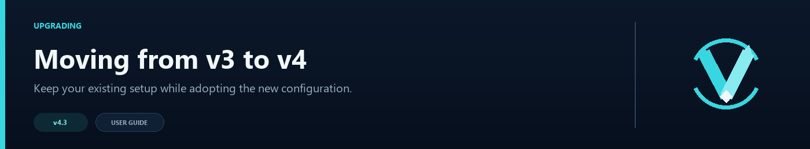

# Migration Guide: v4.4 → 4.5



The upgrade from 4.4.0 to 4.5.0 is smooth — `navigator.toml` auto-migrates from version 8 to version 9, new modular config files are generated with safe defaults, and all existing routing continues to work. The backend `config.yml` also auto-migrates from v1 to v2.

## Before You Begin

**Back up your config before starting.**

```bash
cp -r plugins/velocitynavigator/ plugins/velocitynavigator-v4.4-backup/
```

If you run the Paper/Spigot backend bridge:

```bash
cp plugins/VelocityNavigator/config.yml plugins/VelocityNavigator/config.yml.v1-backup
```

---

## What Changed

| Area | 4.4.0 | 4.5.0 |
|---|---|---|
| `navigator.toml` version | 8 | **9** |
| `gui.toml` version | 2 | 2 (unchanged) |
| Backend `config.yml` version | 1 | **2** |
| Config files | `navigator.toml`, `messages.toml`, `gui.toml`, `servers.toml` | Above + `storage.toml`, `auth.toml`, `geo.toml` |
| NavigatorAPI access | Cast to `VelocityNavigator` | Direct via `config()`, `server()`, `logger()`, `dataDirectory()`, etc. |
| Backups location | Plugin root | `backups/` subfolder |
| Java selector | Auto-route or inventory/chat | Auto-route or inventory/chat (unchanged) |

---

## Step 1: Replace the JAR

1. Download `VelocityNavigator-4.5.0.jar` from [Modrinth](https://modrinth.com/plugin/velocitynavigator).
2. Stop the Velocity proxy.
3. Remove the old JAR from `plugins/`.
4. Place the new JAR in `plugins/`.

If you use the backend bridge, replace the JAR on every Paper/Spigot backend as well. The same JAR works on both sides.

```
plugins/
├── VelocityNavigator-4.5.0.jar   ← new (proxy + every backend)
└── velocitynavigator/
    ├── navigator.toml              ← will be auto-migrated to v9
    ├── messages.toml
    ├── gui.toml
    └── ...
```

---

## Step 2: Start the Proxy

Start your Velocity proxy. VelocityNavigator will:

1. Detect the v8 config.
2. Back it up to `backups/navigator.toml.v8.bak`.
3. Migrate to v9 format.
4. Generate new modular config files (`storage.toml`, `auth.toml`, `geo.toml`) with safe defaults.
5. Log migration notices to the console.

You should see something like:

```
[VelocityNavigator] Migrated navigator.toml from v8 to v9.
[VelocityNavigator] Created storage.toml with default settings.
```

The migration creates a backup of your old config under `backups/navigator.toml.v8.bak`. All existing legacy `.bak` files in the plugin root are automatically moved to the `backups/` folder.

---

## Step 3: Verify the Migration

### Check the new config files

After migration, your `plugins/velocitynavigator/` folder should look like:

```
velocitynavigator/
├── navigator.toml       ← v9, with all your settings preserved
├── messages.toml        ← unchanged
├── gui.toml             ← unchanged (still v2)
├── servers.toml         ← unchanged
├── storage.toml         ← new (defaults to file storage)
├── auth.toml            ← new (disabled by default)
├── geo.toml             ← new (disabled by default)
└── backups/
    └── navigator.toml.v8.bak
```

### Verify routing works

1. Run `/vn status` to confirm the plugin loaded correctly.
2. Type `/lobby` in-game to test routing.
3. Run `/vn debug player <name>` to verify routing decisions.
4. Run `/vn config validate` to check for any config issues.

---

## Step 4: Update Backend Servers

Every Paper/Spigot backend running the bridge JAR needs the 4.5.0 JAR. The backend `config.yml` auto-migrates from v1 to v2 on first load.

**What changes in backend `config.yml`:**

| v1 Key | v2 Change |
|---|---|
| `bstats_plugin_id` | Removed (now hardcoded to 32887) |
| — | New: `config_version = 2` |
| — | New: `update_check_enabled` (default `true`) |
| — | New: `update_check_interval_minutes` (default `120`) |

After replacing the JAR and restarting backends, run `/vn bridge status` on the proxy to confirm each backend shows `✓ (up to date)`.

---

## New Features You Can Enable

All new systems are disabled by default. Review each one before enabling it.

### Database Storage

Edit `storage.toml` to switch from file storage to a database backend. The default uses local file storage:

```toml
# storage.toml (default — no changes needed)
[storage]
type = "file"
```

To enable a database backend:

```toml
# storage.toml (database example)
[storage]
type = "sqlite"           # file, sqlite, mysql, mariadb, postgresql
host = "localhost"
port = 3306
database = "vn_data"
username = ""
password = ""
sqlite_file = "data.db"
pool_size = 10
connection_timeout_ms = 5000
```

See [Storage & Databases](Storage-and-Databases) for setup instructions.

### Authentication

Edit `auth.toml` to require player login before routing:

```toml
# auth.toml
[auth]
enabled = true
algorithm = "argon2id"
enable_2fa = false
pin_length = 6
void_world_holding = true
session_timeout_minutes = 60
holding_server = "holding"
```

Players use `/register <password>` and `/login <password>`. Set up a holding server in `velocity.toml` before enabling. See [Authentication & Security](Authentication-and-Security).

### Geo Routing

Edit `geo.toml` and `navigator.toml` to enable country-based affinity routing:

```toml
# geo.toml
[geo_routing]
enabled = true
database_path = "GeoLite2-City.mmdb"
```

See [Geo Routing](Geo-Routing) for the full setup including the MaxMind database.

### Maintenance Mode

Network-wide and per-server maintenance with customizable reason messages is available via new admin commands. See [Maintenance Mode](Maintenance-Mode).

---

## Config Changes Table

### navigator.toml v8 → v9

| Change | Details |
|---|---|
| Version bump | `config_version` changes from `8` to `9` |
| Storage section | Embedded `[storage]` settings migrated to `storage.toml` |
| Auth section | Embedded `[auth]` settings migrated to `auth.toml` |
| Geo section | Embedded `[geo_routing]` settings migrated to `geo.toml` |
| Holding server | Added `holding_server` key under `[auth]` |
| Backups location | Legacy `.bak` files moved from root to `backups/` |

### New Config Files

| File | Default State | What It Controls |
|---|---|---|
| `storage.toml` | Generated with `type = "file"` | Database backend selection (file, SQLite, MySQL, MariaDB, PostgreSQL) |
| `auth.toml` | Generated with `enabled = false` | Player authentication, sessions, and holding server; TOTP remains reserved |
| `geo.toml` | Generated with `enabled = false` | GeoIP database path, provider selection |

### New Admin Commands

| Command | Description |
|---|---|
| `/vn affinity clean` | Purge expired in-memory affinity entries |
| `/vn redis status\|test` | Inspect or test the Redis connection (enhanced output) |
| `/vn bridge status` | Now shows `✓ (up to date)`, `⚠ (outdated)`, or `✗ (not detected)` per backend |

### NavigatorAPI Changes for Plugin Developers

| Change | Details |
|---|---|
| New accessor methods | `pluginVersion()`, `server()`, `logger()`, `dataDirectory()`, `config()`, `bedrockHandler()` |
| Renamed method | `getDataDirectory()` → `dataDirectory()` |
| No more casting | `MessageFormatter` and other internals no longer cast `NavigatorAPIProvider.get()` to `VelocityNavigator` |

---

## Rollback

If 4.5.0 causes issues:

1. Stop the proxy.
2. Replace the 4.5.0 JAR with the 4.4.0 JAR.
3. Restore the v8 config:
   ```bash
   cp plugins/velocitynavigator/backups/navigator.toml.v8.bak plugins/velocitynavigator/navigator.toml
   ```
4. Remove the new config files if desired:
   ```bash
   rm plugins/velocitynavigator/storage.toml
   rm plugins/velocitynavigator/auth.toml
   rm plugins/velocitynavigator/geo.toml
   ```
5. On each backend, restore the v1 `config.yml` (auto-migration also saves a backup at `plugins/VelocityNavigator/backups/config.yml.v1.bak`):
   ```bash
   cp plugins/VelocityNavigator/config.yml.v1-backup plugins/VelocityNavigator/config.yml
   # or use the auto-backup:
   # cp plugins/VelocityNavigator/backups/config.yml.v1.bak plugins/VelocityNavigator/config.yml
   ```
6. Start the proxy.

---

## Folia Compatibility

VelocityNavigator 4.5.0 adds Folia support for Paper/Spigot backends. The `plugin.yml` declares `folia-supported: true`. The backend automatically detects Folia at runtime and uses region-scoped schedulers. No configuration changes are needed — the same JAR works on standard Paper/Spigot and Folia servers.

---

See also: [Configuration Guide](Configuration-Guide) · [Modular Configuration](Modular-Configuration) · [CHANGELOG](https://github.com/DemonZ-Development/VelocityNavigator/blob/main/CHANGELOG.md)
