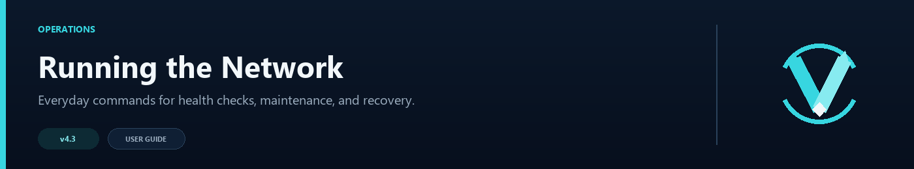

# Operations Runbook



This page covers the tasks you are most likely to perform on a running network: checking health, taking a lobby out for maintenance, confirming routing, and recovering from a bad change.

## Everyday checks

These commands give a quick picture of the network:

| Command | What to look for |
|---|---|
| `/vn status` | Active version, routing mode, and main feature state |
| `/vn health` | Aggregate circuit, cache, queue, party, Redis, and affinity diagnostics |
| `/vn servers [page]` | Per-lobby health, drain, circuit, player count, and capacity |
| `/vn config validate` | Configuration errors and useful warnings |
| `/vn bridge status` | Java inventory bridge versions seen from backends |
| `/vn redis status` | Redis connection, traffic, reconnects, and rejected registrations |

The optional [HTML Dashboard](HTML-Dashboard) provides the same kind of live overview in a browser.

## Take a server down for maintenance

Stop new players from being routed to the lobby:

```text
/vn drain lobby-2
```

Confirm it appears as drained in `/vn health`, then move or wait for its existing players before stopping the backend. Drain mode survives a normal proxy restart in `plugins/velocitynavigator/drained-servers.txt`.

When maintenance is finished, start the backend, wait for it to answer health checks, and run:

```text
/vn undrain lobby-2
```

Use drain mode for planned work. Circuit breakers are intended for unexpected failures.

## Check a routing change

After changing a routing mode, weights, capacity, or contextual group:

1. Run `/vn config validate`.
2. Run `/vn reload` and confirm it succeeds.
3. Check `/vn health` for the expected candidate pool.
4. Send several joins or `/lobby` requests through the proxy.
5. Review `/vn status`, `/vn servers`, or the HTML dashboard.

Do not expect `random`, `power_of_two`, or affinity-enabled routing to look perfectly even over a handful of players.

## Handle “No lobby found”

Run `/vn servers` first for the per-lobby view, then `/vn health` for the wider subsystem summary. Together they show whether candidates are offline, full, drained, circuit-open, or blocked elsewhere in the routing setup.

If every server is full and the queue is enabled, confirm all lobbies have a finite `max_players` and the initial-join holding server is registered. If all health checks fail, review the configured degradation or no-server strategy.

The [Troubleshooting Guide](Troubleshooting-Guide) has a symptom-by-symptom path.

## Add or remove a backend

Preview the change before writing anything:

```text
/vn server dry-run lobby lobby-3 10.0.0.23:25565 default 100 1
```

Then make the same change with `add`:

```text
/vn server add lobby lobby-3 10.0.0.23:25565 default 100 1
```

Use `/vn server list` to check managed lobbies and `/vn server remove lobby-3` to remove one. See [Server Management](Server-Management) for backups, game-server syntax, and overwrite protection.

For autoscaled backends shared by several proxies, use signed [Redis registration](Redis-and-Multi-Proxy) instead of editing each proxy by hand.

## Recover from a configuration mistake

A failed `/vn reload` keeps the last usable configuration, so read the reported error and fix the file before trying again.

For a larger rollback:

1. Stop the proxy if you need to replace `velocity.toml`.
2. Copy back the appropriate file from `plugins/velocitynavigator/backups/` or your own backup.
3. Start the proxy and run `/vn config validate`.
4. Check `/vn health` before opening traffic again.

VelocityNavigator's own data files are described in [Storage and Databases](Storage-and-Databases).

## Watch Redis on a multi-proxy network

Use `/vn redis status` to check whether state is being published and received. A reconnect counter that keeps growing usually points to endpoint, TLS, authentication, or network instability.

Every proxy must have a different `node_id`. Party membership and queue positions remain local even when Redis is healthy, so keep those players pinned to one proxy.

## Use the dashboard safely

The dashboard port is configured independently from Prometheus:

```toml
[dashboard]
enabled = true
port = 9226
bind_host = "127.0.0.1"
bearer_token = "choose-a-long-random-token"
refresh_seconds = 5
```

Keep it on loopback for local access. For a remote operations page, use a private interface, a strong token, firewall rules, and preferably an HTTPS reverse proxy.

## Add longer-term monitoring

The built-in dashboard shows current state and counters since startup. Prometheus is the better choice when you need history and alerts.

Follow [Prometheus and Grafana Setup](Prometheus-&-Grafana-Setup) to expose the metrics endpoint, secure it, and import the supplied dashboard.

## Before updating the JAR

Back up the plugin directory, read the changelog, replace the JAR, and start one proxy first when your network has several nodes. After startup, run:

```text
/vn config validate
/vn health
/vn bridge status
```

If Redis is enabled, also run `/vn redis status`. Keep the backup until normal joins, lobby commands, and any enabled selector are behaving as expected.
