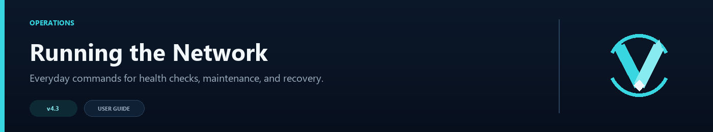

# Operations Runbook



This page covers routine network operations: checking health, taking a lobby down for maintenance, confirming routing changes, and recovering from configuration errors.

## Everyday checks

Run these commands to view network status:

| Command | What to look for |
|---|---|
| `/vn status` | Active version, routing mode, and main feature state |
| `/vn health` | Aggregate circuit, cache, queue, party, Redis, affinity, backend-state, and maintenance diagnostics |
| `/vn servers [page]` | Per-lobby health, drain, circuit, player count, and capacity |
| `/vn config validate` | Configuration errors and useful warnings |
| `/vn bridge status` | Java inventory bridge versions seen from backends |
| `/vn redis status` | Redis connection, traffic, reconnects, and rejected registrations |

The [HTML Dashboard](HTML-Dashboard) provides a live browser view of this information.

## Take a server down for maintenance

Stop the proxy from routing players to the lobby:

```text
/vn drain lobby-2
```

Confirm the server appears drained in `/vn health`. Move existing players or wait for them to disconnect before stopping the backend. Drain state is in-memory only and does not survive a proxy restart.

For a whole-network maintenance window:

```text
/vn maintenance global on Updating the network
```

The maintenance MOTD replaces the normal MOTD, new joins are rejected, and existing players are disconnected with that reason. When the work is finished, run `/vn maintenance global off`.

When maintenance ends, start the backend, wait for health checks to pass, and run:

```text
/vn undrain lobby-2
```

Use drain mode for planned work on one server. Circuit breakers handle unexpected failures. Maintenance mode is the operator flag for network or per-server outages.

## Check a routing change

After changing routing modes, weights, capacity, or contextual groups:

1. Run `/vn config validate`.
2. Run `/vn reload` and confirm success.
3. Check `/vn health` for the candidate pool.
4. Send joins or `/lobby` requests through the proxy.
5. Review `/vn status`, `/vn servers`, or the HTML dashboard.

The `random`, `power_of_two`, and affinity-enabled routing modes do not distribute players perfectly evenly at low traffic levels.

## Handle "No lobby found"

Run `/vn servers` for the per-lobby view, then `/vn health` for subsystem summaries. These commands show if candidates are offline, full, drained, circuit-open, in a disallowed lifecycle state, or blocked by routing rules.

If lobbies are full and the queue is active, verify all lobbies have a finite `max_players` value and the holding server is registered. If health checks fail, review the degradation or no-server strategy.

The [Troubleshooting Guide](Troubleshooting-Guide) provides a symptom-by-symptom path.

## Add or remove a backend

Preview the change before writing it:

```text
/vn server dry-run lobby lobby-3 10.0.0.23:25565 default 100 1
```

Apply the change:

```text
/vn server add lobby lobby-3 10.0.0.23:25565 default 100 1
```

Use `/vn server list` to list managed lobbies. Use `/vn server remove lobby-3` to remove one. See [Server Management](Server-Management) for backups, syntax, and overwrite protection.

For autoscaled backends shared across proxies, use [Redis Registration](Redis-and-Multi-Proxy) instead of manually editing proxies.

## Recover from a configuration mistake

A failed `/vn reload` keeps the last usable configuration. Read the error and fix the file before retrying.

For larger rollbacks:

1. Stop the proxy if you must replace `velocity.toml`.
2. Copy the file from `plugins/velocitynavigator/backups/` or your backup location.
3. Start the proxy and run `/vn config validate`.
4. Check `/vn health` before allowing traffic.

[Storage and Databases](Storage-and-Databases) details VelocityNavigator's data files.

## Watch Redis on a multi-proxy network

Use `/vn redis status` to verify the proxy publishes and receives state. An increasing reconnect counter points to endpoint, TLS, authentication, or network issues.

Give each proxy a unique `node_id`. Party membership and queue positions remain local even when Redis is active. Pin those players to one proxy.

## Use the dashboard safely

The dashboard port uses separate configuration from Prometheus:

```toml
[dashboard]
enabled = true
port = 9226
bind_host = "127.0.0.1"
bearer_token = "choose-a-long-random-token"
refresh_seconds = 5
```

Keep the dashboard on loopback for local access. For remote access, use a private interface, a strong token, firewall rules, and an HTTPS reverse proxy.

## Add longer-term monitoring

The dashboard shows current state and startup counters. Prometheus provides history and alerts.

Follow [Prometheus and Grafana Setup](Prometheus-&-Grafana-Setup) to expose the metrics endpoint, secure it, and import the dashboard.

## Before updating the JAR

Back up the plugin directory, read the changelog, and replace the JAR. Start one proxy first on multi-node networks. Run:

```text
/vn config validate
/vn health
/vn bridge status
```

Run `/vn redis status` if Redis is enabled. Keep the backup until normal joins, lobby commands, and selectors function correctly.
