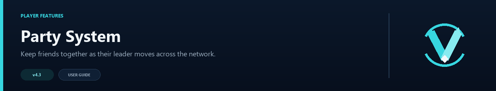

# Party System



Parties let friends move through the network together. They include invitations, a member list, private chat, and optional leader follow without requiring a separate party plugin.

## Enable parties

Open `navigator.toml`:

```toml
[party]
enabled = true
invite_timeout_seconds = 60
follow_leader = true
max_size = 20
command = "party"
chat_command = "p"
permission = "none"
```

Run `/vn config validate`, then `/vn reload`.

## Player commands

| Command | Purpose |
|---|---|
| `/party invite <player>` | Invite an online player |
| `/party accept` | Accept the latest valid invitation |
| `/party deny` | Decline the invitation |
| `/party status` | Show the current members |
| `/party kick <player>` | Remove a member; leader only |
| `/party leave` | Leave the party |
| `/party disband` | Close the party; leader only |
| `/party chat <message>` | Send a private party message |
| `/p <message>` | Short party-chat command |

Running `/party` with no subcommand also shows the current party status.

## Leader follow

With `follow_leader = true`, online members follow the leader after the leader successfully changes server. A member who is offline or already disconnected is simply skipped.

Turn this off if another plugin already handles group movement:

```toml
follow_leader = false
```

## Party lifetime and disconnects

Parties are designed for players who are online together on one proxy:

- If a member disconnects, that member is removed from the party.
- If the leader disconnects, the whole party is disbanded.
- A new invitation to the same player replaces their previous pending invitation, so `/party accept` and `/party deny` always use the latest valid invite.
- Parties and pending invitations are not saved across a Velocity restart.

This keeps the built-in system predictable and lightweight. Networks that need persistent parties, offline members, leader transfer, or cross-proxy party state should use a dedicated party plugin and turn off VelocityNavigator's party commands.

## Limits and permissions

`max_size` includes the leader. `invite_timeout_seconds` controls how long an unanswered invitation remains valid.

Leave `permission = "none"` when everyone may use parties, or set your own permission node:

```toml
permission = "network.party"
```

The command names are configurable, but they must not overlap `/lobby`, `/vn`, the queue command, or each other. `/vn config validate` reports a collision.

## Multi-proxy networks

Party membership is kept on the Velocity proxy where the party was created. Redis does not make parties global. If you run several proxies, configure your external load balancer so party members remain on the same proxy.

## Common checks

- **Invite says player not found:** both players must be online on the same Velocity proxy.
- **Members do not follow:** confirm `follow_leader` is enabled and no other plugin is cancelling the connection.
- **`/p` belongs to another plugin:** change `chat_command` and reload.
- **Commands disappear:** confirm `enabled = true` and run `/vn config validate` for command collisions.

Party messages can be changed in `messages.toml`; see [Language Packs](Language-Packs).
