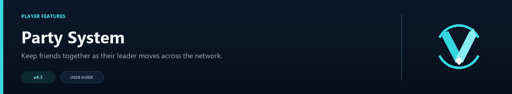

# Party System



Parties keep a group together while players move around your network. They include invitations, private chat, leader and officer roles, and optional automatic following. You do not need a separate party plugin.

## Quick setup

Open `plugins/velocitynavigator/navigator.toml` on the proxy and find the `[party]` section:

```toml
[party]
enabled = true
invite_timeout_seconds = 60
follow_leader = true
join_delay_ms = 250
max_size = 20
command = "party"
chat_command = "p"
permission = "none"
```

Save the file, then run:

```text
/vn config validate
/vn reload
```

Test it with two players on the same proxy:

```text
PlayerOne: /party invite PlayerTwo
PlayerTwo: /party accept
PlayerOne: /party status
PlayerOne: /party warp
```

The status output should list both players. `/party warp` should move PlayerTwo to PlayerOne's current backend.

## Player commands

| Command | Purpose |
|---|---|
| `/party invite <player>` | Invite an online player |
| `/party accept` | Accept the latest valid invitation |
| `/party deny` | Decline the invitation |
| `/party status` | Show the party name, leader, members, and open/private state |
| `/party rename <name>` | Change the party name |
| `/party open` | Allow players to join without an invitation |
| `/party close` | Require an invitation |
| `/party join <leader>` | Join an open party |
| `/party promote [officer\|leader] <player>` | Promote an officer or transfer leadership |
| `/party demote <player>` | Return an officer to member |
| `/party warp` | Move online followers to the leader's current server |
| `/party menu` or `/party gui` | Open a native Bedrock form or clickable Java chat panel |
| `/party kick <player>` | Remove a member |
| `/party leave` | Leave the party |
| `/party disband` | Close the party |
| `/party chat <message>` | Send a private party message |
| `/p <message>` | Use the short party-chat command |

Running `/party` without a subcommand also shows the current status.

## Roles

Parties have three roles:

- **Leader:** Can disband or rename the party, transfer leadership, promote officers, change the open/private setting, and warp the group.
- **Officer:** Can invite and kick players.
- **Member:** Can use party chat and follow the leader.

## Bedrock and Java menus

`/party menu` and `/party gui` choose a display that matches the player's client:

- **Bedrock Edition:** Opens a native Floodgate/Cumulus form. Install Floodgate on the proxy for this interface.
- **Java Edition:** Sends a clickable management panel in chat. It lists roles and provides buttons for actions the player is allowed to perform. It is not an inventory menu.

## PlaceholderAPI

To use party values in scoreboards, holograms, or tab lists, install PlaceholderAPI and the VelocityNavigator JAR on that backend. The player must join through the Velocity proxy so the bridge can receive their current party state.

Use these placeholders:

- `%velocitynavigator_party_in_party%` (`true`/`false`)
- `%velocitynavigator_party_name%` (custom party name or `None`)
- `%velocitynavigator_party_leader%` (leader username)
- `%velocitynavigator_party_role%` (`Leader`, `Officer`, `Member`, or `None`)
- `%velocitynavigator_party_size%` (member count)
- `%velocitynavigator_party_max_size%` (configured maximum)
- `%velocitynavigator_party_is_leader%` (`true`/`false`)
- `%velocitynavigator_party_is_open%` (`true`/`false`)
- `%velocitynavigator_party_members%` (comma-separated member list)

For a quick check, run PlaceholderAPI's parse command from the backend:

```text
/papi parse me %velocitynavigator_party_role%
```

It should return the player's current role. It returns `None` when no party state is available.

## Automatic leader follow

With `follow_leader = true`, online members follow the leader after a successful server change. The proxy skips offline and disconnected members.

Disable this if another plugin already moves groups:

```toml
follow_leader = false
```

## Invitations and disconnects

Each player has one current pending invitation. A newer invitation replaces the previous one. Invitations expire after `invite_timeout_seconds`.

The proxy keeps a disconnected player's party slot and role for 60 seconds. Rejoining the same proxy within that window restores the membership. After 60 seconds the member is removed. If the leader expires, leadership moves to another member or the empty party is disbanded.

Parties and invitations do not survive a Velocity restart.

## Limits and permissions

`max_size` includes the leader. Set `permission = "none"` to allow everyone, or use a permission node:

```toml
permission = "network.party"
```

Command names are configurable, but they must not overlap `/lobby`, `/vn`, the queue command, or each other. `/vn config validate` reports collisions.

## If you run more than one proxy

Party data lives in the memory of one proxy. Redis does not synchronize it. Configure your external load balancer to keep a party's players on the same Velocity instance.

## Common problems

- **Invite says player not found:** Both players must be online on the same proxy.
- **Members do not follow:** Check `follow_leader` and make sure another plugin is not cancelling the connection.
- **Placeholder returns `None`:** Confirm PlaceholderAPI and the same VelocityNavigator JAR are installed on that backend, then reconnect through Velocity.
- **`/p` belongs to another plugin:** Change `chat_command` and reload.
- **Party commands disappear:** Confirm `enabled = true`, then run `/vn config validate`.

Party messages live in `messages.toml`. See [Language Packs](Language-Packs) if you want to translate them.
