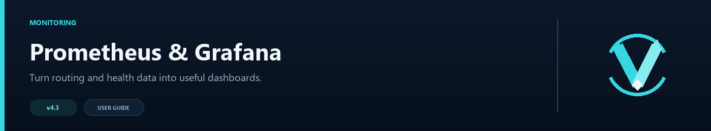
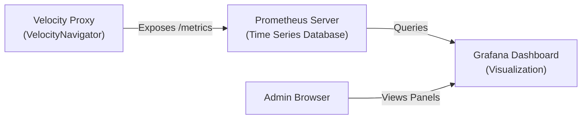

# Prometheus & Grafana Integration Setup Guide



Prometheus collects VelocityNavigator's metrics, and Grafana turns them into charts you can keep open during busy hours or maintenance. Both are optional; normal routing works without them.

## Architecture Overview



- **VelocityNavigator** exposes statistics (active players, server states, circuit breaker statuses, connection rates) in a format Prometheus understands.
- **Prometheus** visits your proxy periodically to collect these statistics.
- **Grafana** reads from Prometheus to render charts and timelines.

---

## Step 1: Enable Metrics in VelocityNavigator

Open your `navigator.toml` file and look for the `[metrics]` block. Configure it as follows:

```toml
[metrics]
enabled = true

[metrics.prometheus]
enabled = true
bind_host = "127.0.0.1"     # Safest when Prometheus runs on the same host
port = 9225                 # Choose a free port (e.g. 9225 or 30042)
bearer_token = ""           # Set a strong token before binding beyond loopback
```

> [!IMPORTANT]
> **Pterodactyl & game panel users:**
> Docker container environments block non-allocated ports. To use the Prometheus exporter, you **must**:
> 1. Request an extra **Port Allocation** (e.g. `25582`) in your panel under the **Network** tab.
> 2. Set `port = 25582` in your `navigator.toml` to match that exact allocated port.

After updating the config, restart your proxy or reload the config using `/vn reload`.

If Prometheus runs on another host, bind to a private interface where possible, set `bearer_token`, and restrict the port to the Prometheus source address. Avoid an unauthenticated `0.0.0.0` listener.

---

## Step 2: Configure Prometheus

If you run your own Prometheus instance (on the same VPS, Docker host, or a central metrics server), add your Velocity proxy as a scrape target in your `prometheus.yml` configuration:

```yaml
scrape_configs:
  - job_name: 'velocity_navigator'
    scrape_interval: 5s       # Scraping frequency
    metrics_path: '/metrics'  # Default path
    static_configs:
      - targets: ['<PROXY_IP>:<METRICS_PORT>'] # E.g., '13.126.225.90:9225'
```

### Securing Your Metrics (Recommended)
If you set a `bearer_token` in your `navigator.toml`, tell Prometheus to pass that token when scraping:

```yaml
scrape_configs:
  - job_name: 'velocity_navigator'
    scrape_interval: 5s
    metrics_path: '/metrics'
    authorization:
      credentials: 'your-secret-token' # Replace with your actual bearer_token
    static_configs:
      - targets: ['<PROXY_IP>:<METRICS_PORT>']
```

Restart Prometheus to apply the configuration.

---

## Step 3: Set Up Grafana

### 1. Add the Prometheus Data Source
1. Open your Grafana dashboard in your browser (usually `http://<vps-ip>:3000`).
2. Navigate to **Connections** → **Data Sources** → **Add data source**.
3. Select **Prometheus**.
4. In the **Connection** settings, enter your Prometheus server URL (e.g. `http://localhost:9090`).
5. Scroll to the bottom and click **Save & test**.

### 2. Generate and Import the Dashboard
Run this command on your Velocity proxy console to generate the pre-built dashboard JSON configuration file:

```
vn setup grafana
```

This writes a file named `grafana-dashboard.json` into your `plugins/VelocityNavigator` folder.

**Importing the JSON**:
1. Download `grafana-dashboard.json` from your proxy server files to your computer.
2. In the Grafana web panel, click **Dashboards** in the left menu.
3. Click the **New** dropdown button in the top right and select **Import**.
4. Click **Upload JSON file** and select the generated `grafana-dashboard.json` file.
5. Select your Prometheus data source at the bottom and click **Import**.

---

## Key Metrics Exposed

The key metrics you can use to build custom charts:

| Metric Name | Type | Description |
|:---|:---|:---|
| `velocitynavigator_player_joins_total` | Counter | Total player connection attempts to the proxy. |
| `velocitynavigator_player_leaves_total` | Counter | Total player disconnects. |
| `velocitynavigator_server_online` | Gauge | Online state of tracked backend servers (`1` = Online, `0` = Offline). |
| `velocitynavigator_server_players` | Gauge | Player count currently connected to each backend server. |
| `velocitynavigator_server_latency_ms` | Gauge | Latency/ping of health checks to backend servers (ms). |
| `velocitynavigator_server_circuit_breaker` | Gauge | State of each circuit breaker (`0`=CLOSED, `1`=HALF_OPEN, `2`=OPEN). |
| `velocitynavigator_server_drained` | Gauge | Drained state of backend servers (`1`=Drained, `0`=Active). |
| `velocitynavigator_routed_connections_total` | Counter | Total successful connections routed to each server. |
| `velocitynavigator_redirects_total` | Counter | Total count of redirects grouped by reason. |
| `velocitynavigator_routing_retries_total` | Counter | Connection retries attempted by the routing workflow. |
| `velocitynavigator_fallback_events_total` | Counter | Routing fallback events grouped by reason. |
| `velocitynavigator_circuit_breaker_trips_total` | Counter | Circuit-breaker trip count. |
| `velocitynavigator_party_count` | Gauge | Number of active local parties. |
| `velocitynavigator_queue_size` | Gauge | Number of players in the local capacity queue. |
| `velocitynavigator_redis_connected` | Gauge | Redis connection state (`1` = connected, `0` = disconnected). |
| `velocitynavigator_redis_reconnects_total` | Counter | Redis reconnect attempts. |
| `velocitynavigator_redis_rejected_registrations_total` | Counter | Dynamic registration events rejected by validation. |

---

## Troubleshooting Setup Issues

- **Failed to bind to port:** check if another service is using the port, or change it in `navigator.toml`.
- **Cannot assign requested address:** if you are hosted on Pterodactyl or container networks, set `bind_host` to `0.0.0.0` instead of a public IP.
- **Connection timed out:** make sure you have opened your metrics port (e.g. `9225` or `30042`) in your cloud provider's firewall (AWS Lightsail, DigitalOcean, panel firewall, etc.).

For detailed steps, see the [Troubleshooting Guide](Troubleshooting-Guide).
