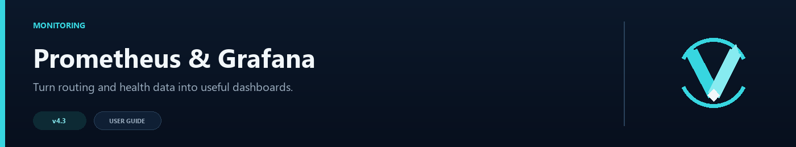
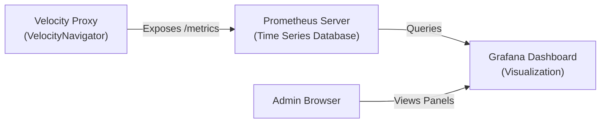

# Prometheus & Grafana Setup



Prometheus collects VelocityNavigator's metrics. Grafana turns them into charts. Both are optional. Normal routing works without them.

## Architecture overview


```mermaid
flowchart LR
    VN["Velocity Proxy\n(VelocityNavigator)"] -- Exposes /metrics --> Prom["Prometheus Server\n(Time Series Database)"]
    Prom -- Queries --> Graf["Grafana Dashboard\n(Visualization)"]
    Admin["Admin Browser"] -- Views Panels --> Graf
```

- **VelocityNavigator** exposes statistics (active players, server states, circuit-breaker statuses, connection rates) for Prometheus.
- **Prometheus** fetches these statistics periodically.
- **Grafana** reads from Prometheus to render charts.

---

## Step 1: Enable metrics in VelocityNavigator

Open `navigator.toml` and configure the `[metrics]` block:

```toml
[metrics]
enabled = true

[metrics.prometheus]
enabled = true
bind_host = "127.0.0.1"     # Safest when Prometheus runs on the same host
port = 9225                 # Choose a free port (e.g. 9225 or 30042)
bearer_token = ""           # Set a strong token before binding beyond loopback
```

> [!IMPORTANT]
> **Pterodactyl and game panel users:**
> Docker container environments block non-allocated ports. To use the Prometheus exporter, you must:
> 1. Request an extra port allocation (e.g. `25582`) in your panel under the Network tab.
> 2. Set `port = 25582` in `navigator.toml` to match that allocated port.

Restart the proxy or reload the config using `/vn reload`.

If Prometheus runs on another host, bind to a private interface, set a `bearer_token`, and restrict the port to the Prometheus source address. Do not use an unauthenticated `0.0.0.0` listener.

---

## Step 2: Configure Prometheus

Add your Velocity proxy as a scrape target in your `prometheus.yml` configuration:

```yaml
scrape_configs:
  - job_name: 'velocity_navigator'
    scrape_interval: 5s       # Scraping frequency
    metrics_path: '/metrics'  # Default path
    static_configs:
      - targets: ['<PROXY_IP>:<METRICS_PORT>'] # E.g., '13.126.225.90:9225'
```

### Securing your metrics

If you use a `bearer_token` in `navigator.toml`, instruct Prometheus to pass that token:

```yaml
scrape_configs:
  - job_name: 'velocity_navigator'
    scrape_interval: 5s
    metrics_path: '/metrics'
    authorization:
      credentials: 'your-secret-token' # Replace with your actual bearer_token
    static_configs:
      - targets: ['<PROXY_IP>:<METRICS_PORT>']
```

Restart Prometheus to apply the configuration.

---

## Step 3: Set up Grafana

### 1. Add the Prometheus data source

1. Open the Grafana dashboard in your browser (usually `http://<vps-ip>:3000`).
2. Navigate to **Connections** → **Data Sources** → **Add data source**.
3. Select **Prometheus**.
4. Enter your Prometheus server URL (e.g. `http://localhost:9090`).
5. Click **Save & test**.

### 2. Generate and import the dashboard

Run this command on the Velocity proxy console to generate the dashboard JSON file:

```
vn setup grafana
```

This writes `grafana-dashboard.json` into the `plugins/VelocityNavigator` folder.

**Importing the JSON**:

1. Download `grafana-dashboard.json` to your computer.
2. In the Grafana web panel, click **Dashboards** in the left menu.
3. Click the **New** dropdown button in the top right and select **Import**.
4. Click **Upload JSON file** and select `grafana-dashboard.json`.
5. Select the Prometheus data source at the bottom and click **Import**.

---

## Key metrics exposed

The exporter exposes these metrics when the relevant subsystems are active:

| Metric Name | Type | Description |
|:---|:---|:---|
| `velocitynavigator_player_joins_total` | Counter | Total player connection attempts to the proxy |
| `velocitynavigator_player_leaves_total` | Counter | Total player disconnects |
| `velocitynavigator_server_online` | Gauge | Online state of backend servers (`1` = Online, `0` = Offline) |
| `velocitynavigator_server_players` | Gauge | Player count connected to each backend server |
| `velocitynavigator_server_latency_ms` | Gauge | Latency/ping of health checks to backend servers (ms) |
| `velocitynavigator_server_circuit_breaker` | Gauge | State of each circuit breaker (`0` = CLOSED, `1` = HALF_OPEN, `2` = OPEN) |
| `velocitynavigator_server_drained` | Gauge | Drained state of backend servers (`1` = Drained, `0` = Active) |
| `velocitynavigator_routed_connections_total` | Counter | Total connections routed to each server |
| `velocitynavigator_routed_connections_total` | Counter | Total connections routed to each server |
| `velocitynavigator_redirects_total` | Counter | Count of redirects grouped by reason |
| `velocitynavigator_routing_retries_total` | Counter | Connection retries attempted |
| `velocitynavigator_fallback_events_total` | Counter | Routing fallback events grouped by reason |
| `velocitynavigator_circuit_breaker_trips_total` | Counter | Circuit-breaker trip count |
| `velocitynavigator_party_count` | Gauge | Number of active local parties |
| `velocitynavigator_queue_size` | Gauge | Number of players in the local capacity queue |
| `velocitynavigator_redis_connected` | Gauge | Redis connection state (`1` = connected, `0` = disconnected) |
| `velocitynavigator_redis_reconnects_total` | Counter | Redis reconnect attempts |
| `velocitynavigator_redis_rejected_registrations_total` | Counter | Dynamic registration events rejected by validation |

---

## Troubleshooting setup issues

- **Failed to bind to port:** Verify the port is unused, or change it in `navigator.toml`.
- **Cannot assign requested address:** If hosted on Pterodactyl or container networks, set `bind_host` to `0.0.0.0`.
- **Connection timed out:** Open the metrics port (e.g. `9225` or `30042`) in the server firewall.
- **Storage counters stay at zero:** Set `[storage type]` to a SQL backend. The file backend lacks a connection pool.
- **Authenticated players gauge is absent:** Set `[auth] enabled = true`. The proxy registers the gauge when the auth subsystem starts.

Read the [Troubleshooting Guide](Troubleshooting-Guide) for further diagnostics.
