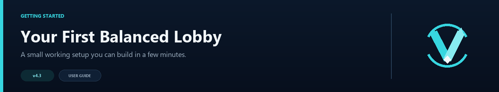

# Quick Start Guide



This setup uses two lobbies and `power_of_two`, a good default for most networks. Once it works, you can add menus, contextual groups, parties, queues, or Redis at your own pace.

## Step 1: Download and Install

1. Download `VelocityNavigator-4.3.0.jar` from the [VelocityNavigator Modrinth page](https://modrinth.com/plugin/velocitynavigator).
2. Place the JAR in your Velocity proxy's `plugins/` folder.
3. Restart the proxy (or run `/vn reload` if you are already running an older version).
4. Optional: place the same JAR in each backend Paper/Spigot 1.16.5+ `plugins/` folder for the Java inventory selector. Backend and proxy must run Java 17+.

```
plugins/
├── VelocityNavigator-4.3.0.jar
└── ...
```

On first start, VelocityNavigator generates `navigator.toml` for systems, `messages.toml` for language, `gui.toml` for Java/Bedrock menus, and `servers.toml` for command-managed lobbies. The universal JAR logs whether it started in proxy or backend bridge mode.

---

## Step 2: Watch It Work with Defaults

Out of the box, VelocityNavigator uses:

- **Selection mode**: `least_players` (picks the server with the fewest players)
- **Lobbies**: placeholder entries named `lobby-1` and `lobby-2`; edit `navigator.toml` to match registered Velocity servers
- **Circuit breaker**: enabled (automatically skips unhealthy servers)
- **Health checks**: enabled with a 60-second cache

If `lobby-1` and `lobby-2` are registered in `velocity.toml`, players typing `/lobby` are routed to the emptier one. Otherwise replace the placeholder names before relying on routing.

---

## Step 3: Edit `navigator.toml`

Open `plugins/velocitynavigator/navigator.toml` and set your lobby server names:

```toml
[routing]
selection_mode = "least_players"
default_lobbies = ["lobby-1", "lobby-2", "lobby-3"]
```

> **Important**: server names in `default_lobbies` must exactly match the server names defined in `velocity.toml`.

Save the file, then run `/vn reload` in the proxy console.

To change the server-wide language, edit only the `language` line at the top of `messages.toml`:

```toml
language = "ru"
```

Built-ins: `en`, `ru`, `es`, `fr`, `de`, `pt_br`, `zh_cn`. Any other value creates a custom-language workflow and preserves text for manual editing. Locale detection is intentionally disabled.

To enable the inventory selector:

```toml
[routing]
use_menu_for_lobby = true

[routing.java_menu]
type = "inventory"
fallback_to_chat = true
```

Install the same universal JAR on each backend, restart it, let a player join, and verify with `/vn bridge status`. Customize rows, materials, fixed slots, pagination controls, and refresh timing in `gui.toml`.

Before enabling advanced systems, run `/vn config validate`. For managed servers, use `/vn server dry-run game ...` or `/vn server dry-run lobby ...` before the real add command.

---

## Step 4: Choose a Selection Mode

Not sure which algorithm to use? Follow this decision tree:

```
How many lobby servers do you have?
│
├─ 1–3 servers ──── least_players   (simple, always picks emptiest)
│
├─ 4–10 servers ─── power_of_two    (fast, near-optimal distribution)
│
├─ 10+ servers ──── least_connections (EMA-based, handles bursty traffic)
│
└─ Need sticky sessions?
   │
   ├─ Yes ──── consistent_hash  (players return to "their" server)
   │
   └─ Need weighted distribution?
      │
      └─ Yes ──── weighted_round_robin  (some servers get more traffic)
```

| Mode | Summary |
|------|---------|
| `least_players` | Picks the server with the fewest players. Suited to small networks. |
| `power_of_two` | Picks two at random and chooses the emptier one. Good default for medium networks. |
| `round_robin` | Strict rotation. Useful for testing. |
| `random` | Each player gets a random server. Performs well at scale. |
| `weighted_round_robin` | Round-robin where some servers receive more traffic than others. |
| `least_connections` | Tracks connection rate over time. Good for bursty traffic. |
| `consistent_hash` | Same player maps to the same server. Useful for session affinity. |
| `latency` | Selects the healthy candidate with the lowest measured ping. Useful when latency differs meaningfully between backends. |

See [Routing Algorithms](Routing-Algorithms) for the full reference.

---

## Step 5: Confirm the setup

1. Join your network.
2. Type `/lobby`.
3. You should be connected to one of your lobby servers.

Check the routing decision:

```
/vn debug player YourName
```

Verify distribution across your servers:

```
/vn status
```

---

## Next Steps

- [Configuration Guide](Configuration-Guide) — customize every setting
- [Routing Algorithms](Routing-Algorithms) — how each algorithm works
- [Operations Runbook](Operations-Runbook) — drain servers, check health, troubleshoot

---

Total time: about 5 minutes. You are now running VelocityNavigator v4.3.
# Optional advanced systems

VelocityNavigator 4.3.0 can also provide native parties, full-pool queues, Redis multi-proxy synchronization, dynamic backend registration, and MOTD lifecycle-state routing. Configure them in `navigator.toml` using the [Advanced Proxy Systems guide](Advanced-Proxy-Systems).
