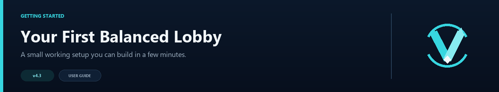

# Quick Start Guide



This guide gets two lobbies working first. Leave menus, authentication, Redis, and geo routing disabled until this basic route works.

Before you start, have these ready:

- one Velocity proxy;
- two backend servers already added to Velocity's `velocity.toml`;
- the exact Velocity server names for those backends;
- console access, because `/vn` is an administrator command.

This guide uses `lobby-1` and `lobby-2`. Replace those names everywhere if your servers are called something else.

## Step 1: Download and Install

1. Download `VelocityNavigator-4.5.0.jar` from the [VelocityNavigator Modrinth page](https://modrinth.com/plugin/velocitynavigator).
2. Place the JAR in your Velocity proxy's `plugins/` folder.
3. Start or restart the proxy. `/vn reload` reloads configuration; it cannot replace a running JAR.
4. For now, install the JAR only on Velocity. Add it to Paper/Spigot/Folia later if you want inventory menus or NPCs.

```
plugins/
├── VelocityNavigator-4.5.0.jar
└── ...
```

On first start, look for:

```text
VelocityNavigator universal JAR is running in VELOCITY PROXY mode.
```

The proxy creates `plugins/velocitynavigator/` with `navigator.toml`, `messages.toml`, `gui.toml`, and the optional feature files.

---

## Step 2: Match Your Velocity Server Names

Open Velocity's `velocity.toml` and find the `[servers]` table:

```toml
[servers]
lobby-1 = "127.0.0.1:25566"
lobby-2 = "127.0.0.1:25567"
```

The names on the left—`lobby-1` and `lobby-2`—are the names VelocityNavigator needs. Do not put IP addresses in `default_lobbies`.

---

## Step 3: Edit `navigator.toml`

Open `plugins/velocitynavigator/navigator.toml` and set your lobby server names:

```toml
[routing]
selection_mode = "least_players"
default_lobbies = ["lobby-1", "lobby-2", "lobby-3"]
```

> **Important**: server names in `default_lobbies` must exactly match the server names defined in `velocity.toml`.

Save the file, then run `/vn reload` in the proxy console.

Now run:

```text
/vn config validate
/vn health
```

Fix validation errors before testing with players. Both lobby names should appear in the health output.

To change the server-wide language, edit only the `language` line at the top of `messages.toml`:

```toml
language = "ru"
```

Built-ins: `en`, `ru`, `es`, `fr`, `de`, `pt_br`, `zh_cn`, `ja`, `it`, `ko`, `nl`, `pl`, `tr`, `ar`, `hi`. Any other value creates a custom-language workflow and preserves text for manual editing. Locale detection is disabled.

Do not enable the inventory selector until normal `/lobby` routing works. When you are ready:

```toml
[routing]
use_menu_for_lobby = true

[routing.java_menu]
type = "inventory"
fallback_to_chat = true
```

Install the same universal JAR on each lobby backend that should provide Java inventory, NPCs, YAML menus, or backend placeholders. Restart those backends, let a player visit each one, and check `/vn bridge status`. If a bridge is missing, the Java selector falls back to chat when `fallback_to_chat = true`; backend NPCs and YAML menus simply cannot run there.

Before enabling advanced systems, run `/vn config validate`. For managed servers, use `/vn server dry-run game ...` or `/vn server dry-run lobby ...` before the real add command.

---

## Step 4: Choose a Selection Mode

Follow this decision tree to choose an algorithm:

```
How many lobby servers do you have?
│
├─ 1–3 servers ──── least_players   (simple, always picks emptiest)
│
├─ 4–10 servers ─── power_of_two    (fast, near-optimal distribution)
│
├─ 10+ servers ──── least_connections (EMA-based, handles bursty traffic)
│
└─ Need sticky sessions?
   │
   ├─ Yes ──── consistent_hash  (players return to "their" server)
   │
   └─ Need weighted distribution?
      │
      └─ Yes ──── weighted_round_robin  (some servers get more traffic)
```

| Mode | Summary |
|------|---------|
| `least_players` | Picks the server with the fewest players. Suited to small networks. |
| `power_of_two` | Picks two at random and chooses the emptier one. Good default for medium networks. |
| `round_robin` | Strict rotation. Useful for testing. |
| `random` | Each player gets a random server. Performs well at scale. |
| `weighted_round_robin` | Round-robin where some servers receive more traffic than others. |
| `least_connections` | Tracks connection rate over time. Good for bursty traffic. |
| `consistent_hash` | Same player maps to the same server. Useful for session affinity. |
| `latency` | Selects the healthy candidate with the lowest measured ping. Useful when latency differs meaningfully between backends. |

See [Routing Algorithms](Routing-Algorithms) for the full reference.

---

## Step 5: Confirm the Setup

1. Join through Velocity, not directly through a backend port.
2. Type `/lobby`.
3. Confirm that you reach one of the configured lobbies.
4. Join with a second test player or switch loads, then run `/lobby` again.

Check the routing decision:

```
/vn debug player YourName
```

Verify distribution across your servers:

```
/vn status
```

If it does not work, run `/vn config validate`, `/vn health`, and `/vn servers` in that order. The [Troubleshooting Guide](Troubleshooting-Guide) explains each failure state.

---

## Next Steps

- [Configuration Guide](Configuration-Guide): customize every setting
- [Routing Algorithms](Routing-Algorithms): how each algorithm works
- [Operations Runbook](Operations-Runbook): drain servers, check health, troubleshoot

---

At this point the basic router is ready. Add one optional system at a time and validate after each change.

> **v4.5 adds**: database storage backends, GeoIP-based routing, maintenance mode, and authentication integration.

# Optional advanced systems

VelocityNavigator 4.5.0 provides native parties, full-pool queues, Redis multi-proxy synchronization, dynamic backend registration, MOTD lifecycle-state routing, database storage backends, GeoIP-based routing, maintenance mode, and authentication integration. Configure them using the [Advanced Proxy Systems guide](Advanced-Proxy-Systems).
