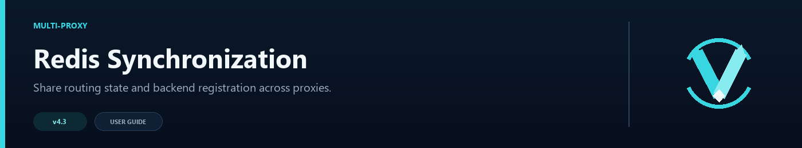

# Redis and Multi-Proxy Networks



Redis is optional. A single Velocity proxy does not need it. Add Redis when several proxies should share routing health and affinity information, or when backends should announce themselves automatically.

## What Redis shares

- circuit-breaker state
- health snapshots and measured latency
- backend lifecycle state
- player affinity
- dynamic backend registration events

Party membership and queue positions are not shared. Keep those players on the same proxy with your external load balancer.

## Proxy configuration

Each proxy needs its own `node_id` but uses the same endpoint, channel prefix, and registration secret:

```toml
[redis]
enabled = true
host = "redis.example.net"
port = 6379
username = "velocitynavigator"
password = "replace-this"
ssl = true
node_id = "proxy-eu-1"
channel_prefix = "vn"
sync_seconds = 5
connect_timeout_ms = 3000
read_timeout_ms = 10000
reconnect_min_ms = 1000
reconnect_max_ms = 30000
registration_secret = "use-a-long-random-secret"
registration_max_age_seconds = 30
allowed_registration_hosts = ["10.20.0.13", "*.backend.example.net"]
```

Use a different stable `node_id` on each proxy, such as `proxy-eu-1` and `proxy-eu-2`.

The ID should describe the proxy, not a temporary process ID, and should stay the same after restarts. Two live proxies must never share it: a proxy ignores messages carrying its own `node_id`, so duplicated IDs prevent those proxies from accepting each other's state. Every participating proxy and backend must also use the same `channel_prefix`.

## Check the connection

After `/vn reload`, run:

```text
/vn redis test
/vn redis status
```

The test checks the configured endpoint and `PING`. Status shows whether the subscription is connected, message counts, reconnects, rejected registrations, and the latest error.

## Automatic backend registration

Install the universal JAR on the Paper or Spigot backend, then edit its `plugins/VelocityNavigator/config.yml`:

```yaml
redis:
  enabled: true
  host: redis.example.net
  port: 6379
  username: velocitynavigator
  password: replace-this
  ssl: true
  channel_prefix: vn
  registration_secret: use-a-long-random-secret
  server_name: lobby-3
  advertised_host: 10.20.0.13
  advertised_port: 25565
  group: default
  max_players: 100
  weight: 1
  unregister_on_shutdown: true
```

The `registration_secret` must exactly match the proxy. `advertised_host` must be reachable from every proxy and allowed by `allowed_registration_hosts`. Use a unique `server_name` that is safe to register in Velocity.

Dynamic registration changes the running proxy only. It does not edit `velocity.toml`; use [Server Management](Server-Management) when you want a permanent file entry.

## Outages and recovery

Redis is a synchronization layer, not a requirement for local routing. If it becomes unavailable, each proxy continues using its own health checks, routing configuration, circuit breaker, and locally saved affinity data. New remote state and dynamic registration events cannot cross between machines until the connection is restored.

The Velocity-side subscriber reconnects automatically using `reconnect_min_ms` and `reconnect_max_ms`. Once connected, the regular state broadcast resumes. Check the live state with:

```text
/vn redis status
/vn redis test
```

Backend registration is event-based: a backend announces itself when its bridge starts and, when `unregister_on_shutdown` is enabled, announces removal during a clean shutdown. If Redis was unavailable when a backend started, restart that backend after Redis recovers so it announces itself again. If a shutdown announcement was missed, the old runtime entry may remain visible as offline; restarting the proxy clears runtime-only registrations.

Redis Pub/Sub does not replay missed messages. Permanent servers should therefore remain in `velocity.toml`, or be managed with `/vn server add`, instead of relying only on a one-time dynamic announcement.

## Security basics

- Keep Redis on a private network whenever possible.
- Use Redis authentication instead of an open endpoint.
- Enable TLS when traffic leaves a trusted host or private segment.
- Use a long, unique `registration_secret`.
- Keep `allowed_registration_hosts` narrow.
- Never reuse a public website password as the Redis or registration secret.

## Supported Redis setups

VelocityNavigator connects to one standalone-compatible endpoint and supports Redis ACL username/password authentication plus TLS. Redis Cluster discovery and Sentinel failover discovery are not included. A managed Redis service is fine when it provides a normal compatible endpoint.

For a simple explanation of what is stored locally and what Redis is used for, see [Storage and Databases](Storage-and-Databases).
