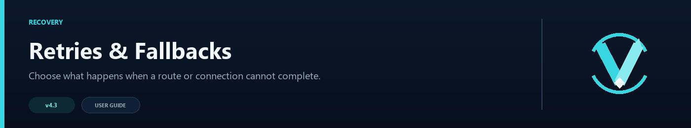

# Retries and Fallbacks



VelocityNavigator has several recovery layers, and each solves a different problem. Retries handle a connection that fails after a lobby was selected. Contextual fallbacks change lobby groups. Degradation can make a best-effort `/lobby` choice when health checks reject the whole pool. The empty-lobby strategy decides what happens when no normal lobby can be selected.

## Connection retries

```toml
[routing]
max_retries = 2
```

When a `/lobby` connection fails, the plugin tries another eligible candidate from the same routing decision. It does not retry the same server. The default allows two retries after the first attempt.

Retries use a short increasing delay with jitter, starting around 200 ms and capped around two seconds. This avoids sending several immediate connection attempts during a backend or network failure.

The retry message is customizable in `messages.toml`:

```toml
retrying = "<yellow>Retrying connection... (<attempt>/<max>)</yellow>"
```

## Contextual fallback groups

Contextual routing first checks the group mapped from the player's current server. A fallback chain can try other lobby groups in order:

```toml
[routing.contextual]
enabled = true
fallback_to_default = true

[routing.contextual.fallback_chain]
bedwars_lobbies = ["main_hubs", "survival_lobbies"]
```

If the chain has no available lobby, `fallback_to_default = true` allows the default pool as the last group. See [Contextual Routing Guide](Contextual-Routing-Guide) for the complete mapping setup.

## Graceful degradation

```toml
[degradation]
enabled = true
mode = "random"
```

Degradation is a best-effort path for the player lobby command when configured candidates exist but all of their health results have failed. It chooses from the configured pool without trusting those failed health results.

Available modes are `random`, `round_robin`, and `least_players`. Use this only when attempting a possibly stale backend is better than immediately returning a no-lobby message.

## Empty-lobby strategy

```toml
[lobby]
no_server_strategy = "disconnect"
fallback_server = ""
```

`disconnect` shows `lobby.no_server_message` when an initial join has nowhere safe to go. For `/lobby` requests from an already connected player, the same text is shown without disconnecting that current session.

To use one registered backend as the last resort:

```toml
[lobby]
no_server_strategy = "fallback_server"
fallback_server = "maintenance"
```

The fallback backend must exist in Velocity. It is still rejected when offline, drained, or blocked by its circuit breaker. Do not include it in a normal lobby pool unless you want it considered during regular routing too.

## Capacity queue

When every eligible lobby is online but full, the [Capacity Queue](Capacity-Queue) can wait for space instead of using degradation. A holding server can accept brand-new proxy connections while they wait.

## Recommended order

For a normal network:

1. Keep health checks and circuit breakers enabled.
2. Use contextual fallback groups when game modes have separate pools.
3. Keep two connection retries for short-lived failures.
4. Configure a capacity queue when full lobbies are expected.
5. Use a fallback server for a deliberate maintenance destination.
6. Enable degradation only when best-effort routing matches your operational policy.
