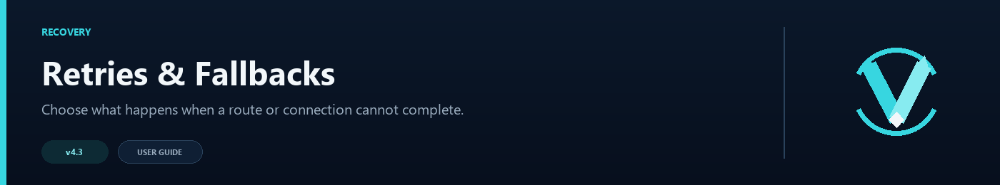

# Retries and Fallbacks



You configure several recovery layers to solve different problems. You use retries to handle connections failing after selection. You use contextual fallbacks to change lobby groups. You use degradation to make a `/lobby` choice when health checks reject the pool. You configure the empty-lobby strategy for when you cannot select a normal lobby.

## Connection retries

```toml
[routing]
max_retries = 2
```

You retry another eligible candidate from the same routing decision when a `/lobby` connection fails. You do not retry the same server. You configure two retries by default.

You configure retries with a short increasing delay with jitter, starting near 200 ms and capped near two seconds. You avoid sending immediate connection attempts during failures.

You customize the retry message in `messages.toml`:

```toml
retrying = "<yellow>Retrying connection... (<attempt>/<max>)</yellow>"
```

## Contextual fallback groups

You configure contextual routing to check the group mapped from the player's current server. You set a fallback chain to try other lobby groups in order:

```toml
[routing.contextual]
enabled = true
fallback_to_default = true

[routing.contextual.fallback_chain]
bedwars_lobbies = ["main_hubs", "survival_lobbies"]
```

You allow the default pool as the last group when the chain has no available lobby and you set `fallback_to_default = true`. You review [Contextual Routing Guide](Contextual-Routing-Guide) for setup.

## Graceful degradation

```toml
[degradation]
enabled = true
mode = "random"
```

You use degradation as a best-effort path when candidates exist but fail health results. You choose from the configured pool without trusting those failed results.

You configure modes like `random`, `round_robin`, or `least_players`. You use this when attempting a possibly stale backend beats returning a no-lobby message.

## Empty-lobby strategy

```toml
[lobby]
no_server_strategy = "disconnect"
fallback_server = ""
```

You configure `disconnect` to show `lobby.no_server_message` when an initial join fails to find a safe server. You show the same text for `/lobby` requests without disconnecting the session.

You configure one registered backend as the last resort:

```toml
[lobby]
no_server_strategy = "fallback_server"
fallback_server = "maintenance"
```

You must register the fallback backend in Velocity. You reject it when offline, drained, or blocked. You avoid including it in a normal lobby pool unless you want it in regular routing.

You replace the normal fallback message with the global reason text when you enable [Maintenance Mode](Maintenance-Mode). You can direct players to a designated fallback backend for maintenance.

## Capacity queue

You configure the [Capacity Queue](Capacity-Queue) to wait for space when eligible lobbies fill up. You configure a holding server to accept new proxy connections during the wait.

## Recommended order

You configure a normal network:

1. You enable health checks and circuit breakers.
2. You configure contextual fallback groups for separate pools.
3. You retain two connection retries for short-lived failures.
4. You set a capacity queue when expecting full lobbies.
5. You designate a fallback server for maintenance.
6. You use [Maintenance Mode](Maintenance-Mode) for whole-network outages.
7. You enable degradation only when best-effort routing matches your policy.
