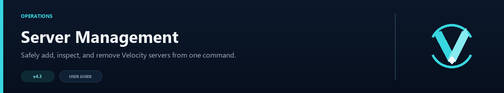

# Server Management



VelocityNavigator can add and remove Velocity backends from the proxy console. Changes take effect immediately and are also written to disk, so they remain after a restart.

## Enable the commands

```toml
[server_management]
enabled = true
velocity_config = "velocity.toml"
allow_overwrite = false
```

Relative paths are resolved from the proxy directory. Keep overwrite protection disabled unless you deliberately want a command to replace the address of an existing Velocity server.

## What each server type changes

| Operation | `velocity.toml` | `servers.toml` | Registered now | Added to lobby routing |
|---|:---:|:---:|:---:|:---:|
| `add game` | Yes | No | Yes | No |
| `add lobby` | Yes | Yes | Yes | Yes |

A game backend becomes available to Velocity features such as forced hosts and other plugins, but VelocityNavigator will not choose it as a lobby. A lobby also receives a routing group, capacity, and weight.

## Add a game server

Preview the operation:

```text
/vn server dry-run game survival-1 10.0.0.31:25565
```

Then add it:

```text
/vn server add game survival-1 10.0.0.31:25565
```

This writes the server under `[servers]` in `velocity.toml` and registers it with the running proxy. It does not add a lobby record.

## Add a lobby

The shortest form adds an uncapped, weight-1 lobby to the default group:

```text
/vn server add lobby lobby-3 10.0.0.23:25565
```

The full form sets its group, capacity, and routing weight:

```text
/vn server dry-run lobby lobby-3 10.0.0.23:25565 bedwars_lobbies 100 2
/vn server add lobby lobby-3 10.0.0.23:25565 bedwars_lobbies 100 2
```

| Value | Default | Meaning |
|---|---:|---|
| `group` | `default` | Routing group that receives the dynamic lobby |
| `max_players` | `-1` | Routing capacity; `-1` means uncapped |
| `weight` | `1` | Relative share for weighted routing |

Use a positive capacity if the lobby should participate in the capacity queue. A named contextual group is used when a player's source mapping selects that group.

## Inspect managed lobbies

```text
/vn server list
```

This lists command-managed lobbies in `name@group` form and prints the resolved `velocity.toml` path. Game servers are intentionally absent because they do not have entries in `servers.toml`.

Use `/vn servers [page]` for live per-lobby health, players, capacity, drain state, and circuit state. Command-managed and Redis-registered lobbies are included in that status screen.

## Change an existing entry

Running `add lobby` again with the same name and address updates its group, capacity, or weight. Changing an existing server's address is rejected while `allow_overwrite = false`.

If an address change is intentional, enable overwrite protection temporarily, run a dry-run, perform the add command, then disable overwrite again. `/vn config validate` warns while overwrite protection is off.

## Remove a server

```text
/vn server remove lobby-3
```

Removal deletes the Velocity server entry, removes any managed lobby metadata, unregisters the live backend, and removes it from dynamic routing. It does not edit Velocity's `[forced-hosts]` lists. If a forced host still names that server, the command reports the hostname so you can update it yourself.

## Addresses and names

Names may contain letters, numbers, dots, underscores, and hyphens. They may be up to 64 characters.

Accepted address forms include:

```text
10.0.0.23:25565
lobby-3.internal:25565
[2001:db8::23]:25565
```

IPv6 addresses must use brackets. Ports must be between 1 and 65535.

## Safety and backups

`dry-run` checks the name, address, type, config path, and overwrite conflict without changing files or live registration.

Before a real write, VelocityNavigator creates timestamped copies in `plugins/velocitynavigator/backups/`. Files are replaced atomically where the operating system supports it. Lobby additions and removals preserve the previous `velocity.toml`, `servers.toml`, and dynamic lobby set if a multi-step operation fails.

### Restore a backup manually

Use backups with the same timestamp when restoring both files:

1. Stop Velocity so it cannot rewrite either file during recovery.
2. Make a separate copy of the current `velocity.toml` and `plugins/velocitynavigator/servers.toml`.
3. In `plugins/velocitynavigator/backups/`, choose the matching `velocity.toml.<timestamp>.bak` and `servers.toml.<timestamp>.bak` files.
4. Copy them back as `velocity.toml` in the proxy root and `servers.toml` in `plugins/velocitynavigator/`.
5. Start Velocity, then run `/vn server list`, `/vn servers`, and `/vn config validate`.

A game-server-only change creates a `velocity.toml` backup but does not change `servers.toml`. Restoring files from different timestamps can leave a Velocity server registered without matching lobby metadata, so keep each timestamped pair together.

After a live change, use:

```text
/vn server list
/vn servers
/vn config validate
```

For temporary autoscaled lobbies announced by a backend rather than permanent file entries, see [Redis and Multi-Proxy](Redis-and-Multi-Proxy).
