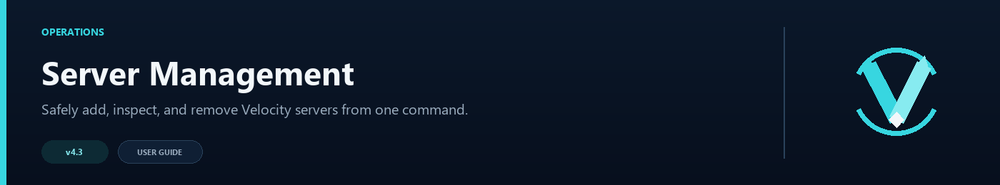

# Server Management



VelocityNavigator adds and removes Velocity backends from the proxy console. Changes take effect immediately and write to disk, persisting across restarts.

## Enable the commands

```toml
[server_management]
enabled = true
velocity_config = "velocity.toml"
allow_overwrite = false
```

Relative paths resolve from the proxy directory. Disable overwrite protection unless you intend to replace the address of an existing Velocity server.

## What each server type changes

| Operation | `velocity.toml` | `servers.toml` | Registered now | Added to lobby routing |
|---|:---:|:---:|:---:|:---:|
| `add game` | Yes | No | Yes | No |
| `add lobby` | Yes | Yes | Yes | Yes |

A game backend becomes available to Velocity features and other plugins. VelocityNavigator skips it for lobby routing. A lobby receives a routing group, capacity, and weight.

## Add a game server

Preview the operation:

```text
/vn server dry-run game survival-1 10.0.0.31:25565
```

Execute it:

```text
/vn server add game survival-1 10.0.0.31:25565
```

This command writes the server under `[servers]` in `velocity.toml` and registers it with the running proxy. It skips creating a lobby record.

## Add a lobby

The shortest form adds an uncapped, weight-1 lobby to the default group:

```text
/vn server add lobby lobby-3 10.0.0.23:25565
```

The full form sets the group, capacity, and routing weight:

```text
/vn server dry-run lobby lobby-3 10.0.0.23:25565 bedwars_lobbies 100 2
/vn server add lobby lobby-3 10.0.0.23:25565 bedwars_lobbies 100 2
```

| Value | Default | Meaning |
|---|---:|---|
| `group` | `default` | Routing group receiving the lobby |
| `max_players` | `-1` | Routing capacity; `-1` means uncapped |
| `weight` | `1` | Relative share for weighted routing |

Set a positive capacity to include the lobby in the capacity queue. A contextual group applies when a player's source mapping selects it.

## Inspect managed lobbies

```text
/vn server list
```

This lists command-managed lobbies as `name@group` and prints the resolved `velocity.toml` path. Game servers do not appear because they lack entries in `servers.toml`.

Use `/vn servers [page]` for live per-lobby health, players, capacity, drain state, and circuit state. Command-managed and Redis-registered lobbies appear in this status screen.

## Change an existing entry

Running `add lobby` with the same name and address updates its group, capacity, or weight. The proxy rejects address changes when `allow_overwrite = false`.

To change an address intentionally, enable overwrite protection, run a dry-run, execute the command, and disable overwrite again. `/vn config validate` issues a warning when overwrite protection remains off.

## Remove a server

```text
/vn server remove lobby-3
```

Removal deletes the Velocity server entry, clears managed lobby metadata, unregisters the live backend, and drops it from dynamic routing. It ignores Velocity's `[forced-hosts]` lists. If a forced host references the server, the command reports the hostname for manual updates.

## Addresses and names

Names accept letters, numbers, dots, underscores, and hyphens. They allow up to 64 characters.

Accepted address formats:

```text
10.0.0.23:25565
lobby-3.internal:25565
[2001:db8::23]:25565
```

IPv6 addresses require brackets. Ports range from 1 to 65535.

## Safety and backups

`dry-run` checks the name, address, type, config path, and overwrite status. It skips file changes and live registration.

Before writing, VelocityNavigator creates timestamped copies in `plugins/velocitynavigator/backups/`. The plugin replaces files atomically where the operating system allows. Lobby additions and removals preserve the previous `velocity.toml`, `servers.toml`, and dynamic lobby sets if multi-step operations fail.

### Restore a backup manually

Use backups with identical timestamps when restoring files:

1. Stop Velocity to prevent file rewrites.
2. Copy the current `velocity.toml` and `plugins/velocitynavigator/servers.toml`.
3. In `plugins/velocitynavigator/backups/`, locate matching `velocity.toml.<timestamp>.bak` and `servers.toml.<timestamp>.bak` files.
4. Copy them as `velocity.toml` in the proxy root and `servers.toml` in `plugins/velocitynavigator/`.
5. Start Velocity. Run `/vn server list`, `/vn servers`, and `/vn config validate`.

A game-server change creates a `velocity.toml` backup but ignores `servers.toml`. Restoring files from different timestamps leaves Velocity servers registered without matching lobby metadata. Keep timestamped pairs together.

After a live change, run:

```text
/vn server list
/vn servers
/vn config validate
```

For autoscaled lobbies announced by backends, read [Redis and Multi-Proxy](Redis-and-Multi-Proxy). To view maintenance interactions with managed lobbies, see [Maintenance Mode](Maintenance-Mode).
