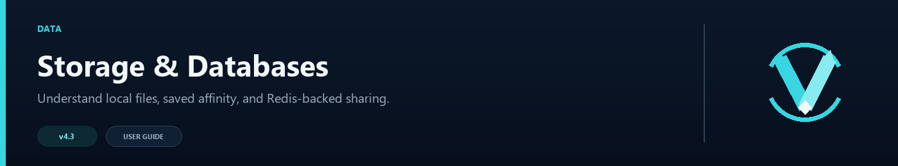

# Storage and Databases

VelocityNavigator does not require MySQL, MariaDB, PostgreSQL, or MongoDB. A normal single-proxy setup keeps its configuration and small pieces of persistent state in the plugin folder.

## Files on the Velocity proxy

| File | Purpose |
|---|---|
| `navigator.toml` | Routing, commands, health, metrics, and optional systems |
| `messages.toml` | Language and player-facing text |
| `gui.toml` | Java inventory and Bedrock form layout |
| `servers.toml` | Lobby information added through server-management commands |
| `affinity-store.json` | Unexpired sticky-lobby records when affinity is enabled |
| `drained-servers.txt` | Servers kept out of new routing during maintenance |

Back up the whole `plugins/velocitynavigator/` folder before a major update or a large configuration change.

## What stays in memory

Live health results, current player counts, circuit-breaker state, parties, and queue positions are runtime information. Most of it is rebuilt naturally while the proxy runs.

Party membership and queue positions do not survive a proxy restart and are not stored in a SQL database.

## When Redis helps

Redis is useful when:

- you run more than one Velocity proxy;
- proxies should share health, circuit, backend-state, or affinity information;
- autoscaled backends need to register and unregister themselves.

Redis is not a replacement for the config files, and enabling it does not make parties or queues global. See [Redis and Multi-Proxy Networks](Redis-and-Multi-Proxy) for the full setup.

## Do I need a database plugin?

No. Do not install a JDBC driver or create SQL tables for VelocityNavigator. If another plugin handles global parties, punishments, permissions, or player profiles, it can continue using its own database independently.

## Moving to another proxy

1. Stop the old proxy cleanly.
2. Copy the complete VelocityNavigator plugin folder.
3. Copy or update the related server entries in `velocity.toml`.
4. Start the new proxy and run `/vn config validate`.
5. Check `/vn servers` and try `/lobby` before opening it to everyone.

If Redis is enabled, give the new proxy its own `node_id` rather than copying the old node identity unchanged.
