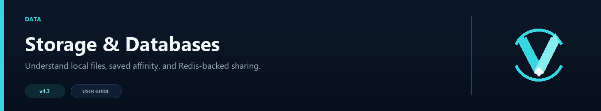

# Storage and Databases



VelocityNavigator supports local JSON file storage and SQL database backends (SQLite, MySQL, MariaDB, and PostgreSQL) via dedicated `storage.toml` or `db.toml` configuration files. You can switch backends.

## Supported Storage Providers

| Provider | Description |
|---|---|
| `file` | Requires no external dependencies. Saves affinity, auth data, and routing stats to local `.json` files. |
| `sqlite` | Embedded SQL database shaded into the plugin JAR. |
| `mysql` | MySQL 5.7+ backend with HikariCP connection pooling. |
| `mariadb` | MariaDB 10.3+ backend with HikariCP connection pooling. |
| `postgresql` | PostgreSQL 12+ backend with HikariCP connection pooling. |

## Configuration

Configure the storage backend in `storage.toml` (or under `[storage]` in `navigator.toml`):

```toml
[storage]
type = "file" # "file" (default), "sqlite", "mysql", "mariadb", or "postgresql"

# SQL connection settings (mysql, mariadb, postgresql)
host = "127.0.0.1"
port = 3306
database = "velocitynavigator"
username = "vn_user"
password = "secretpassword"

# SQLite file path (sqlite only)
sqlite_file = "data/velocitynavigator.db"

# Connection pool settings (sql providers)
pool_size = 10
connection_timeout_ms = 5000
```

### Configuration Reference

| Field | Type | Default | Description |
|---|---|---|---|
| `type` | string | `"file"` | Storage backend: `file`, `sqlite`, `mysql`, `mariadb`, or `postgresql`. |
| `host` | string | `"127.0.0.1"` | Database server hostname or IP (SQL providers). |
| `port` | int | `3306` | Database server port (SQL providers). |
| `database` | string | `"velocitynavigator"` | Database name (SQL providers). |
| `username` | string | `""` | Database username (SQL providers). |
| `password` | string | `""` | Database password (SQL providers). |
| `sqlite_file` | string | `"data/velocitynavigator.db"` | Path to the SQLite database file, relative to the plugin data directory. |
| `pool_size` | int | `5` | Maximum connections in the HikariCP pool. |
| `connection_timeout_ms` | long | `5000` | Milliseconds to wait for a connection before timing out. |

## File Storage

The `file` provider stores data as JSON files in the plugin data directory:

| File | Contents |
|---|---|
| `player_affinity.json` | Unexpired sticky-lobby session records |
| `player_auth.json` | Player authentication and registration records |
| `routing_stats.json` | Recent routing decisions |
| `connection_log.json` | Recent successful routed connections |

File storage suits small networks and development environments. Use an SQL backend for multi-proxy networks.

## SQL Database Setup

### MySQL / MariaDB

```sql
CREATE DATABASE velocitynavigator CHARACTER SET utf8mb4 COLLATE utf8mb4_unicode_ci;
CREATE USER 'vn_user'@'127.0.0.1' IDENTIFIED BY 'secretpassword';
GRANT ALL PRIVILEGES ON velocitynavigator.* TO 'vn_user'@'127.0.0.1';
FLUSH PRIVILEGES;
```

Configure `storage.toml`:

```toml
[storage]
type = "mysql"
host = "127.0.0.1"
port = 3306
database = "velocitynavigator"
username = "vn_user"
password = "secretpassword"
pool_size = 10
```

### PostgreSQL

```sql
CREATE DATABASE velocitynavigator;
CREATE USER vn_user WITH PASSWORD 'secretpassword';
GRANT ALL PRIVILEGES ON DATABASE velocitynavigator TO vn_user;
```

Configure `storage.toml`:

```toml
[storage]
type = "postgresql"
host = "127.0.0.1"
port = 5432
database = "velocitynavigator"
username = "vn_user"
password = "secretpassword"
pool_size = 10
```

### SQLite

The plugin creates the database file automatically:

```toml
[storage]
type = "sqlite"
sqlite_file = "data/velocitynavigator.db"
```

## Connection Pooling

SQL providers use HikariCP for connection management. HikariCP features:

- Automatic connection leak detection
- Connection validation before use
- Idle and maximum pool size management
- Configurable timeouts and keepalive

The `pool_size` controls maximum connections. Most networks use 5-10 connections. Increase the size for high-traffic networks.

## Automated Migration

When a live reload changes the provider from file storage to a database, VelocityNavigator runs `StorageMigrator` to copy player affinity and authentication records before closing the old provider.

The migration process:

1. Initializes the new database and schema.
2. Copies valid affinity and authentication records from the file provider.
3. Switches the live services to the new provider.
4. Closes the old provider and logs the result.

Routing telemetry is not copied between providers. Keep a backup before switching production storage.

## Multi-Proxy Considerations

| Storage type | Multi-proxy support |
|---|---|
| `file` | Not supported. Each proxy runs a separate file store. |
| `sqlite` | Not supported. SQLite excludes concurrent writes from multiple processes. |
| `mysql` / `mariadb` | Fully supported. Proxies share the database. |
| `postgresql` | Fully supported. Proxies share the database. |

Use MySQL, MariaDB, or PostgreSQL for multi-proxy networks. Redis manages real-time state synchronization (circuit breakers, health caches, affinity). The database handles durable persistence.

## Troubleshooting

- **Connection refused**: Verify the database server runs and accepts connections. Check firewalls, `host`, and `port`.
- **Authentication failed**: Check `username` and `password`. Verify the MySQL user holds `GRANT ALL`.
- **Migration errors**: Review the console log for failing tables or records. The proxy starts even when migration partially fails.
- **Pool exhaustion**: Increase `pool_size` or decrease `cache_seconds` in `[health_checks]` to lower queries.
- **SQLite lock errors**: SQLite rejects concurrent writes from multiple processes. Switch to MySQL, MariaDB, or PostgreSQL.
