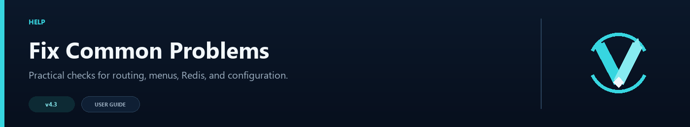

# Troubleshooting Guide



Most VelocityNavigator problems come from a server name that differs between files, a backend that cannot be reached from the proxy, or a feature that is enabled without all of its required settings. Start with these two commands:

```text
/vn config validate
/vn health
```

The first checks configuration; the second shows what the running proxy can currently see.

## Players cannot reach a lobby

Check the following in order:

1. The lobby exists in Velocity's `velocity.toml`.
2. The same name appears in `routing.default_lobbies` or the relevant contextual group.
3. The proxy can reach the backend address and port.
4. `/vn health` does not show it as offline, drained, full, or blocked by its lifecycle state.
5. A finite `max_players` has not already been reached.

Names are case-insensitive in most routing paths, but keeping the same spelling everywhere makes mistakes easier to spot.

## Initial joins still prefer the first Velocity server

Confirm that initial routing is enabled:

```toml
[routing]
balance_initial_join = true
```

Then make sure every expected lobby is registered and included in the routing pool. Velocity's `try` order remains the fallback when the plugin cannot produce an eligible initial target. See [Initial Join Balancing](Initial-Join-Balancing) for the full setup.

## Distribution looks uneven

Small samples naturally look uneven, especially with `random` or `power_of_two`. Use `/vn status` after a meaningful number of joins to review the recorded distribution.

Also check:

- `least_players` and `power_of_two` react to current load rather than enforcing an exact rotation;
- weighted routing intentionally sends more players to higher-weight lobbies;
- player affinity may return recent players to the same healthy lobby;
- different `max_players` values change the available capacity.

If you need a strict, visible rotation while checking the setup, temporarily use `round_robin`.

## A healthy server is being skipped

A successful ping is only one eligibility check. The server may also be:

- in drain mode;
- at its configured capacity;
- held out by an open circuit breaker;
- outside the player's contextual routing group;
- advertising a backend state that is not allowed.

Use `/vn servers` for the per-lobby view and `/vn health` for the subsystem summary. The [Health Checks and Circuit Breakers](Health-Checks-and-Circuit-Breakers) and [Backend Lifecycle States](Backend-Lifecycle-States) pages explain those controls.

## The circuit breaker keeps opening

Repeated health or connection failures open the circuit. Check the backend console, firewall, address, port, and proxy-to-backend latency before increasing thresholds.

For planned maintenance, use `/vn drain <server>` instead. Drain mode prevents new routes without treating the server as failed.

## Configuration changes do not apply

Run `/vn reload`, then read the result in chat or the proxy console. A failed reload keeps the last usable configuration.

Common causes include:

- invalid TOML punctuation or quoting;
- an unknown routing mode;
- duplicate command names;
- an invalid port or negative feature limit;
- a referenced server that is not registered with Velocity.

Do not edit `active_language` in `messages.toml`; change `language` and let the plugin update the active value.

## Commands are missing or denied

Check that the command has not been renamed in `navigator.toml`, and confirm the player has the configured permission. A permission value of `none` allows everyone.

Party and queue commands also disappear when their feature is disabled. Run `/vn config validate` after changing command names because the lobby, admin, party, party-chat, and queue commands must not collide.

## The Java inventory selector falls back to chat

The Java inventory is rendered by the optional Paper/Spigot bridge. Put the same universal JAR on every backend where the menu should open, restart that backend, join it once, and run:

```text
/vn bridge status
```

If the bridge is absent or its handshake cannot complete, chat fallback is expected. Check that plugin messaging is allowed and that the proxy and backend use the same VelocityNavigator version. See [Java and Bedrock Selectors](Java-and-Bedrock-Selectors).

## The Bedrock form does not open

Confirm Geyser and Floodgate are installed and that Bedrock support and the form are enabled. If automatic detection is unreliable in your proxy setup, review the Floodgate configuration and UUID mapping.

With `fallback_to_chat = true`, a player still receives a usable chat selector when a native form cannot be shown.

## A language did not switch

Set the top-level language in `messages.toml`, keep the matching language section present, and run `/vn reload`:

```toml
language = "de"
```

Keep placeholders such as `<server>`, `<reason>`, and `{players}` intact. See [Language Packs](Language-Packs) for custom translations.

## A GUI item is missing or in the wrong slot

Check `gui.toml` for a duplicated slot, a slot outside the configured inventory size, or a material name that does not exist on your backend version. Run `/vn config validate`, then use a simple material such as `PAPER` while narrowing down the problem.

## Parties do not follow the leader

Confirm `party.enabled` and `party.follow_leader` are both true. Members must be online on the same Velocity proxy as the leader. Redis does not make party membership global across proxies.

Use `/party status` to confirm membership before the leader changes server. See [Party System](Party-System).

## The queue never starts

Queueing begins only when every eligible lobby is full. Every candidate therefore needs a positive `max_players`; an uncapped lobby means the pool is never completely full.

For players joining the proxy while full, `holding_server` must name a registered Velocity backend that is not itself part of a lobby pool. See [Capacity Queue](Capacity-Queue).

## Redis will not connect

Run:

```text
/vn redis test
/vn redis status
```

Check the host, port, ACL username, password, TLS setting, and firewall. Each proxy needs a unique persistent `node_id`. The built-in client expects a standalone Redis-compatible endpoint; Sentinel and Cluster discovery are not supported.

If backend registration is rejected, compare the shared registration secret, advertised host, host allowlist, and system clock on both machines. See [Redis and Multi-Proxy](Redis-and-Multi-Proxy).

## A managed server change fails

Try the same operation with `/vn server dry-run ...`. Existing server names are protected while `allow_overwrite = false`, and invalid addresses or forced-host references may require attention.

VelocityNavigator keeps timestamped backups in `plugins/velocitynavigator/backups/`. See [Server Management](Server-Management) before changing a live server table.

## The dashboard does not open

Check `dashboard.enabled`, `dashboard.port`, and `dashboard.bind_host`. The dashboard and Prometheus exporter cannot use the same port.

`127.0.0.1` is universal loopback and accepts connections only from the proxy machine; it is not a personal or public IP. For remote access, bind to a private interface, set a strong bearer token, and restrict the port with a firewall or reverse proxy. Pterodactyl and other hosting-panel users must allocate a separate dashboard port, put that exact number in `dashboard.port`, and normally use `0.0.0.0` inside the container. See [HTML Dashboard](HTML-Dashboard).

## Prometheus cannot bind

An “address already in use” error means another process has the configured port. Choose a free port, or another allocation supplied by your provider. “Cannot assign requested address” means the selected IP is not attached to that host or container; do not paste the provider's public IP into `bind_host` unless its documentation requires it.

For local scraping, use `127.0.0.1`. For a container or remote scraper, use an appropriate private bind address, bearer token, and firewall rule. The [Prometheus and Grafana Setup](Prometheus-&-Grafana-Setup) page includes a ready configuration and dashboard import flow.

## Still stuck?

Collect these before asking for help:

- VelocityNavigator version and Java version;
- Velocity version and backend server software;
- the output of `/vn config validate` and `/vn health`;
- the relevant proxy log lines;
- sanitized config sections with passwords and bearer tokens removed.

Support is available through [DemonZ Development on Discord](https://discord.com/invite/GYsTt96ypf).
